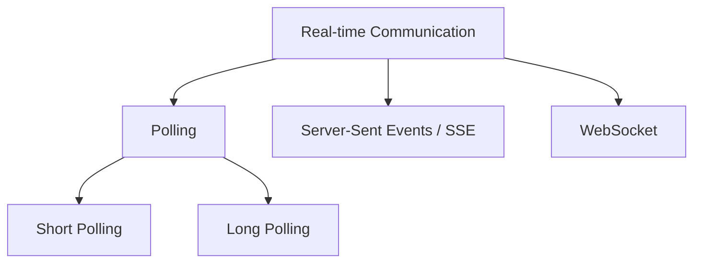
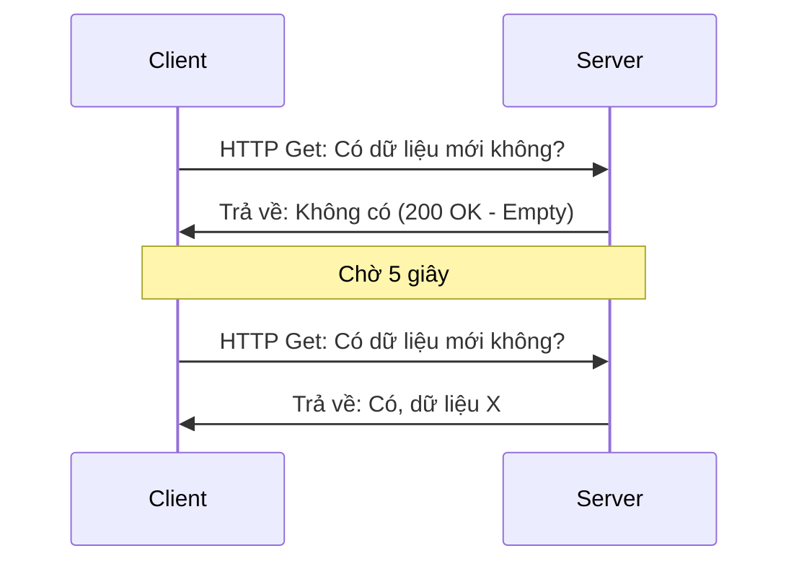
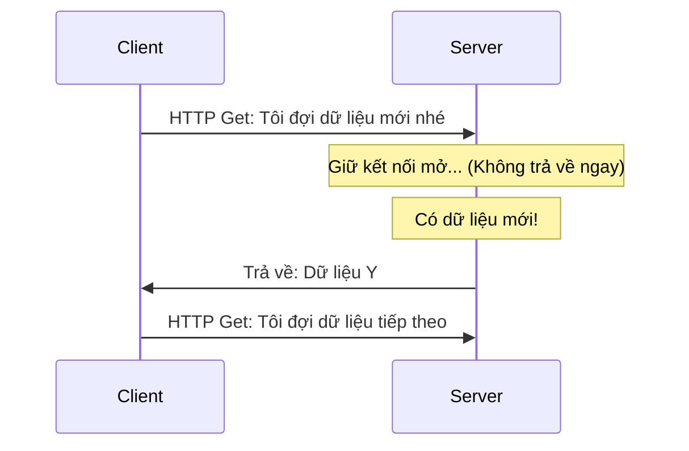
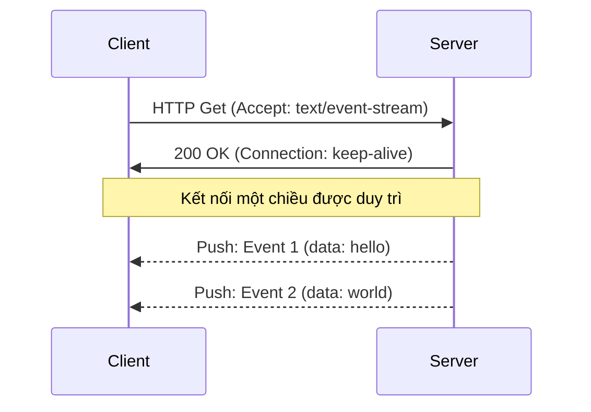
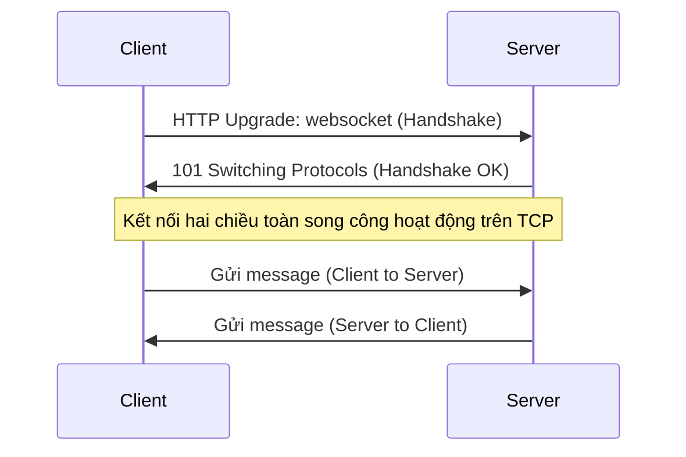

# ⚡ Real-time Web Communication — WebSocket, EventSource & Polling

> Tài liệu chuyên sâu về các giải pháp giao tiếp thời gian thực (Real-time Communication) trên trình duyệt — Từ cơ chế bắt tay, luồng truyền dữ liệu, ma trận quyết định đến code thực chiến chống nghẽn và câu hỏi phỏng vấn Senior.

---

## 1. Khái Niệm & Cơ Chế Hoạt Động (How It Works)

Trong thế giới web, HTTP là giao thức dạng **Request-Response** (Client gửi yêu cầu, Server trả lời). Để giải quyết bài toán cập nhật dữ liệu liên tục từ server (như bảng giá chứng khoán, tin nhắn chat, thông báo), chúng ta có 4 kỹ thuật chính sau:



### 1.1 Short Polling (Truy vấn ngắn)
- **Cơ chế:** Client liên tục gửi các HTTP request thông thường đến Server sau một khoảng thời gian cố định (ví dụ: mỗi 5 giây) để hỏi xem có dữ liệu mới hay không.
- **Hoạt động:** Server trả về dữ liệu lập tức (trả về data nếu có, hoặc trả về rỗng/404 nếu không có).
- **Nhược điểm:** Tốn tài nguyên mạng và CPU của Server do lượng HTTP request rác khổng lồ (khiến Server liên tục phải parse HTTP headers).



### 1.2 Long Polling (Truy vấn dài)
- **Cơ chế:** Client gửi một HTTP request lên Server. Thay vì trả lời ngay, Server **giữ (hang)** connection mở cho đến khi xuất hiện dữ liệu mới hoặc gặp timeout (ví dụ: 30 giây).
- **Hoạt động:** Ngay khi nhận được phản hồi từ Server (dù có dữ liệu hay hết giờ), Client lập tức mở một HTTP request khác để tiếp tục chu kỳ.
- **Nhược điểm:** Vẫn tốn chi phí đóng/mở kết nối HTTP liên tục, khó scale khi lượng người dùng đồng thời tăng cao.



### 1.3 Server-Sent Events (SSE / EventSource)
- **Cơ chế:** Client thiết lập một kết nối HTTP một chiều (One-way) duy nhất và lâu dài từ Server đến Client thông qua đối tượng `EventSource`. Giao thức sử dụng MIME type là `text/event-stream`.
- **Hoạt động:** Kết nối giữ liên tục. Server có thể chủ động đẩy (Push) dữ liệu dạng văn bản (text) đến Client bất kỳ lúc nào mà Client không cần gửi thêm request nào.
- **Đặc trưng:** Tích hợp sẵn cơ chế tự động kết nối lại (Auto-reconnect) và lọc sự kiện (Custom events).



### 1.4 WebSocket
- **Cơ chế:** Giao thức kết nối hai chiều toàn song công (Full-duplex, Bi-directional) hoạt động trên nền TCP độc lập với HTTP.
- **Hoạt động:** Client gửi một request HTTP đặc biệt chứa các header Upgrade (`Upgrade: websocket`). Nếu Server đồng ý, kết nối được nâng cấp lên WebSocket (`ws://` hoặc `wss://`). Cả Client và Server có thể tự do gửi dữ liệu (text hoặc nhị phân) cho nhau bất kỳ lúc nào trên cùng kết nối đó.



---

## 2. Ma Trận Quyết Định (Decision Matrix)

| Tiêu chí | Short Polling | Long Polling | EventSource (SSE) | WebSocket |
| :--- | :--- | :--- | :--- | :--- |
| **Giao thức mạng** | HTTP / HTTPS | HTTP / HTTPS | HTTP / HTTPS | WS / WSS (độc lập) |
| **Chiều truyền tin** | Client-to-Server | Client-to-Server | Server-to-Client (Một chiều) | Song công (Hai chiều) |
| **Chi phí Header (Overhead)**| Rất cao (Mỗi request gửi lại header) | Cao | Thấp (Chỉ gửi header một lần) | Cực thấp (Frame size nhỏ từ 2-10 bytes) |
| **Tự động Reconnect** | Thủ công | Thủ công | **Tích hợp sẵn** | Thủ công (Cần tự viết logic) |
| **Định dạng dữ liệu** | Bất kỳ (JSON, XML...) | Bất kỳ (JSON, XML...) | Chỉ UTF-8 Text | Text và Binary (Blob, ArrayBuffer) |
| **Hỗ trợ HTTP/2** | Có | Có | Có (Cực kỳ khuyến nghị) | Cần bypass/tunneling |
| **Bảo mật** | Cookie/Authorization thông thường | Cookie/Authorization thông thường | Cookie/Authorization thông thường | Cần xác thực lúc Handshake |

---

## 3. Mã Nguồn Thực Chiến (Production-ready Code)

### 3.1 Thiết lập EventSource (SSE) phía Client
EventSource hỗ trợ lắng nghe sự kiện mặc định hoặc sự kiện tùy biến (Custom Events) được định nghĩa từ server.

```javascript
function initializeSSE(url) {
  // Khởi tạo kết nối SSE
  const eventSource = new EventSource(url, { withCredentials: true });

  // 1. Lắng nghe sự kiện mặc định (message)
  eventSource.onmessage = (event) => {
    const data = JSON.parse(event.data);
    console.log('Nhận dữ liệu chung:', data);
  };

  // 2. Lắng nghe sự kiện custom được định nghĩa bởi server (ví dụ: 'stock-update')
  eventSource.addEventListener('stock-update', (event) => {
    const stock = JSON.parse(event.data);
    console.log('Cập nhật mã chứng khoán:', stock);
  });

  // 3. Lắng nghe sự kiện mở kết nối thành công
  eventSource.onopen = () => {
    console.log('SSE: Kết nối thành công!');
  };

  // 4. Xử lý lỗi (SSE tự động reconnect ngầm khi lỗi, ta chỉ cần log hoặc kiểm tra trạng thái)
  eventSource.onerror = (error) => {
    console.error('SSE Lỗi:', error);
    if (eventSource.readyState === EventSource.CLOSED) {
      console.log('SSE: Kết nối đã đóng hoàn toàn.');
    }
  };

  // Hàm để đóng kết nối chủ động
  return function closeConnection() {
    eventSource.close();
    console.log('SSE: Đã chủ động đóng kết nối.');
  };
}
```

### 3.2 Quản Lý Kết Nối WebSocket Với Exponential Backoff & Jitter
WebSocket không có cơ chế tự động kết nối lại khi mạng đứt. Đoạn code dưới đây triển khai thuật toán **Exponential Backoff** (thời gian chờ tăng theo số lần thử lũy thừa) kết hợp với **Jitter** (độ lệch ngẫu nhiên) nhằm tránh hiện tượng hàng loạt client cùng reconect một lúc làm sập server (Thundering Herd Problem).

```javascript
class ReliableWebSocket {
  constructor(url, protocols = []) {
    this.url = url;
    this.protocols = protocols;
    this.ws = null;
    
    // Cấu hình Reconnect
    this.reconnectAttempts = 0;
    this.maxReconnectDelay = 30000; // Tối đa 30 giây
    this.baseDelay = 1000; // Bắt đầu thử lại sau 1 giây
    this.isClosedIntentionally = false;
  }

  connect() {
    this.isClosedIntentionally = false;
    this.ws = new WebSocket(this.url, this.protocols);

    this.ws.onopen = (event) => {
      console.log('WS: Kết nối thành công!');
      this.reconnectAttempts = 0; // Reset số lần thử khi kết nối thành công
    };

    this.ws.onmessage = (event) => {
      this.handleMessage(event.data);
    };

    this.ws.onclose = (event) => {
      console.warn(`WS: Kết nối đóng. Code: ${event.code}, Lý do: ${event.reason}`);
      if (!this.isClosedIntentionally) {
        this.reconnect();
      }
    };

    this.ws.onerror = (error) => {
      console.error('WS: Lỗi xảy ra:', error);
      // onerror thường đi kèm với onclose, không nên gọi reconnect ở cả hai nơi
    };
  }

  send(data) {
    if (this.ws && this.ws.readyState === WebSocket.OPEN) {
      this.ws.send(typeof data === 'object' ? JSON.stringify(data) : data);
    } else {
      console.error('WS: Không thể gửi tin nhắn. Kết nối chưa mở.');
    }
  }

  handleMessage(data) {
    console.log('WS: Nhận tin nhắn ->', data);
  }

  reconnect() {
    // Thuật toán Exponential Backoff: delay = baseDelay * 2 ^ attempts
    const delay = Math.min(
      this.maxReconnectDelay,
      this.baseDelay * Math.pow(2, this.reconnectAttempts)
    );
    
    // Thêm Jitter ngẫu nhiên từ 0 đến 1000ms để tránh đồng bộ hóa các client
    const jitter = Math.random() * 1000;
    const finalDelay = delay + jitter;

    console.log(`WS: Đang kết nối lại sau ${(finalDelay / 1000).toFixed(2)} giây... (Lần thử ${this.reconnectAttempts + 1})`);

    setTimeout(() => {
      this.reconnectAttempts++;
      this.connect();
    }, finalDelay);
  }

  close() {
    this.isClosedIntentionally = true;
    if (this.ws) {
      this.ws.close(1000, 'Đóng chủ động từ Client');
    }
  }
}
```

---

## 4. Bẫy Phỏng Vấn (Common Interview Q&A)

### **Q1: Server-Sent Events (SSE) có một giới hạn nghiêm trọng là chỉ cho phép tối đa 6 kết nối đồng thời từ một domain trên HTTP/1.1. Làm thế nào để khắc phục giới hạn này?**

**A:**
- **Nguyên nhân:** Trình duyệt áp đặt giới hạn tối đa 6 kết nối TCP đồng thời trên mỗi domain khi sử dụng HTTP/1.1. Do mỗi kết nối SSE là một kết nối lâu dài (persistent connection), nếu người dùng mở 6 tab khác nhau của cùng một website, tab thứ 7 trở đi sẽ bị block hoàn toàn và không thể nhận bất kỳ data nào từ server.
- **Giải pháp tối ưu:** Chuyển đổi giao thức mạng của Server lên **HTTP/2** (hoặc HTTP/3). 
  - Trong HTTP/2, cơ chế **Multiplexing** (Đa luồng trên một kết nối) cho phép chạy hàng trăm luồng dữ liệu (streams) đồng thời trên **chỉ một kết nối TCP duy nhất**.
  - Khi chạy trên HTTP/2, giới hạn 6 kết nối bị xóa bỏ, giúp người dùng mở thoải mái hàng chục tab mà không sợ bị block SSE.

---

### **Q2: So sánh Server-Sent Events (SSE) và WebSockets. Khi nào thì dùng giải pháp nào?**

**A:**
Lựa chọn dựa trên luồng nghiệp vụ của ứng dụng:

1. **Chọn WebSockets khi:**
   - Ứng dụng yêu cầu tương tác **hai chiều thực sự và liên tục** với độ trễ thấp nhất có thể.
   - Ví dụ: Ứng dụng chat trực tuyến, game online nhiều người chơi, tài liệu soạn thảo chung (như Google Docs), công cụ vẽ chung.
   - Cần truyền tải dữ liệu nhị phân (Binary) lớn.
2. **Chọn Server-Sent Events (SSE) khi:**
   - Ứng dụng chỉ cần truyền dữ liệu **một chiều từ Server về Client**.
   - Ví dụ: Bảng giá chứng khoán/tiền điện tử, News Feed tự động cập nhật, Dashboard hiển thị trạng thái server, Hệ thống thông báo (push notification) đẩy từ server về.
   - Yêu cầu khả năng tự động kết nối lại ổn định mà không cần viết thêm thư viện hỗ trợ.
   - Hạ tầng mạng của hệ thống đi qua nhiều Proxy hoặc Firewall nghiêm ngặt (SSE sử dụng HTTP truyền thống cổng 80/443 nên ít bị chặn hơn so với WebSocket).

---

### **Q3: Trình bày cơ chế hoạt động của thuật toán Exponential Backoff và Jitter trong việc reconnect WebSocket. Tại sao chúng quan trọng?**

**A:**
- **Exponential Backoff:** Là thuật toán tăng thời gian chờ trước khi thử lại theo cấp số nhân sau mỗi lần thất bại (ví dụ: thất bại lần 1 chờ 1s, lần 2 chờ 2s, lần 3 chờ 4s, lần 4 chờ 8s... cho đến khi đạt mức tối đa). Nó bảo vệ Server khỏi việc bị dội bom request liên tục từ hàng ngàn Client khi hệ thống vừa gặp sự cố mạng hoặc Server khởi động lại.
- **Jitter (Độ nhiễu ngẫu nhiên):** Nếu mạng của tòa nhà bị mất đột ngột và có lại, tất cả 500 thiết bị của nhân viên sẽ thử reconnect cùng lúc. Nếu chỉ dùng Exponential Backoff thông thường, 500 thiết bị này sẽ cùng đợi đúng 1s để reconnect, rồi lại cùng đợi đúng 2s, 4s... Việc đồng bộ hóa thời điểm gửi request này tạo ra các đỉnh tải trọng khổng lồ (spikes), có thể làm sập Server một lần nữa. Jitter cộng thêm một khoảng thời gian ngẫu nhiên (ví dụ từ +0ms đến +1000ms) vào mỗi lần thử, làm phân tán thời gian gửi request của các client, giúp tải trọng của Server trải đều và mượt mà hơn.
