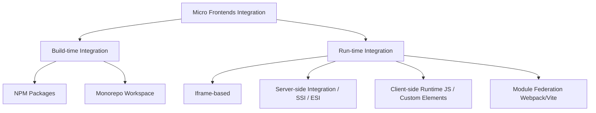

# 🧩 Micro Frontends (MFE) — Kiến Trúc Hệ Thống Frontend Quy Mô Lớn

> Tài liệu chuyên sâu về **Micro Frontends (MFE)** — Từ lý thuyết nền tảng, tích hợp runtime, cơ chế chia sẻ components/dữ liệu đến các bài toán vận hành thực tế và phỏng vấn chuyên sâu.

---

## 📂 Cấu Trúc Thư Mục

| Thư mục / File | Nội dung |
|---------|---------|
| 📂 `07-micro-frontends/` | Thư mục gốc chứa toàn bộ tài liệu MFE |
| ├── 📑 [`README.md`](./README.md) | Tổng quan kiến trúc MFE, So sánh Monolith vs Microservices vs MFE, Ma trận quyết định |
| ├── 📑 [`component-sharing.md`](./component-sharing.md) | Hướng dẫn chia sẻ Components (Build-time vs Run-time, Webpack/Vite Module Federation, Web Components) |
| ├── 📑 [`communication.md`](./communication.md) | Luồng chia sẻ dữ liệu và các cơ chế giao tiếp giữa các MFE kèm mã nguồn mẫu |
| ├── 📑 [`core-mechanisms.md`](./core-mechanisms.md) | Các bài toán khó: Đồng bộ Routing, Cô lập CSS, Quản lý Shared Deps, Error Boundary, CI/CD |
| ├── 📑 [`interviews.md`](./interviews.md) | Bộ câu hỏi phỏng vấn nâng cao (Concept nâng cao & 5 Tình huống thiết kế thực tế cho Senior) |

---

## 1. Micro Frontends Là Gì?

**Micro Frontends (MFE)** là một mô hình kiến trúc trong đó một ứng dụng web lớn được chia nhỏ thành nhiều phần ứng dụng độc lập, có thể build, deploy và vận hành riêng biệt bởi các team khác nhau, sau đó được tích hợp lại thành một giao diện đồng nhất cho người dùng cuối.

### So Sánh Kiến Trúc: Monolith vs Microservices vs Micro Frontends

| Tiêu chí | Monolith | Microservices (Backend) | Micro Frontends (Frontend) |
| :--- | :--- | :--- | :--- |
| **Phạm vi** | Toàn bộ ứng dụng (FE + BE chung một codebase) | Phân rã ở tầng Backend thành các service nhỏ | Phân rã ở tầng Frontend thành các app nhỏ |
| **Tách biệt Logic (Decoupling)** | Thấp. Thay đổi nhỏ ở một nơi có thể ảnh hưởng toàn bộ | Cao. Các service độc lập qua REST API/gRPC | Cao. Các MFE độc lập chạy trong một Shell App (Host) |
| **Độc lập Deployment** | Không. Phải deploy toàn bộ cục app | Có. Từng microservice deploy độc lập | Có. Mỗi MFE deploy độc lập (qua Module Federation/Import Maps) |
| **Công nghệ (Tech Stack)** | Đồng nhất một ngôn ngữ/framework | Có thể dùng bất kỳ ngôn ngữ nào cho từng service | Có thể mix nhiều framework (React, Vue, Angular) tuy nhiên không khuyến khích |
| **Độ phức tạp vận hành** | Thấp khi dự án nhỏ, cực kỳ cao khi dự án lớn | Cao (yêu cầu K8s, API Gateway, Docker) | Cao (yêu cầu Module Federation, Routing sync, Asset versioning) |

---

## 2. Các Mô Hình Tích Hợp Micro Frontend (Integration Models)

Có hai trường phái chính để tích hợp các MFE: **Build-time Integration** (Tích hợp lúc đóng gói) và **Run-time Integration** (Tích hợp lúc ứng dụng chạy).

### 2.1 Build-time Integration (Tích hợp khi biên dịch)
Các MFE được đóng gói thành các thư viện riêng lẻ (npm packages) và được cài đặt vào Shell App như những dependency thông thường.
- **Cách hoạt động:** `npm install @company/mfe-auth`. Shell app sẽ bundle các package này vào bundle cuối cùng của mình khi build.
- **Ưu điểm:**
  - Dễ tiếp cận, cơ chế quản lý version rõ ràng (`package.json`).
  - Hỗ trợ tốt Tree Shaking và kiểm tra type lúc compile (Type safety).
- **Nhược điểm:**
  - **Không có Independent Deploy:** Khi cập nhật một MFE, toàn bộ Shell App phải cài lại package và rebuild/re-deploy.
  - Nguy cơ phình to kích thước bundle do trùng lặp các thư viện dùng chung.

### 2.2 Run-time Integration (Tích hợp khi ứng dụng chạy)
Shell App sẽ tải các đoạn mã của các MFE từ các CDN hoặc Server khác nhau tại thời điểm người dùng chạy ứng dụng.

#### 1. Iframe-based Integration
- **Cách hoạt động:** Shell App nhúng MFE thông qua thẻ `<iframe>`.
- **Ưu điểm:** Cô lập tuyệt đối về mặt CSS, JS, và bảo mật (sandbox). Không lo trùng lặp phiên bản framework.
- **Nhược điểm:** Hiệu năng kém, tốn RAM, trải nghiệm UI đứt gãy (khi cuộn trang, hiển thị modal/popup vượt ra khỏi khung iframe), khó đồng bộ Routing và chia sẻ trạng thái.

#### 2. Server-side Integration (SSI / ESI / Edge-side Templates)
- **Cách hoạt động:** Web Server (Nginx, CDN Edge node) sẽ parse mã HTML của trang chủ và chèn (inject) các đoạn HTML của các MFE từ xa vào trước khi trả về cho client.
- **Ưu điểm:** Load trang đầu cực nhanh (tốt cho SEO), giảm tải xử lý cho client.
- **Nhược điểm:** Phụ thuộc nặng nề vào hạ tầng Web Server hoặc CDN. Khó xử lý SPA (Single Page Application) chuyển trang mượt mà.

#### 3. Client-side Runtime JS (Custom Elements / JS Injection)
- **Cách hoạt động:** Mỗi MFE compile ra một file JS duy nhất (hoặc một vài bundle). Shell app gọi API lấy danh sách manifest, inject các thẻ `<script>` vào DOM, và gắn kết (mount) ứng dụng con vào một container element (ví dụ `
`).
- **Ưu điểm:** Linh hoạt cao, hỗ trợ tốt SPA, kiểm soát hoàn toàn vòng đời của MFE.
- **Nhược điểm:** Cần viết boilerplate để mount/unmount thủ công cho từng framework.

#### 4. Module Federation (Webpack 5 / Vite Federation)
- **Cách hoạt động:** Cơ chế chính thức hỗ trợ MFE ở tầng bundler. Cho phép một ứng dụng chia sẻ động (expose) các components, hooks hoặc functions cho ứng dụng khác tải trực tiếp (consume) từ xa qua HTTP mà không cần build-time bundle.
- **Ưu điểm:**
  - Độc lập deploy hoàn toàn.
  - Chia sẻ runtime dependencies thông minh (ví dụ: chỉ tải duy nhất 1 bản `react` nếu cả host và remote đều cần).
  - Trải nghiệm mượt mà giống hệt SPA monolith.
- **Nhược điểm:** Cần cấu hình bundler phức tạp, đòi hỏi sự thống nhất về phiên bản build tools.

---

## 3. Ma Trận Quyết Định (Decision Matrix)

Để chọn lựa phương pháp tích hợp tối ưu cho dự án của bạn, hãy tham chiếu bảng dưới đây:

| Phương pháp | Độc lập Deploy | Độc lập Tech Stack | Tốc độ Load/SEO | Dễ implement | Phù hợp cho trường hợp |
| :--- | :--- | :--- | :--- | :--- | :--- |
| **Build-time (NPM)** | ❌ Không | ❌ Không | ⚡ Tốt | ⭐ Dễ nhất | Hệ thống Design System, UI Library dùng chung ít thay đổi |
| **Iframe** |  Có |  Có | ❌ Kém | ⭐ Dễ | Nhúng ứng dụng bên thứ ba (ví dụ: Google Maps, Chat Widget, Cổng thanh toán) |
| **Server-Side (SSI)** |  Có |  Có | 🚀 Cực tốt | ❌ Khó | Các trang E-commerce cần SEO cực mạnh và chuyển trang tĩnh |
| **JS Injection (Web Comp.)** |  Có |  Có | ⚡ Tốt | ⚠️ Trung bình | Hệ thống Multi-framework (Ví dụ: Host React nhúng MFE Angular) |
| **Module Federation** | 🚀 Có | ⚠️ Hạn chế | ⚡ Tốt | ❌ Khó cấu hình | Hệ thống SPA lớn, cùng tech stack (ví dụ: React), cần tối ưu bundle và chia sẻ component thời gian thực |

---

> 👉 Tiếp theo: Hãy tìm hiểu cách **[Chia sẻ Component giữa các MFE](./component-sharing.md)** bằng Module Federation và Web Components.
