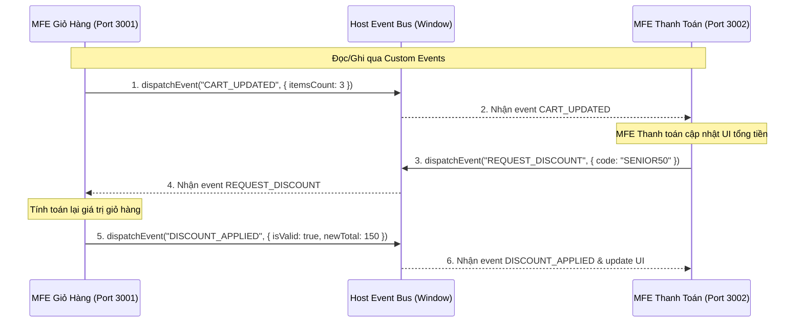

# 💬 Giao Tiếp & Chia Sẻ Dữ Liệu Giữa Các Micro Frontends

> Tìm hiểu cách thiết lập các luồng truyền dẫn dữ liệu (Data Flow), cơ chế đọc/ghi hai chiều, các giải pháp chia sẻ state runtime và các bẫy rò rỉ bộ nhớ (Memory leaks) khi lập trình MFE.

---

## Mục Lục

1. [Tổng Quan 6 Giải Pháp Giao Tiếp](#1-tổng-quan-6-giải-pháp-giao-tiếp)
2. [Cơ Chế Đọc/Ghi Dữ Liệu Hai Chiều (Bi-directional Data Flow)](#2-cơ-chế-đọcghi-dữ-liệu-hai-chiều-bi-directional-data-flow)
3. [Mã Nguồn Mẫu Thực Tế (Code Examples)](#3-mã-nguồn-mẫu-thực-tế-code-examples)
   - [Mẫu 1: Custom Events (Native Window Event Bus)](#mẫu-1-custom-events-native-window-event-bus)
   - [Mẫu 2: Shared Zustand Store (Chia sẻ State tập trung)](#mẫu-2-shared-zustand-store-chia-sẻ-state-tập-trung)
   - [Mẫu 3: Pub/Sub Pattern (Hệ thống đăng ký - xuất bản tin nhắn)](#mẫu-3-pubsub-pattern-hệ-thống-đăng-ký---xuất-bản-tin-nhắn)
4. [Gotchas & Tránh Rò Rỉ Bộ Nhớ (Memory Leaks)](#4-gotchas--tránh-rò-rỉ-bộ-nhớ-memory-leaks)

---

## 1. Tổng Quan 6 Giải Pháp Giao Tiếp

Khi phân rã ứng dụng thành các MFE độc lập, chúng không thể sống hoàn toàn biệt lập mà luôn cần trao đổi thông tin (ví dụ: MFE Giỏ hàng cần biết khi MFE Trang sản phẩm thêm sản phẩm mới). Dưới đây là 6 cách phổ biến:

| Phương Pháp | Mô Tả | Ưu Điểm | Nhược Điểm | Khi Nào Nên Dùng |
| :--- | :--- | :--- | :--- | :--- |
| **Custom Events** | Sử dụng Web APIs (`window.dispatchEvent`) để phát và lắng nghe event | Độc lập tuyệt đối về tech stack, native, hiệu năng cao | Khó kiểm soát kiểu dữ liệu (data type), dễ bị trùng tên event | Các MFE khác tech stack truyền tin nhắn bất đồng bộ |
| **Shared State (Zustand/Redux)** | Host khởi tạo store và truyền instance đó xuống các remote MFE | Quản lý state tập trung, đồng bộ reactive (tự render khi đổi data) | Gắn kết chặt chẽ (tight coupling), đòi hỏi chung phiên bản library | Hệ thống MFE có độ tích hợp cao (Ví dụ: Dashboard & bộ filter) |
| **Props & Callbacks** | Truyền trực tiếp khi render Component từ Host | Đơn giản, tự nhiên giống SPA thông thường | Chỉ dùng được giữa Host và con trực tiếp, không dùng được chéo con | Host truyền cấu hình tĩnh hoặc callback đóng/mở modal |
| **URL State** | Sử dụng Query Params (`?userId=123`) hoặc Route State | Lưu giữ được trạng thái khi F5 tải lại trang | Dung lượng data nhỏ, chỉ chứa được chuỗi kí tự đơn giản | Lưu filter state, tab selection, ID đối tượng |
| **Pub/Sub Bus** | Tạo một Class Message Bus trung gian để đăng ký và gửi tin | Hỗ trợ lập trình hướng sự kiện (event-driven), kiểm soát luồng đi tốt | Phải duy trì code thư viện Pub/Sub, cần quản lý vòng đời listener | Hệ thống phức tạp, cần log/trace toàn bộ tin nhắn chạy qua lại |
| **Storage APIs** | Sử dụng LocalStorage, SessionStorage, IndexedDB | Dữ liệu lưu trữ bền vững qua các lần tải lại trang | Ghi xuống đĩa (disk I/O) chậm, không có tính phản ứng (reactive) tức thì | Lưu Token đăng nhập, User Profile, cấu hình giao diện (Theme) |

---

## 2. Cơ Chế Đọc/Ghi Dữ Liệu Hai Chiều (Bi-directional Data Flow)

Trong ứng dụng MFE, luồng đọc/ghi dữ liệu cần được phân định rõ ràng để tránh **Race Conditions** (Xung đột ghi đè) và **State Desynchronization** (Không đồng bộ dữ liệu).

### Sơ đồ luồng hoạt động Bi-directional (Ví dụ: Thanh toán & Giỏ hàng)



### Nguyên tắc thiết kế Data Flow an toàn:
1. **Single Source of Truth:** Chỉ một MFE duy nhất được quyền sở hữu và thay đổi trực tiếp (Write) một mảng dữ liệu. Các MFE khác chỉ được đọc (Read) và gửi "yêu cầu thay đổi" (Request/Action) thông qua Event.
2. **Namespace quy chuẩn:** Tên event phải được đặt theo cấu trúc rõ ràng: `[SENDER]:[ACTION_OR_EVENT]`. Ví dụ: `AUTH:LOGIN_SUCCESS`, `CART:ITEM_ADDED`.
3. **Data Payload tối giản:** Không nên đẩy các instance class, function hay dữ liệu quá lớn qua Event Bus. Chỉ đẩy các giá trị nguyên thủy (Primitive values) hoặc JSON Object sạch.

---

## 3. Mã Nguồn Mẫu Thực Tế (Code Examples)

### Mẫu 1: Custom Events (Native Window Event Bus)

Đây là cách giao tiếp phi trạng thái (stateless) linh hoạt nhất.

#### 🔹 Bên gửi dữ liệu (MFE A - Ví dụ: Product Detail App)
```javascript
// Hàm gửi sự kiện thêm vào giỏ hàng
export function dispatchAddToCart(productId, quantity) {
  const event = new CustomEvent('CART:ADD_ITEM', {
    detail: {
      productId,
      quantity,
      timestamp: Date.now()
    },
    bubbles: true,
    composed: true
  });
  
  window.dispatchEvent(event);
  console.log(`[MFE Product] Đã gửi CART:ADD_ITEM cho sản phẩm: ${productId}`);
}
```

#### 🔹 Bên lắng nghe và xử lý (MFE B - Ví dụ: Cart App)
```javascript
import { useEffect, useState } from 'react';

export function CartStatus() {
  const [cartItems, setCartItems] = useState([]);

  useEffect(() => {
    // Callback xử lý khi nhận được event
    const handleAddItem = (event) => {
      const { productId, quantity } = event.detail;
      console.log(`[MFE Cart] Nhận tín hiệu thêm sản phẩm: ${productId}, SL: ${quantity}`);
      
      setCartItems((prev) => [...prev, { productId, quantity }]);
    };

    // Đăng ký lắng nghe sự kiện trên đối tượng global 'window'
    window.addEventListener('CART:ADD_ITEM', handleAddItem);

    // DỌN DẸP (Cleanup) listener khi component bị unmount (TRÁNH MEMORY LEAK)
    return () => {
      window.removeEventListener('CART:ADD_ITEM', handleAddItem);
    };
  }, []);

  return <div>Số lượng mặt hàng trong giỏ: {cartItems.length}</div>;
}
```

---

### Mẫu 2: Shared Zustand Store (Chia sẻ State tập trung)

Zustand là một thư viện quản lý state cực kỳ gọn nhẹ. Chúng ta có thể tạo một Shared Store tại Host App và truyền instance của store này tới các MFE con để chúng có khả năng phản ứng (Reactive) đồng bộ khi state thay đổi.

#### 🔹 Bước 1: Host App định nghĩa và xuất bản Store
```javascript
// File: src/stores/sharedStore.js (Ở Host App)
import { createStore } from 'zustand/vanilla'; // Dùng vanilla JS store để tương thích mọi framework

export const sharedStore = createStore((set) => ({
  user: null,
  theme: 'dark',
  setUser: (userData) => set({ user: userData }),
  toggleTheme: () => set((state) => ({ theme: state.theme === 'dark' ? 'light' : 'dark' })),
}));

// Gán store vào biến toàn cục window để các Remote MFE có thể truy cập runtime
window.__SHARED_STORE__ = sharedStore;
```

#### 🔹 Bước 2: Remote MFE tiêu thụ và đồng bộ hóa UI (Ví dụ: React Remote App)
```jsx
// File: src/components/UserProfile.jsx (Ở Remote MFE)
import React, { useSyncExternalStore } from 'react';

// Selector helper để bind Zustand store phi React vào React state dùng API tiêu chuẩn
const getSharedStoreInstance = () => {
  if (!window.__SHARED_STORE__) {
    throw new Error("Shared store chưa được khởi tạo ở Host App!");
  }
  return window.__SHARED_STORE__;
};

export function UserProfile() {
  const store = getSharedStoreInstance();
  
  // Lấy giá trị user state một cách reactive bằng useSyncExternalStore
  const user = useSyncExternalStore(
    store.subscribe,
    () => store.getState().user
  );
  
  const theme = useSyncExternalStore(
    store.subscribe,
    () => store.getState().theme
  );

  const handleLogin = () => {
    // Ghi dữ liệu trực tiếp vào Shared Store
    store.getState().setUser({ name: 'Senior Frontend Dev', role: 'Admin' });
  };

  return (
    <div style={{ background: theme === 'dark' ? '#333' : '#fff', color: theme === 'dark' ? '#fff' : '#333', padding: '15px' }}>
      <h3>UserProfile MFE (React)</h3>
      {user ? (
        <p>Chào mừng, {user.name} ({user.role})</p>
      ) : (
        <button onClick={handleLogin}>Đăng Nhập Giả Lập</button>
      )}
      <button onClick={store.getState().toggleTheme}>Đổi Theme</button>
    </div>
  );
}
```

---

### Mẫu 3: Pub/Sub Pattern (Hệ thống đăng ký - xuất bản tin nhắn)

Hệ thống tin nhắn trung gian (Message Bus) giúp cô lập hoàn toàn việc truyền tin, tăng tính linh hoạt và dễ kiểm soát lỗi.

```javascript
// File: MessageBus.js
class MessageBus {
  constructor() {
    this.subscriptions = {};
  }

  // Đăng ký nhận tin nhắn theo topic
  subscribe(topic, callback) {
    if (!this.subscriptions[topic]) {
      this.subscriptions[topic] = [];
    }
    this.subscriptions[topic].push(callback);

    // Trả về hàm unsubscribe để dọn dẹp dễ dàng
    return () => {
      this.subscriptions[topic] = this.subscriptions[topic].filter(cb => cb !== callback);
    };
  }

  // Phát tin nhắn đến toàn bộ subscriber của topic
  publish(topic, data) {
    if (!this.subscriptions[topic]) return;
    this.subscriptions[topic].forEach(callback => {
      try {
        callback(data);
      } catch (err) {
        console.error(`Lỗi thực thi callback trong topic ${topic}:`, err);
      }
    });
  }
}

// Khởi tạo instance duy nhất toàn hệ thống
if (!window.__MFE_MESSAGE_BUS__) {
  window.__MFE_MESSAGE_BUS__ = new MessageBus();
}
export const messageBus = window.__MFE_MESSAGE_BUS__;
```

Sử dụng:
```javascript
// MFE A - Đăng ký lắng nghe
const unsub = messageBus.subscribe('NOTIFY:ALERT', (data) => {
  alert(`Thông báo mới: ${data.text}`);
});

// MFE B - Gửi thông điệp
messageBus.publish('NOTIFY:ALERT', { text: 'Phiên làm việc sắp hết hạn!' });

// Hủy đăng ký khi destroy
unsub();
```

---

## 4. Gotchas & Tránh Rò Rỉ Bộ Nhớ (Memory Leaks)

### 🔴 1. Memory Leaks từ Thao Tác Gắn Sự Kiện (Event Listener Leak)
Khi một MFE con bị unmount khỏi DOM (ví dụ: người dùng chuyển từ Route `/cart` sang `/products`), nếu bạn quên gọi `removeEventListener`, closure lưu giữ tham chiếu của React component/Vue instance cũ vẫn nằm trong RAM của trình duyệt. Sau nhiều lần chuyển trang, ứng dụng sẽ chạy chậm dần và crash do hết bộ nhớ.
- **Cách khắc phục:** Luôn dọn dẹp listener trong hàm return của `useEffect` (React) hoặc hooks `onUnmounted` (Vue).

### 🔴 2. Lỗi Race Conditions Khi Khởi Khởi Tạo MFE
Nếu MFE A gửi một Event ngay khi vừa chạy, nhưng MFE B (đối tượng nhận) đang trong quá trình tải bundle JS và chưa kịp đăng ký lắng nghe sự kiện, tin nhắn đó sẽ bị mất vĩnh viễn.
- **Cách khắc phục:**
  - Thiết lập cơ chế **Replay Event** (Lưu giữ tin nhắn cuối cùng để khi MFE B đăng ký sẽ nhận được ngay).
  - Hoặc Host App cần đảm bảo luồng khởi tạo (Bootstrap sequence) đúng thứ tự, MFE nhận sự kiện cốt lõi được khởi động trước.

### 🔴 3. Tránh Đụng Độ Namespace (Event Collision)
Nếu hai team độc lập đặt trùng tên sự kiện (ví dụ cả hai đều dùng tên event chung chung là `UPDATE_DATA`), việc gửi nhận tin nhắn sẽ bị loạn.
- **Cách khắc phục:** Luôn định nghĩa một enum/hằng số tập trung cho tất cả các tên Event và áp dụng quy tắc đặt tiền tố:
  - Cú pháp tốt: `[MFE_NAME]:[MODULE]:[ACTION]` (Ví dụ: `PAYMENT:CHECKOUT:SUCCESS`).

---

> 👉 Tiếp theo: Hãy tìm hiểu các **[Cơ chế cốt lõi của MFE](./core-mechanisms.md)**: Đồng bộ Routing, Cô lập CSS, và Chia sẻ dependencies.
