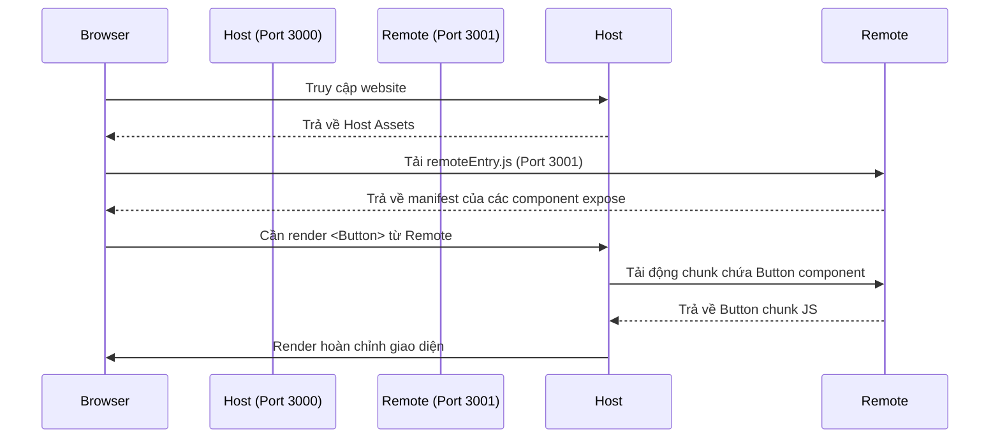

# 🔄 Chia Sẻ Component Giữa Các Micro Frontends

> Tìm hiểu các giải pháp chia sẻ Component từ Build-time đến Run-time, cách cấu hình chi tiết Webpack/Vite Module Federation và cách bọc Component thành Web Component để sử dụng đa framework.

---

## Mục Lục

1. [Tổng Quan Các Giải Pháp](#1-tổng-quan-các-giải-pháp)
2. [Module Federation (Webpack & Vite)](#2-module-federation-webpack--vite)
   - [Cách hoạt động](#21-cách-hoạt-động)
   - [Setup cấu hình chi tiết](#22-setup-cấu-hình-chi-tiết)
   - [Sử dụng ở phía Host (Consumer)](#23-sử-dụng-ở-phía-host-consumer)
3. [Web Components / Custom Elements (Đa Framework)](#3-web-components--custom-elements-đa-framework)
   - [Cách bọc React Component thành Web Component](#31-cách-bọc-react-component-thành-web-component)
   - [Sử dụng Web Component trong Vue hoặc HTML thuần](#32-sử-dụng-web-component-trong-vue-hoặc-html-thuần)
4. [Import Maps + ES Modules](#4-import-maps--es-modules)
5. [Best Practices & Tránh Bẫy Hiệu Năng](#5-best-practices--tránh-bẫy-hiệu-năng)

---

## 1. Tổng Quan Các Giải Pháp

Khi phát triển ứng dụng với nhiều MFE, nhu cầu chia sẻ component (như Header, Footer, Button, Table, UI Kit) giữa các app là rất phổ biến. Có 3 hướng tiếp cận chính:

| Giải Pháp | Tầng Tích Hợp | Độc Lập Deploy | Khả Năng Đa Framework | Độ Phức Tạp Setup |
| :--- | :--- | :--- | :--- | :--- |
| **NPM Package / Monorepo** | Build-time | ❌ Không (phải rebuild host) | ❌ Không (chặt chẽ theo framework) | ⭐ Dễ |
| **Webpack/Vite Module Federation** | Run-time | 🚀 Có | ⚠️ Hạn chế (cần wrapper) | ❌ Khó |
| **Web Components (Custom Elements)** | Run-time | 🚀 Có | 🚀 Tuyệt đối (chạy mọi nơi) | ⚠️ Trung bình |

---

## 2. Module Federation (Webpack & Vite)

**Module Federation** là giải pháp chuẩn mực nhất hiện nay để chia sẻ code runtime giữa các MFE mà không cần build-time npm install.

### 2.1 Cách Hoạt Động
- **Remote App (Exposer):** Build ra một file entry đặc biệt (thường tên là `remoteEntry.js`), đóng vai trò là danh mục (manifest) chứa thông tin các component được xuất bản.
- **Host App (Consumer):** Tải file `remoteEntry.js` của Remote app lúc runtime, sau đó phân giải và tải động component khi cần thiết.



### 2.2 Setup Cấu Hình Chi Tiết

#### 🔹 Cấu hình phía Remote (Exposer)
Trong file `webpack.config.js` của ứng dụng Remote (ví dụ: `mfe-shared-components` chạy cổng 3001):

```javascript
const ModuleFederationPlugin = require('webpack/lib/container/ModuleFederationPlugin');
const deps = require('./package.json').dependencies;

module.exports = {
  // ... cấu hình webpack cơ bản (entry, output, devServer...)
  plugins: [
    new ModuleFederationPlugin({
      name: 'shared_components', // Định danh duy nhất cho Remote này
      filename: 'remoteEntry.js', // Tên file manifest sẽ emit ra
      exposes: {
        // Danh sách các components muốn chia sẻ (Key: Tên expose, Value: Path tới file)
        './Button': './src/components/Button.jsx',
        './Header': './src/components/Header.jsx'
      },
      shared: {
        // Chia sẻ dependencies để tránh trùng lặp bundle
        react: { singleton: true, requiredVersion: deps.react, eager: false },
        'react-dom': { singleton: true, requiredVersion: deps['react-dom'], eager: false }
      }
    })
  ]
};
```

*Lưu ý:* Cấu hình `singleton: true` cực kỳ quan trọng đối với các thư viện quản lý state hoặc UI như React để đảm bảo chỉ có duy nhất 1 instance của React chạy trong toàn bộ tab trình duyệt, tránh lỗi `Invalid Hook Call`.

#### 🔹 Cấu hình phía Host (Consumer)
Trong file `webpack.config.js` của Host App (ví dụ chạy cổng 3000):

```javascript
const ModuleFederationPlugin = require('webpack/lib/container/ModuleFederationPlugin');
const deps = require('./package.json').dependencies;

module.exports = {
  plugins: [
    new ModuleFederationPlugin({
      name: 'host_app',
      remotes: {
        // Định nghĩa Remote App muốn liên kết (Key: alias dùng trong code, Value: name@url)
        'shared_components': 'shared_components@http://localhost:3001/remoteEntry.js'
      },
      shared: {
        react: { singleton: true, requiredVersion: deps.react },
        'react-dom': { singleton: true, requiredVersion: deps['react-dom'] }
      }
    })
  ]
};
```

---

### 2.3 Sử Dụng Ở Phía Host (Consumer)

Vì remote component được tải bất đồng bộ qua mạng (Lazy loading), bạn **bắt buộc** phải sử dụng `React.lazy` và `Suspense` để render component nhằm tránh lỗi crash ứng dụng khi mạng chậm.

```jsx
import React, { Suspense } from 'react';

// Load động component từ Remote App (dùng format: remoteName/exposedKey)
const RemoteButton = React.lazy(() => import('shared_components/Button'));
const RemoteHeader = React.lazy(() => import('shared_components/Header'));

function App() {
  return (
    <div style={{ padding: '20px' }}>
      <h1>Host Application</h1>
      
      {/* Phải bọc trong Suspense để hiển thị Loading fallback */}
      <Suspense fallback={<div>Loading Header from Remote...</div>}>
        <RemoteHeader title="My MFE Platform" />
      </Suspense>

      <div style={{ marginTop: '20px' }}>
        <Suspense fallback={<button>Loading Button...</button>}>
          <RemoteButton 
            label="Click Me!" 
            onClick={() => alert('Clicked remote button!')} 
          />
        </Suspense>
      </div>
    </div>
  );
}

export default App;
```

---

## 3. Web Components / Custom Elements (Đa Framework)

Khi các MFE của bạn được xây dựng trên **các framework khác nhau** (ví dụ Host viết bằng Vue, nhưng muốn dùng một Rich Text Editor viết bằng React từ Remote), Module Federation thuần túy sẽ gặp khó khăn. **Web Components** là giải pháp tối ưu nhất cho bài toán này.

```
+-------------------------------------------------+
| Host App (Vue / Angular / Svelte)               |
|                                                 |
|   <react-button-wc label="Submit" />            |
|          |                                      |
|          +---> Web Component Wrapper            |
|                     |                           |
|                     +---> React (Internal)      |
+-------------------------------------------------+
```

### 3.1 Cách Bọc React Component Thành Web Component
Để trình duyệt hiểu và render được React Component dưới dạng một thẻ HTML thuần, ta sử dụng Web APIs `customElements.define` và gói React lifecycle vào trong Custom Element class:

```javascript
// File: src/components/ReactButtonWC.jsx
import React from 'react';
import { createRoot } from 'react-dom/client';
import Button from './Button'; // React component nguyên bản

class ReactButtonWC extends HTMLElement {
  constructor() {
    super();
    this.root = null;
  }

  // Chạy khi custom element được chèn vào DOM
  connectedCallback() {
    const mountPoint = document.createElement('div');
    
    // Sử dụng Shadow DOM nếu muốn cô lập CSS hoàn toàn
    this.attachShadow({ mode: 'open' }).appendChild(mountPoint);

    this.root = createRoot(mountPoint);
    this.render();
  }

  // Định nghĩa các attributes muốn lắng nghe sự thay đổi
  static get observedAttributes() {
    return ['label'];
  }

  // Chạy khi attribute thay đổi
  attributeChangedCallback(name, oldValue, newValue) {
    if (this.root) {
      this.render();
    }
  }

  // Hàm trigger render React bên trong Web Component
  render() {
    const label = this.getAttribute('label') || 'Default Label';

    this.root.render(
      <Button 
        label={label} 
        onClick={() => {
          // Dispatch Event ngược ra ngoài để Host lắng nghe
          this.dispatchEvent(new CustomEvent('onBtnClick', {
            detail: { message: 'Clicked inside Web Component!' },
            bubbles: true, // Cho phép event nổi bong bóng lên DOM cha
            composed: true // Cho phép event xuyên qua ranh giới Shadow DOM
          }));
        }} 
      />
    );
  }

  // Chạy khi custom element bị xóa khỏi DOM
  disconnectedCallback() {
    if (this.root) {
      this.root.unmount();
    }
  }
}

// Đăng ký custom element với trình duyệt
if (!customElements.get('react-button-wc')) {
  customElements.define('react-button-wc', ReactButtonWC);
}
```

---

### 3.2 Sử Dụng Web Component Trong Vue Hoặc HTML Thuần

Sau khi MFE chứa Web Component tải file script của nó vào Host, Host có thể dùng thẻ `<react-button-wc>` giống như thẻ HTML thông thường:

#### 🔹 Sử dụng trong HTML thuần:
```html
<script src="http://localhost:3001/react-button-wc.js"></script>

<react-button-wc label="Submit Form"></react-button-wc>

<script>
  const btn = document.querySelector('react-button-wc');
  btn.addEventListener('onBtnClick', (e) => {
    console.log(e.detail.message); // "Clicked inside Web Component!"
  });
</script>
```

#### 🔹 Sử dụng trong Vue 3:
Bạn cần cấu hình Vue compiler để nó bỏ qua cảnh báo tag lạ (Custom Element):

```javascript
// vite.config.js của Vue Host
export default defineConfig({
  plugins: [
    vue({
      template: {
        compilerOptions: {
          // Coi các thẻ bắt đầu bằng 'react-' là custom elements
          isCustomElement: (tag) => tag.startsWith('react-')
        }
      }
    })
  ]
})
```

Render trong Vue template:
```html
<template>
  <div>
    <h2>Vue 3 Host App</h2>
    <!-- Vue binding props thành attribute và listen event bằng đầu @ -->
    <react-button-wc :label="buttonText" @onBtnClick="handleWebComponentClick" />
  </div>
</template>

<script setup>
import { ref } from 'vue';
const buttonText = ref("Gửi dữ liệu");

const handleWebComponentClick = (event) => {
  console.log("Dữ liệu nhận từ WC:", event.detail.message);
};
</script>
```

---

## 4. Import Maps + ES Modules

Đây là giải pháp native không phụ thuộc vào bundler phức tạp, tận dụng khả năng import ESM trực tiếp từ trình duyệt.

- **Cấu hình Import Map** trong file HTML của Host:
```html
<script type="importmap">
  {
    "imports": {
      "react": "https://esm.sh/react@18.2.0",
      "react-dom": "https://esm.sh/react-dom@18.2.0",
      "@mfe/shared-card": "http://localhost:3001/components/Card.js"
    }
  }
</script>
```

- **Sử dụng trong MFE/Host code:**
```javascript
import React from 'react';
import Card from '@mfe/shared-card'; // Trình duyệt tự động resolve url từ importmap
```

---

## 5. Best Practices & Tránh Bẫy Hiệu Năng

### ⚠️ Bẫy 1: Style Pollution (Trùng lặp & chồng chéo CSS)
Khi nhiều MFE inject CSS vào chung một tài liệu DOM, CSS Class của MFE A có thể đè đè CSS Class của MFE B.
- **Giải pháp:**
  1. Sử dụng **Shadow DOM** khi bọc Web Component. Shadow DOM sẽ tạo ra một bức tường cô lập CSS hoàn toàn độc lập với CSS bên ngoài.
  2. Sử dụng **CSS Modules** để tự sinh hash class unique.
  3. Nếu sử dụng Tailwind CSS, hãy thiết lập `prefix` trong `tailwind.config.js` của mỗi MFE để tránh đụng class (ví dụ `prefix: 'mfe-auth-'`).

### ⚠️ Bẫy 2: Lỗi Duplicate Dependencies (Trùng thư viện)
Khi chia sẻ các components qua Module Federation, nếu phiên bản dependency không khớp hoặc cấu hình sai, trình duyệt sẽ load cả 2 bản thư viện React khác nhau, gây phình dung lượng bundle hoặc crash runtime.
- **Giải pháp:** Luôn khai báo phiên bản chung (`requiredVersion`) chính xác lấy từ `package.json` và cấu hình `singleton: true`.

### ⚠️ Bẫy 3: Remote Component Loading Failure (Lỗi load file)
Khi server chứa Remote component bị sập hoặc gặp sự cố mạng, file `remoteEntry.js` không thể tải, dẫn đến việc cả trang web của Host bị màn hình trắng (White Screen of Death).
- **Giải pháp:** 
  1. Luôn sử dụng **React Error Boundary** để bọc ngoài các Dynamic Imports. Nếu component remote bị lỗi, hiển thị UI thay thế (Fallback UI) thay vì làm sập toàn bộ ứng dụng Host.
  2. Triển khai CDN / Caching chiến lược cho các tệp runtime MFE.

---

> 👉 Tiếp theo: Hãy tìm hiểu chi tiết về **[Luồng giao tiếp & Đọc/Ghi dữ liệu giữa các MFE](./communication.md)**.
