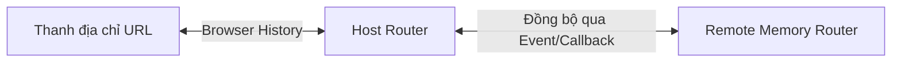

# ⚙️ Các Cơ Chế Cốt Lõi Trong Micro Frontends

> Đi sâu nghiên cứu các trụ cột kỹ thuật của MFE: Đồng bộ Routing giữa các App, Cô lập Styling bảo vệ giao diện, Tối ưu hóa dung lượng qua Shared Dependencies, và Xây dựng kiến trúc chịu lỗi (Resilience) kết hợp quy trình CI/CD độc lập.

---

## Mục Lục

1. [Đồng Bộ Hóa Routing & Navigation](#1-đồng-bộ-hóa-routing--navigation)
2. [Cô Lập CSS & Styling (Style Isolation)](#2-cô-lập-css--styling-style-isolation)
3. [Quản Lý & Chia Sẻ Dependencies](#3-quản-lý--chia-sẻ-dependencies)
4. [Kiến Trúc Chịu Lỗi (Error Boundaries & Resilience)](#4-kiến-trúc-chịu-lỗi-error-boundaries--resilience)
5. [Chiến Lược CI/CD & Deploy Độc Lập](#5-chiến-lược-cicd--deploy-độc-lập)
6. [Chiến Lược Testing Trong MFE](#6-chiến-lược-testing-trong-mfe)

---

## 1. Đồng Bộ Hóa Routing & Navigation

Trong ứng dụng SPA Monolith thông thường, chỉ có duy nhất một Router (ví dụ: React Router) quản lý lịch sử trình duyệt (`Browser History`).
Trong MFE, Host App và các Remote App có thể sử dụng các Router độc lập. Nếu không đồng bộ, khi bấm nút chuyển trang trong Remote App, URL trình duyệt thay đổi nhưng Host App không biết để load đúng trang, hoặc ngược lại.

### Giải Pháp Tối Ưu: Browser History (Host) vs Memory History (Remote)

- **Host App (Shell):** Sử dụng `Browser History` trực tiếp liên kết với thanh địa chỉ trình duyệt.
- **Remote App:** Sử dụng `Memory History` (Router chạy bằng bộ nhớ ảo, không trực tiếp thay đổi thanh địa chỉ).
- **Cơ chế đồng bộ:** Host và Remote lắng nghe sự thay đổi lịch sử của nhau và phát sự kiện (callback) để cập nhật router đối phương.



#### 🔹 Ví dụ cài đặt phía Remote App (React Router v6)
```javascript
// File: src/bootstrap.jsx (Remote App)
import React from 'react';
import { createMemoryRouter, RouterProvider } from 'react-router-dom';
import routes from './routes';

export const mount = (el, { onNavigate, initialPath }) => {
  // Khởi tạo MemoryRouter với đường dẫn hiện tại của Host truyền vào
  const router = createMemoryRouter(routes, {
    initialEntries: [initialPath],
  });

  // Khi router của Remote chuyển trang, báo cho Host biết
  if (onNavigate) {
    router.subscribe((state) => {
      onNavigate(state.location.pathname);
    });
  }

  // Lắng nghe sự kiện Host báo chuyển trang để đồng bộ ngược lại vào MemoryRouter
  const onHostNavigate = (nextPathname) => {
    const { pathname } = router.state.location;
    if (pathname !== nextPathname) {
      router.navigate(nextPathname);
    }
  };

  el.render(<RouterProvider router={router} />);

  return { onHostNavigate };
};
```

#### 🔹 Ví dụ cài đặt phía Host App
```javascript
// File: src/components/RemoteAppWrapper.jsx (Host App)
import React, { useRef, useEffect } from 'react';
import { useLocation, useNavigate } from 'react-router-dom';
import { mount } from 'remote_app/mount';

export function RemoteAppWrapper() {
  const containerRef = useRef(null);
  const navigate = useNavigate();
  const location = useLocation(); // Lấy vị trí URL hiện tại của Host

  useEffect(() => {
    const { onHostNavigate } = mount(containerRef.current, {
      initialPath: location.pathname,
      // Khi con chuyển trang -> Cập nhật URL trình duyệt của Host
      onNavigate: (nextPathname) => {
        if (location.pathname !== nextPathname) {
          navigate(nextPathname);
        }
      },
    });

    // Theo dõi URL Host đổi (ví dụ bấm nút Back/Forward) -> báo cho Remote biết
    onHostNavigate(location.pathname);
  }, [location.pathname]);

  return <div ref={containerRef} id="remote-app-root" />;
}
```

---

## 2. Cô Lập CSS & Styling (Style Isolation)

CSS mang tính toàn cục (Global Scope). Nếu hai MFE định nghĩa class `.btn` với màu nền khác nhau, class nạp sau sẽ đè class nạp trước. Có 4 giải pháp cô lập CSS phổ biến:

### 2.1 CSS Modules (Khuyến Khích)
Bundler (Webpack/Vite) tự động chuyển đổi tên class thành các chuỗi hash duy nhất.
- Ví dụ: `.button` thành `.button_a8f9b_5`.
- **Ưu điểm:** Native, dễ dùng, hiệu năng cực tốt, tương thích 100% các công cụ build.

### 2.2 Shadow DOM
Đóng gói hoàn toàn cây DOM của MFE con tách biệt khỏi DOM chính.
```javascript
const shadowRoot = hostElement.attachShadow({ mode: 'open' });
shadowRoot.innerHTML = `<style>button { background: red; }</style><button>Click</button>`;
```
- **Ưu điểm:** Khả năng cô lập CSS mạnh mẽ nhất, JS bên ngoài không thể can thiệp CSS bên trong Shadow DOM.
- **Nhược điểm:**
  - Khó sử dụng thư viện UI dùng chung cần chèn Global CSS (như Tailwind CSS, Bootstrap). Bạn phải inject lại file CSS CSS đó vào trong mỗi Shadow DOM.
  - Các Portal (ví dụ Modal component render ở `<body>`) sẽ bị vỡ layout vì nằm ngoài Shadow boundary.

### 2.3 Tailwind CSS Prefix (Khuyến Khích cho Tailwind)
Nếu tất cả các MFE dùng Tailwind, hãy cấu hình `prefix` duy nhất cho từng ứng dụng để tránh va chạm class.
```javascript
// tailwind.config.js (MFE Auth)
module.exports = {
  prefix: 'auth-', // Các class sẽ đổi thành: auth-flex, auth-bg-red-500
  // ...
}
```

---

## 3. Quản Lý & Chia Sẻ Dependencies

Tải nhiều bản sao của cùng một thư viện (ví dụ: React, Lodash, Moment) là nguyên nhân chính gây sụt giảm hiệu năng MFE.

### 3.1 Module Federation `shared` Config
Webpack cho phép cấu hình chia sẻ runtime dependencies. Có 3 tham số cấu hình cốt lõi:
- **`singleton: true`:** Bắt buộc trình duyệt chỉ tải **duy nhất một bản** của dependency này. Cực kỳ quan trọng với `react`, `react-dom`, `@angular/core`.
- **`strictVersion: true`:** Nếu Host và Remote có phiên bản thư viện không tương thích (ví dụ Host cần React 18, Remote cần React 16), trình duyệt sẽ ném lỗi crash thay vì cố chạy tiếp để tránh lỗi không mong muốn.
- **`eager: false`:** Thiết lập tải bất đồng bộ (lazy load) dependency đó khi cần thiết thay vì tải ngay từ đầu lúc khởi tạo ứng dụng.

```javascript
shared: {
  react: {
    singleton: true,
    requiredVersion: '^18.2.0',
    strictVersion: true,
    eager: false
  }
}
```

### 3.2 Import Maps
Định nghĩa mapping thư viện ở tầng HTML. Cho phép các MFE viết `import React from 'react'` mà không cần bundle React vào file build của mình, trình duyệt sẽ tự động map ra file CDN toàn cầu.
```html
<script type="importmap">
  {
    "imports": {
      "react": "https://esm.sh/react@18.2.0?dev"
    }
  }
</script>
```

---

## 4. Kiến Trúc Chịu Lỗi (Error Boundaries & Resilience)

Trong kiến trúc MFE, nguyên tắc hàng đầu là **"Graceful Degradation" (Giảm cấp mượt mà)**: Nếu một ứng dụng con bị lỗi hoặc sập server, phần còn lại của ứng dụng vẫn phải hoạt động bình thường.

```
+-------------------------------------------------------------+
| Host App (Shell)                                            |
|  +-----------------------+   +---------------------------+  |
|  | MFE Header (OK)       |   | MFE User Profile (OK)     |  |
|  +-----------------------+   +---------------------------+  |
|  +-------------------------------------------------------+  |
|  | MFE Dashboard (CRASHED / OFFLINE)                     |  |
|  | +---------------------------------------------------+ |  |
|  | | [⚠️ Lỗi tải ứng dụng con. Vui lòng thử lại sau]     | |  |
|  | +---------------------------------------------------+ |  |
|  +-------------------------------------------------------+  |
+-------------------------------------------------------------+
```

### Triển khai React Error Boundary bọc quanh các MFE Remote

```jsx
// File: src/components/ErrorBoundary.jsx
import React from 'react';

export class MfeErrorBoundary extends React.Component {
  constructor(props) {
    super(props);
    this.state = { hasError: false, error: null };
  }

  static getDerivedStateFromError(error) {
    // Cập nhật state để lần render sau hiển thị UI thay thế
    return { hasError: true, error };
  }

  componentDidCatch(error, errorInfo) {
    // Log lỗi ra hệ thống giám sát (Sentry, Datadog...)
    console.error(`[MFE Error Boundary] Bắt được lỗi tại ${this.props.mfeName}:`, error, errorInfo);
  }

  render() {
    if (this.state.hasError) {
      // Giao diện Fallback khi MFE bị sập
      return (
        <div style={{ padding: '20px', border: '1px dashed red', borderRadius: '8px', background: '#fff5f5' }}>
          <h4>⚠️ Không thể tải ứng dụng "{this.props.mfeName}"</h4>
          <p>Hệ thống đang gặp sự cố kết nối. Vui lòng bấm thử lại.</p>
          <button onClick={() => this.setState({ hasError: false })}>Tải lại</button>
        </div>
      );
    }

    return this.props.children;
  }
}
```

Sử dụng tại Host App:
```jsx
import React, { Suspense } from 'react';
import { MfeErrorBoundary } from './ErrorBoundary';

const RemoteDashboard = React.lazy(() => import('dashboard_mfe/Dashboard'));

export function App() {
  return (
    <div>
      <h1>Hệ Thống Quản Trị</h1>
      
      <MfeErrorBoundary mfeName="Dashboard MFE">
        <Suspense fallback={<div>Đang tải Dashboard...</div>}>
          <RemoteDashboard />
        </Suspense>
      </MfeErrorBoundary>
    </div>
  );
}
```

---

## 5. Chiến Lược CI/CD & Deploy Độc Lập

Lợi ích lớn nhất của MFE là **Independent Deploy** (Deploy độc lập). Làm sao để deploy một ứng dụng con mà không cần build hay deploy lại Shell App?

### 5.1 Giải Pháp Module Federation (Static Entry)
1. Mỗi MFE deploy lên một đường dẫn tĩnh trên CDN. Ví dụ:
   - MFE Auth: `https://cdn.company.com/auth/latest/remoteEntry.js`
   - MFE Payment: `https://cdn.company.com/payment/latest/remoteEntry.js`
2. Phía Host App cấu hình trỏ tới đường dẫn tĩnh này.
3. Khi deploy, team Auth chỉ cần build code mới và upload đè lên thư mục `/auth/latest/` trên CDN, sau đó thực hiện xóa cache CDN (CDN Purge).
4. Người dùng tải lại trang sẽ tự động nhận code mới.

### 5.2 Giải Pháp Import Maps (Dynamic Entry)
1. Host App tải file `importmap.json` từ một API hoặc CDN Server.
2. File `importmap.json` chứa thông tin phiên bản hiện tại:
   ```json
   {
     "imports": {
       "@mfe/auth": "https://cdn.company.com/auth/v1.2.5/main.js"
     }
   }
   ```
3. Khi deploy phiên bản mới `v1.2.6` cho MFE Auth, CI/CD chỉ cần chạy script cập nhật file `importmap.json` trên CDN trỏ sang URL mới. Không cần đụng đến code của Host App.

---

## 6. Chiến Lược Testing Trong MFE

Kiểm thử trong môi trường MFE phức tạp hơn Monolith do sự phân tách về runtime.

```
       +------------------------------------+
       | E2E Testing (Playwright / Cypress) |  <--- Kiểm thử toàn bộ luồng tích hợp Host + Remotes
       +------------------------------------+
                        |
       +------------------------------------+
       |   Contract Testing (Pact / API)    |  <--- Đảm bảo hợp đồng API/Props giữa Host & Remote không bị vỡ
       +------------------------------------+
                        |
       +------------------------------------+
       | Unit/Integration Test (Isolated)   |  <--- Kiểm thử độc lập từng MFE con ở local
       +------------------------------------+
```

### 6.1 Unit/Integration Test (Cô Lập)
Từng MFE tự viết unit test cho các components và hooks nội bộ bằng **Jest / Vitest / React Testing Library** như một dự án thông thường. Mock toàn bộ các dependencies tải từ Host hoặc các Remote khác.

### 6.2 Contract Testing (Kiểm Thử Hợp Đồng)
Sử dụng các công cụ như **Pact** để định nghĩa "hợp đồng" (Contract) giữa Host App (Consumer) và Remote App (Provider). Hợp đồng quy định rõ:
- Remote App bắt buộc phải expose những component nào, nhận vào các props gì, kiểu dữ liệu ra sao.
- Khi Remote App thay đổi props (ví dụ đổi prop `user` từ Object sang String), CI/CD của Remote App sẽ chạy Contract Test và phát hiện lỗi không tương thích với Host trước khi deploy.

### 6.3 End-to-End (E2E) Testing
Sử dụng **Playwright** hoặc **Cypress** để giả lập hành vi người dùng thật trên môi trường Staging/Production:
- Viết test suite chạy kiểm tra toàn bộ luồng người dùng đi qua nhiều MFE (Ví dụ: Đăng nhập (MFE Auth) -> Chọn hàng (MFE Store) -> Thanh toán (MFE Payment)).
- *Mẹo tối ưu:* Khi chạy E2E cục bộ, có thể start Host App và mock các MFE Remote bằng các static assets để giảm thời gian khởi chạy test suite.

---

> 👉 Tiếp theo: Hãy thử sức với **[Bộ câu hỏi phỏng vấn Micro Frontends nâng cao](./interviews.md)** dành cho vị trí Senior/Architect.
