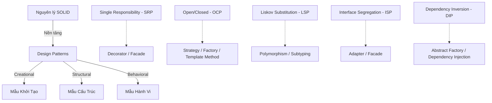

# 📐 Design Patterns — Mẫu Thiết Kế Phần Mềm Thực Chiến (C# Focus)

> Tài liệu chuyên sâu về **Design Patterns (Mẫu thiết kế phần mềm)** — Từ các nguyên lý SOLID nền tảng, phân loại và hướng dẫn lựa chọn pattern, đến các mã nguồn mẫu chuẩn chỉnh bằng C# và ví dụ áp dụng thực tế trong .NET Framework / EF Core.

---

## 📂 Cấu Trúc Thư Mục

| File | Nội dung |
|:---|:---|
| 📑 [`README.md`](./README.md) | Tổng quan Design Patterns, Mối liên hệ với SOLID, Ma trận quyết định lựa chọn pattern |
| 📑 [`creational-patterns.md`](./creational-patterns.md) | **Mẫu Khởi Tạo** (Singleton, Factory Method, Abstract Factory, Builder, Prototype) |
| 📑 [`structural-patterns.md`](./structural-patterns.md) | **Mẫu Cấu Trúc** (Adapter, Bridge, Composite, Decorator, Facade, Flyweight, Proxy) |
| 📑 [`behavioral-patterns.md`](./behavioral-patterns.md) | **Mẫu Hành Vi** (Strategy, Observer, Command, Iterator, State, Template Method, Mediator, Chain of Responsibility, Visitor, Memento, Interpreter) |
| 📑 [`hidden-patterns.md`](./hidden-patterns.md) | **Các Mẫu Thiết Kế Ẩn** (Dependency Injection, Repository & Unit of Work, Specification, Fluent API, Null Object, Double Dispatch) |
| 📑 [`interviews.md`](./interviews.md) | **Bộ câu hỏi phỏng vấn Q&A** nâng cao & 5 Tình huống thiết kế thực tế cho Senior |

---

## 1. Design Patterns Là Gì? Tại Sao Phải Học?

**Design Patterns** không phải là các đoạn code hay thư viện có sẵn để copy-paste. Chúng là **các giải pháp đã được chứng minh hiệu quả** cho các vấn đề thiết kế phần mềm phổ biến mà các lập trình viên thường gặp phải trong quá trình phát triển hệ thống.

### Tại sao cần học Design Patterns?
1. **Tránh phát minh lại bánh xe**: Khi gặp một bài toán thiết kế khó, rất có thể ai đó đã giải quyết nó bằng một pattern tối ưu.
2. **Ngôn ngữ chung (Common Vocabulary)**: Thay vì giải thích dài dòng: *"Tôi muốn tạo một class quản lý luồng request đi qua nhiều bộ lọc lọc dần..."*, bạn chỉ cần nói *"Tôi dùng Chain of Responsibility"*.
3. **Viết code dễ bảo trì & mở rộng**: Áp dụng pattern đúng chỗ giúp code lỏng lẻo (loosely coupled), dễ viết Unit Test và dễ thêm tính năng mới mà không phá vỡ tính năng cũ.

---

## 2. Mối Quan Hệ Mật Thiết Giữa SOLID & Design Patterns

Các Design Patterns thực chất là sự cụ thể hóa của **5 nguyên lý SOLID**. Nếu không hiểu SOLID, việc áp dụng Design Patterns sẽ rất gượng ép và dễ biến thành "Over-engineering" (thiết kế quá đà phức tạp).

### Tóm tắt nhanh SOLID bằng 1 câu:
*   **S (Single Responsibility):** Mỗi class chỉ nên làm duy nhất một việc (Một lý do duy nhất để thay đổi).
*   **O (Open/Closed):** Mở rộng tính năng bằng cách viết class mới kế thừa/interface, đóng việc sửa đổi class cũ đang chạy ổn định.
*   **L (Liskov Substitution):** Class con phải thay thế được class cha mà không làm hỏng chương trình (không ném ra `NotImplementedException`).
*   **I (Interface Segregation):** Thà tạo nhiều interface nhỏ chuyên biệt hơn là tạo một interface to đùng bắt class implement những method họ không dùng.
*   **D (Dependency Inversion):** Giao tiếp qua Interface (Abstraction), không phụ thuộc trực tiếp vào Class cụ thể (Concretions).

---

## 3. Ma Trận Quyết Định Lựa Chọn Pattern (Decision Matrix)

Bảng dưới đây giúp bạn định vị nhanh pattern cần sử dụng khi đối mặt với một vấn đề thiết kế cụ thể:

| Bạn muốn giải quyết vấn đề gì? | Pattern Khuyên Dùng | Nhóm Pattern | Lý do lựa chọn |
| :--- | :--- | :--- | :--- |
| Đảm bảo một class chỉ có **duy nhất 1 instance** trên toàn hệ thống (ví dụ: DbConnection, ConfigManager) | **Singleton** | Khởi tạo | Tiết kiệm tài nguyên, đồng bộ trạng thái toàn cục. |
| Tạo đối tượng mà **không muốn lộ logic khởi tạo** ra ngoài, hoặc loại đối tượng được quyết định ở runtime | **Factory Method** / **Abstract Factory** | Khởi tạo | Giảm phụ thuộc trực tiếp (coupling), dễ thêm loại đối tượng mới. |
| Khởi tạo một đối tượng **phức tạp gồm nhiều bước** cấu hình (ví dụ: xây dựng Http Request, SQL Query) | **Builder** | Khởi tạo | Tránh constructor quá nhiều tham số (Constructor Overload Explosion), code rõ ràng dễ đọc. |
| Tích hợp một thư viện/class có **giao diện (interface) không tương thích** với code hiện tại | **Adapter** | Cấu trúc | Đóng vai trò làm "phích chuyển đổi" mà không cần sửa code thư viện. |
| **Thêm tính năng** cho một đối tượng tại runtime mà không muốn kế thừa (ví dụ: Log, Cache, Encrypt dữ liệu) | **Decorator** | Cấu trúc | Tuân thủ tuyệt đối OCP, xếp chồng (wrap) nhiều tính năng lên nhau linh hoạt. |
| Cung cấp một **giao diện đơn giản hóa** cho một hệ thống con (subsystem) cực kỳ phức tạp phía sau | **Facade** | Cấu trúc | Giúp client dễ sử dụng, che giấu độ phức tạp của hệ thống. |
| Thay đổi **thuật toán/hành vi** của một đối tượng tại runtime tùy theo ngữ cảnh | **Strategy** | Hành vi | Tránh dùng quá nhiều câu lệnh rẽ nhánh `if-else` hoặc `switch-case`. |
| Cần thông báo cho **nhiều đối tượng khác** khi một đối tượng thay đổi trạng thái | **Observer** | Hành vi | Cơ chế Pub-Sub giúp các đối tượng cập nhật tự động mà không phụ thuộc cứng vào nhau. |
| Cần quản lý các request đi qua một **chuỗi các bộ lọc** xử lý liên tiếp | **Chain of Responsibility** | Hành vi | Tách biệt người gửi request và các bên xử lý, dễ dàng thêm/bớt bộ lọc. |
| Cần quản lý giao tiếp chéo phức tạp giữa nhiều class (tránh tình trạng các class gọi trực tiếp lẫn nhau) | **Mediator** | Hành vi | Đóng vai trò "tháp điều khiển không lưu", gom giao tiếp về một mối tập trung. |
