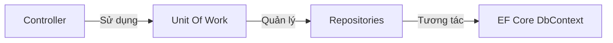

# 👁️ Hidden Patterns (Các Mẫu Thiết Kế Ẩn Ít Người Nhận Ra)

> Có những kỹ thuật lập trình và cấu trúc thiết kế chúng ta viết hàng ngày như một thói quen (hoặc do framework bắt buộc), nhưng thực chất chúng là những **Design Patterns** chính hiệu hoặc sự kết hợp tinh tế giữa nhiều pattern cổ điển.

---

## 📂 Các Mẫu Thiết Kế Ẩn Phổ Biến

1.  **[Dependency Injection (DI)](#1-dependency-injection-di-pattern)** — Sự kết hợp của Strategy và Factory.
2.  **[Repository & Unit of Work](#2-repository--unit-of-work)** — Cặp bài trùng truy cập dữ liệu Enterprise.
3.  **[Fluent Interface (Fluent API)](#3-fluent-interface-fluent-api)** — Method Chaining nâng cao trải nghiệm viết code.
4.  **[Null Object Pattern](#4-null-object-pattern)** — Nói không với lỗi `NullReferenceException`.
5.  **[Specification Pattern](#5-specification-pattern)** — Đóng gói logic truy vấn và nghiệp vụ.
6.  **[Double Dispatch](#6-double-dispatch)** — Bí mật đằng sau sức mạnh của Visitor Pattern.

---

## 1. Dependency Injection (DI) Pattern

Hầu hết lập trình viên .NET đều biết viết `builder.Services.AddScoped<IEmailService, EmailService>()` và tiêm `IEmailService` vào constructor của Controller. Nhưng bản chất của nó là gì?

### 🔬 Phân tích bản chất:
DI là một dạng hiện thực hóa nguyên lý **Dependency Inversion Principle (DIP)** thông qua mô hình **Inversion of Control (IoC)**, được xây dựng từ:
1.  **Strategy Pattern:** Class của bạn (ví dụ: `UserController`) nhận vào một interface (`IEmailService`). Bạn có thể truyền bất kỳ class hiện thực nào (`SmsService`, `SendGridEmailService`) vào runtime. Interface đóng vai trò là Strategy.
2.  **Factory Pattern:** Bạn không tự `new EmailService()`. Một bộ phận trung gian (DI Container/Service Provider) đóng vai trò là một Factory khổng lồ tự động phân giải dependencies và khởi tạo đối tượng cho bạn.

---

## 2. Repository & Unit of Work

Khi dùng Entity Framework Core, bạn làm việc với `DbContext` và `DbSet<T>`. Đây chính là hiện thực của cặp bài trùng **Repository & Unit of Work**.



### 💡 Định nghĩa dễ nhớ
*   **Repository** đóng vai trò như một **Kệ sách**. Bạn có kệ sách chứa Sách Toán, Sách Văn. Bạn chỉ việc gọi `.Add()`, `.Remove()`, `.Find()` mà không cần quan tâm kệ sách này lưu dữ liệu xuống file text, database SQL hay bộ nhớ RAM.
*   **Unit of Work** đóng vai trò như **Giao dịch mua hàng (Transaction)**. Bạn nhặt nhiều cuốn sách từ các kệ khác nhau. Mọi thay đổi chỉ thực sự được ghi nhận khi bạn thanh toán tại quầy thu ngân (gọi hàm `SaveChanges()`). Nếu có bất kỳ lỗi nào xảy ra giữa chừng, toàn bộ quá trình mua hàng sẽ bị hủy bỏ (Rollback).

### 💻 Code ví dụ bằng C# với EF Core

```csharp
using System;
using System.Collections.Generic;
using System.Threading.Tasks;

namespace DesignPatterns.Hidden.RepoUnitOfWork;

// 1. Generic Repository Interface
public interface IRepository<T> where T : class
{
    Task AddAsync(T entity);
    Task<T?> GetByIdAsync(Guid id);
    void Delete(T entity);
}

// 2. Unit of Work Interface
public interface IUnitOfWork : IDisposable
{
    IRepository<Product> Products { get; }
    IRepository<Order> Orders { get; }
    Task<int> CompleteAsync(); // Thực chất là call DbContext.SaveChangesAsync()
}

// Thực tế trong EF Core:
// DbContext chính là Unit of Work.
// DbSet<T> chính là Repository.
```

---

## 3. Fluent Interface (Fluent API)

Khi bạn cấu hình định tuyến trong ASP.NET Core hoặc cấu hình Model trong EF Core, bạn thường viết code liên chuỗi kéo dài:

```csharp
modelBuilder.Entity<User>()
    .HasKey(u => u.Id)
    .Property(u => u.Username)
    .IsRequired()
    .HasMaxLength(50);
```

### 🔬 Cách thức hoạt động ngầm:
Đây là kỹ thuật **Method Chaining** (Liên kết phương thức). Mỗi phương thức trong chuỗi sau khi thực hiện thay đổi trên đối tượng đều trả về chính đối tượng đó (`return this;`) hoặc một đối tượng cấu hình trung gian tiếp theo. Nó giúp code viết mượt mà như đọc văn bản tự nhiên.

---

## 4. Null Object Pattern

Lỗi kinh điển nhất của lập trình viên là `NullReferenceException` (Object reference not set to an instance of an object).

### 🛠 Vấn đề & Giải pháp
*   **Vấn đề:** Bạn gọi phương thức của một đối tượng trả về từ hàm khác, và luôn phải viết câu lệnh check null:
    ```csharp
    var user = _userRepository.GetById(id);
    if (user != null) {
        user.SendNotification("Hello");
    }
    ```
*   **Giải pháp:** Thay vì trả về `null` khi không tìm thấy đối tượng, hãy trả về một **đối tượng Null đặc biệt (Null Object)** kế thừa từ cùng interface nhưng có các phương thức rỗng vô hại (không làm gì cả).

### 💻 Code ví dụ bằng C#

```csharp
using System;

namespace DesignPatterns.Hidden.NullObject;

public interface ILogger
{
    void Log(string message);
}

// Logger thật
public class ConsoleLogger : ILogger
{
    public void Log(string message) => Console.WriteLine($"[LOG]: {message}");
}

// Null Object Logger (Không làm gì cả)
public class NullLogger : ILogger
{
    public void Log(string message)
    {
        // Im lặng hoàn toàn, không ném NullReferenceException
    }
}

public class UserService
{
    private readonly ILogger _logger;

    // Nếu không truyền logger, ta gán mặc định bằng NullLogger thay vì để null
    public UserService(ILogger? logger = null)
    {
        _logger = logger ?? new NullLogger();
    }

    public void CreateUser(string username)
    {
        // Không cần check 'if (_logger != null)'
        _logger.Log($"Đang tạo user: {username}");
        // Logic tạo user...
    }
}
```

### 🏛 Ứng dụng trong Framework
*   **`Microsoft.Extensions.Logging.Abstractions`:** Chứa class `NullLogger.Instance` chuyên dùng để gán mặc định nhằm tránh lỗi crash ứng dụng khi thiếu cấu hình log.

---

## 5. Specification Pattern (Mẫu Đặc Tả)

Trong các ứng dụng Clean Architecture, logic nghiệp vụ lọc dữ liệu thường bị phân tán ở nhiều nơi (Controller, Service, Repository) dẫn đến trùng lặp code SQL/LINQ.

### 💡 Giải pháp:
Specification Pattern đóng gói các quy tắc nghiệp vụ/lọc dữ liệu thành một lớp riêng biệt. Lớp này chỉ làm một nhiệm vụ duy nhất: Kiểm tra xem một đối tượng có thỏa mãn quy tắc đó hay không (trả về `bool`) hoặc biên dịch thành biểu thức điều kiện C# (`Expression<Func<T, bool>>`).

### 💻 Code ví dụ bằng C#

```csharp
using System;
using System.Linq.Expressions;

namespace DesignPatterns.Hidden.Specification;

public class Product
{
    public string Name { get; set; } = string.Empty;
    public decimal Price { get; set; }
    public int Stock { get; set; }
}

// Class đặc tả điều kiện lọc
public class PremiumProductSpecification
{
    private const decimal MinPremiumPrice = 1000m;

    public Expression<Func<Product, bool>> ToExpression()
    {
        // Đóng gói logic: Sản phẩm Premium có giá trị trên 1000$ và còn hàng
        return product => product.Price >= MinPremiumPrice && product.Stock > 0;
    }
}

// Sử dụng với EF Core / LINQ:
// var premiumSpec = new PremiumProductSpecification();
// var premiumProducts = dbContext.Products.Where(premiumSpec.ToExpression()).ToList();
```

---

## 6. Double Dispatch (Điều Phối Kép)

Đây là kỹ thuật cốt lõi giúp **Visitor Pattern** hoạt động mà rất ít người hiểu tường tận.

### 🔬 Vấn đề đa hình một phía (Single Dispatch):
Trong C# và hầu hết ngôn ngữ OOP, đa hình (polymorphism) là **Single Dispatch** — Nghĩa là phương thức nào được gọi phụ thuộc vào kiểu runtime của **đối tượng gọi phương thức** (đối tượng bên trái dấu chấm `.`).
Tuy nhiên, kiểu của **tham số truyền vào phương thức** (đối tượng bên trong dấu ngoặc đơn `()`) lại được quyết định tĩnh tại thời điểm compile (Compile-time type), không phải Runtime type.

### 💡 Giải pháp Double Dispatch:
Để đạt được đa hình ở cả hai phía (cả đối tượng gọi lẫn tham số truyền vào), ta thực hiện một cú bắt tay kép: đối tượng truyền vào làm tham số sẽ gọi ngược lại một phương thức của đối tượng nhận, tự truyền chính nó (`this`) làm đối số.

```csharp
using System;

namespace DesignPatterns.Hidden.DoubleDispatch;

public interface IResourceElement
{
    void Accept(IVisitor visitor);
}

public class PdfDocument : IResourceElement
{
    // Cú bắt tay thứ 2: Chuyển quyền quyết định loại đối tượng cho Visitor bằng từ khóa 'this'
    public void Accept(IVisitor visitor) => visitor.Visit(this);
}

public class WordDocument : IResourceElement
{
    public void Accept(IVisitor visitor) => visitor.Visit(this);
}

public interface IVisitor
{
    void Visit(PdfDocument pdf);
    void Visit(WordDocument word);
}

public class ExportVisitor : IVisitor
{
    // Trình biên dịch C# sẽ tự động chọn đúng overload tại runtime dựa trên kiểu thực tế
    public void Visit(PdfDocument pdf) => Console.WriteLine("Dịch tài liệu PDF sang dạng ảnh.");
    public void Visit(WordDocument word) => Console.WriteLine("Dịch tài liệu Word sang HTML.");
}

// Cách chạy:
// IResourceElement doc = new PdfDocument(); // Upcast
// IVisitor exporter = new ExportVisitor();
// doc.Accept(exporter); // In ra: "Dịch tài liệu PDF sang dạng ảnh."
```
