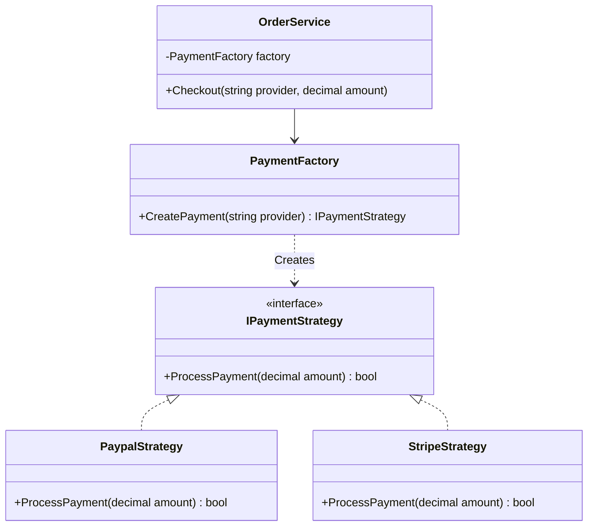

# 💬 Design Patterns Interview Questions & Scenarios

> Bộ câu hỏi phỏng vấn Design Patterns chọn lọc — Từ lý thuyết chuyên sâu, các điểm bẫy thường gặp của nhà tuyển dụng, cho đến các tình huống thiết kế hệ thống thực tế (System Design Scenario) dành cho vị trí Senior Developer.

---

## 📂 Mục lục

1.  **[Phần 1: Lý Thuyết Chuyên Sâu & Các Điểm Bẫy](#phần-1-lý-thuyết-chuyên-sâu--các-điểm-bẫy)**
    *   Q1: Factory Method vs Abstract Factory?
    *   Q2: Singleton có phải là Anti-pattern? Làm thế nào để viết Unit Test cho Singleton?
    *   Q3: So sánh State vs Strategy (tại sao cấu trúc Class giống hệt nhau nhưng mục đích khác nhau)?
2.  **[Phần 2: 5 Tình Huống Thiết Kế Thực Tế (Senior Level)](#phần-2-5-tình-huống-thiết-kế-thực-tế-senior-level)**
    *   Tình huống 1: Tích hợp đa cổng thanh toán linh hoạt.
    *   Tình huống 2: Thiết kế tính năng Undo/Redo cho trình soạn thảo.
    *   Tình huống 3: Thiết kế cơ chế lọc Http Request (Middleware pipeline).
    *   Tình huống 4: Hệ thống thông báo đa kênh cập nhật trạng thái đơn hàng.
    *   Tình huống 5: Tối ưu bộ nhớ cho game hiển thị hàng triệu vật thể.

---

## Phần 1: Lý Thuyết Chuyên Sâu & Các Điểm Bẫy

### Q1: Phân biệt sự khác nhau bản chất giữa Factory Method và Abstract Factory?

**Trả lời:**
Nhiều lập trình viên nhầm lẫn hai mẫu này vì chúng đều dùng để tạo đối tượng. Tuy nhiên, sự khác biệt nằm ở **phạm vi** và **cách thức triển khai**:

| Tiêu chí | Factory Method | Abstract Factory |
| :--- | :--- | :--- |
| **Bản chất** | Là một **phương thức** (hàm). | Là một **đối tượng** (class chứa nhiều phương thức). |
| **Cơ chế hoạt động** | Dựa vào **Kế thừa** (Inheritance). Lớp con override phương thức của lớp cha để quyết định loại đối tượng con được tạo ra. | Dựa vào **Ủy quyền/Giao tiếp** (Composition). Đối tượng Client giữ tham số interface của Factory và gọi các phương thức để lấy về bộ sản phẩm liên quan. |
| **Độ phức tạp tạo đối tượng** | Tạo **một sản phẩm đơn lẻ** (ví dụ: Tạo tài liệu Passport hoặc DrivingLicense). | Tạo ra **một họ sản phẩm liên quan chặt chẽ** (ví dụ: Tạo bộ WindowsButton + WindowsCheckbox). |

---

### Q2: Tại sao Singleton thường bị coi là một "Anti-pattern"? Làm thế nào để viết Unit Test cho một Class phụ thuộc vào Singleton?

**Trả lời:**
Singleton bị coi là Anti-pattern khi bị lạm dụng vì những lý do sau:
1.  **Ẩn giấu các mối phụ thuộc (Hidden Dependencies):** Nhìn vào constructor của một class, bạn không hề biết nó dùng Singleton cho đến khi đọc chi tiết code bên trong.
2.  **Trạng thái toàn cục (Global State):** Singleton lưu trạng thái suốt vòng đời ứng dụng. Nếu các luồng (threads) khác nhau ghi đè trạng thái của Singleton sẽ dẫn đến lỗi bất định (race condition).
3.  **Vi phạm SRP (Single Responsibility Principle):** Class Singleton vừa lo logic nghiệp vụ chính của nó, vừa tự lo quản lý vòng đời độc bản của chính mình.
4.  **Cực kỳ khó viết Unit Test:** Khi chạy Unit Test, các test case chạy song song hoặc nối tiếp sẽ dùng chung instance Singleton này. Lỗi từ test case 1 có thể lưu trạng thái sai trong Singleton khiến test case 2 bị tạch theo một cách bí ẩn.

#### Cách giải quyết để viết Unit Test:
Không dùng "Classic Singleton" (với thuộc tính `static Instance`). Thay vào đó:
1.  Tách biệt interface cho dịch vụ đó (ví dụ `IDatabaseConnection`).
2.  Đăng ký class cụ thể dưới dạng **Singleton Lifetime** trong DI Container (ASP.NET Core).
3.  Khi viết Unit Test, ta dễ dàng Mock interface `IDatabaseConnection` và truyền (inject) vào constructor của class cần test.

---

### Q3: Về mặt cấu trúc UML, State Pattern và Strategy Pattern giống hệt nhau. Hãy chỉ ra sự khác biệt lớn nhất về ý đồ (Intent) thiết kế giữa chúng?

```text
[Context]  ----->  [Interface (Strategy/State)]
                       ^              ^
                       |              |
             [Concrete A]            [Concrete B]
```

**Trả lời:**
Đúng là cấu trúc class của chúng y hệt nhau (Context bọc một interface và ủy quyền thực thi cho interface đó). Tuy nhiên, **ý đồ thiết kế** và cách thức chuyển đổi giữa các trạng thái/chiến lược hoàn toàn khác nhau:

*   **Strategy (Chiến lược):**
    *   **Ý đồ:** Giúp client lựa chọn thuật toán tối ưu nhất từ trước (ví dụ: người dùng chọn thanh toán bằng Credit Card từ màn hình UI).
    *   **Sự độc lập:** Các concrete strategies (CreditCard, Paypal) thường **không biết về nhau**. Chúng chạy độc lập và không bao giờ tự ý đổi chiến lược của Context sang cái khác.
    *   **Client control:** Client thường là bên cấu hình và truyền Strategy cho Context.
*   **State (Trạng thái):**
    *   **Ý đồ:** Quản lý vòng đời trạng thái của đối tượng tự động. Hành vi thay đổi theo trạng thái nội bộ.
    *   **Sự liên kết:** Các concrete states (Draft, Moderation, Published) **biết rất rõ về nhau**. Lớp trạng thái này chứa logic nghiệp vụ và tự động chuyển đổi Context sang trạng thái tiếp theo sau khi hoàn thành nhiệm vụ.
    *   **Context control:** Client không can thiệp, Context tự động chuyển đổi trạng thái ngầm định.

---

## Phần 2: 5 Tình Huống Thiết Kế Thực Tế (Senior Level)

### Tình huống 1: Tích hợp hệ thống đa cổng thanh toán linh hoạt
> **Yêu cầu:** Thiết kế module thanh toán cho trang thương mại điện tử. Ban đầu hệ thống chỉ thanh toán qua **Paypal**, nhưng tương lai cần nhanh chóng tích hợp thêm **Stripe**, **VNPay**, **MoMo** mà không làm thay đổi hay gián đoạn mã nguồn hiện tại.

#### 💡 Giải pháp Thiết kế:
Kết hợp **Strategy Pattern** và **Simple Factory Pattern**.



#### 💻 C# Code Minh Họa:

```csharp
using System;
using System.Collections.Generic;

namespace DesignPatterns.Interviews.Scenario1;

// 1. Interface chiến lược thanh toán
public interface IPaymentStrategy
{
    bool ProcessPayment(decimal amount);
}

public class PaypalStrategy : IPaymentStrategy
{
    public bool ProcessPayment(decimal amount) { Console.WriteLine($"Paypal: {amount}"); return true; }
}

public class StripeStrategy : IPaymentStrategy
{
    public bool ProcessPayment(decimal amount) { Console.WriteLine($"Stripe: {amount}"); return true; }
}

// 2. Factory chịu trách nhiệm khởi tạo
public class PaymentFactory
{
    private readonly Dictionary<string, IPaymentStrategy> _strategies = new()
    {
        { "paypal", new PaypalStrategy() },
        { "stripe", new StripeStrategy() }
    };

    public IPaymentStrategy GetStrategy(string provider)
    {
        if (_strategies.TryGetValue(provider.ToLower(), out var strategy))
        {
            return strategy;
        }
        throw new NotSupportedException($"Cổng thanh toán {provider} chưa được hỗ trợ!");
    }
}
```

---

### Tình huống 2: Thiết kế hệ thống Undo/Redo cho ứng dụng chỉnh sửa ảnh/văn bản
> **Yêu cầu:** Thiết kế tính năng cho phép người dùng thực hiện các thao tác viết chữ, đổi màu chữ, xóa chữ, sau đó có thể nhấn Ctrl+Z (Undo) để quay lại bước trước hoặc Ctrl+Y (Redo) để tiến lên bước sau.

#### 💡 Giải pháp Thiết kế:
Kết hợp **Command Pattern** (đóng gói thao tác thành object có method `Execute()` và `Undo()`) cùng với **Memento Pattern** (nếu cần lưu trữ bản chụp trạng thái phức tạp) và quản lý bằng 2 Stack (Undo Stack và Redo Stack).

#### 💻 C# Code Minh Họa:

```csharp
using System;
using System.Collections.Generic;

namespace DesignPatterns.Interviews.Scenario2;

// 1. Command Interface
public interface ICommand
{
    void Execute();
    void Undo();
}

// 2. Concrete Command (Thao tác thêm văn bản)
public class InsertTextCommand : ICommand
{
    private readonly TextDocument _doc;
    private readonly string _textToInsert;

    public InsertTextCommand(TextDocument doc, string text)
    {
        _doc = doc;
        _textToInsert = text;
    }

    public void Execute() => _doc.Write(_textToInsert);
    public void Undo() => _doc.DeleteLastWords(_textToInsert.Length);
}

// Receiver (Đối tượng nhận lệnh)
public class TextDocument
{
    public string Content { get; private set; } = string.Empty;
    public void Write(string text) => Content += text;
    public void DeleteLastWords(int length) => Content = Content[..^length];
}

// Invoker (Người gọi lệnh & quản lý lịch sử)
public class HistoryManager
{
    private readonly Stack<ICommand> _undoStack = new();
    private readonly Stack<ICommand> _redoStack = new();

    public void ExecuteCommand(ICommand cmd)
    {
        cmd.Execute();
        _undoStack.Push(cmd);
        _redoStack.Clear(); // Thao tác mới làm mất lịch sử Redo cũ
    }

    public void Undo()
    {
        if (_undoStack.Count > 0)
        {
            var cmd = _undoStack.Pop();
            cmd.Undo();
            _redoStack.Push(cmd);
        }
    }

    public void Redo()
    {
        if (_redoStack.Count > 0)
        {
            var cmd = _redoStack.Pop();
            cmd.Execute();
            _undoStack.Push(cmd);
        }
    }
}
```

---

### Tình huống 3: Thiết kế cơ chế lọc Http Request (Middleware pipeline)
> **Yêu cầu:** Thiết kế hệ thống xử lý Request đi vào Web Server. Request phải được xác thực danh tính (Authentication), sau đó kiểm tra giới hạn tần suất gửi tin (Rate Limiting), rồi mới đi vào xử lý logic nghiệp vụ chính.

#### 💡 Giải pháp Thiết kế:
Sử dụng **Chain of Responsibility Pattern** (tương tự kiến trúc ASP.NET Core Middleware).

```csharp
using System;

namespace DesignPatterns.Interviews.Scenario3;

public class HttpContext { public string Token { get; set; } = string.Empty; public int RequestCount { get; set; } }

public abstract class Middleware
{
    protected Middleware? Next;

    public void SetNext(Middleware nextMiddleware) => Next = nextMiddleware;

    public abstract void Handle(HttpContext context);
}

public class AuthMiddleware : Middleware
{
    public override void Handle(HttpContext context)
    {
        if (string.IsNullOrEmpty(context.Token))
        {
            Console.WriteLine("❌ 401 Unauthorized: Thiếu Token!");
            return; // Ngắt chuỗi (Short-circuit)
        }
        Console.WriteLine("✅ Xác thực thành công.");
        Next?.Handle(context); // Chuyển cho Middleware tiếp theo
    }
}

public class RateLimitingMiddleware : Middleware
{
    public override void Handle(HttpContext context)
    {
        if (context.RequestCount > 100)
        {
            Console.WriteLine("❌ 429 Too Many Requests!");
            return;
        }
        Console.WriteLine("✅ Kiểm tra Rate Limit thành công.");
        Next?.Handle(context);
    }
}
```

---

### Tình huống 4: Hệ thống thông báo đa kênh cập nhật trạng thái đơn hàng
> **Yêu cầu:** Khi trạng thái đơn hàng chuyển đổi (ví dụ: từ Chờ xử lý -> Đang giao -> Đã giao), hệ thống cần gửi thông báo đến các kênh: Email cho khách hàng, SMS cho shipper, và Firebase Push Notification đến Mobile App.

#### 💡 Giải pháp Thiết kế:
Sử dụng **Observer Pattern** (hoặc Pub-Sub).
*   **Subject:** `OrderManager` quản lý danh sách các Observers và kích hoạt sự kiện khi đơn hàng đổi trạng thái.
*   **Observers:** `EmailNotificationService`, `SmsNotificationService`, `FirebaseNotificationService`.
*   Khi có trạng thái mới, `OrderManager` lặp qua danh sách và gọi phương thức thông báo của từng Service. Cách này giúp dễ dàng thêm một kênh thông báo mới (như Telegram/Slack) mà không cần sửa code của `OrderManager`.

---

### Tình huống 5: Tối ưu bộ nhớ cho game hiển thị hàng triệu vật thể trên màn hình
> **Yêu cầu:** Bạn đang thiết kế một trò chơi có rừng cây chứa 1.000.000 cây xanh. Mỗi cây có các thuộc tính: Tọa độ X, Y (thay đổi cho từng cây), và hình ảnh 3D Mesh, Kết cấu lá cây, Màu sắc (giống nhau cho tất cả các cây cùng loại). Nếu tạo 1.000.000 đối tượng cây đầy đủ thuộc tính sẽ gây tràn bộ nhớ RAM (OutOfMemory).

#### 💡 Giải pháp Thiết kế:
Sử dụng **Flyweight Pattern**.
*   Tách trạng thái của đối tượng cây làm 2 loại:
    1.  **Intrinsic State (Trạng thái nội trú/dùng chung):** Hình ảnh 3D, Lá cây, Màu sắc. Gom lại lưu trữ duy nhất một instance trong class `TreeModel` (Flyweight).
    2.  **Extrinsic State (Trạng thái ngoại trú/đặc thù):** Tọa độ X, Y. Lưu trong class `Tree` đơn giản chứa tọa độ và một tham chiếu trỏ tới đối tượng `TreeModel` dùng chung.
*   Nhờ đó, 1.000.000 cây chỉ chứa các số thực tọa độ X, Y siêu nhẹ và trỏ chung vào 1 vùng nhớ đồ họa của `TreeModel`, giúp tiết kiệm đến 95% dung lượng RAM.
