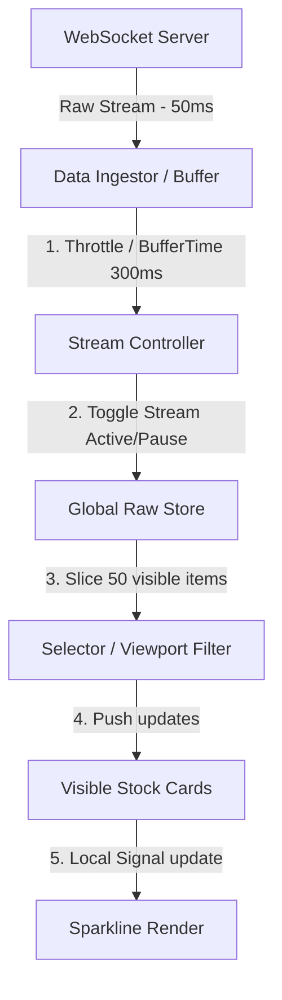

# 🧠 Q&A Phỏng Vấn State Management — Cấp Độ Senior / Architect

Tài liệu này tổng hợp các câu hỏi phỏng vấn chuyên sâu và các tình huống thiết kế thực tế xoay quanh chủ đề **Quản lý trạng thái (State Management)** trong phát triển frontend hiện đại.

---

## 1. Lý Thuyết Chuyên Sâu & So Sánh Kiến Trúc

### **Q1: Tại sao không dùng luôn React Context API / Vue Provide-Inject cho toàn bộ ứng dụng mà lại cần các thư viện bên ngoài như Zustand, Redux hay Pinia? Giải thích cơ chế truyền tin và hiệu năng render (Render Propagation).**

**A:**
React Context API hoặc Vue Provide-Inject được thiết kế cho mục đích **Dependency Injection (Bơm phụ thuộc)** và truyền dữ liệu xuyên qua các tầng component trung gian mà không cần qua Prop Drilling. Chúng **không phải** là các công cụ quản lý state chuyên dụng vì các lý do hiệu năng sau:

1. **Vấn đề Re-render không cần thiết (Context Propagation):**
   - Trong React Context, khi giá trị của Provider thay đổi (dù chỉ là 1 thuộc tính nhỏ trong một object lớn), **tất cả** các component có sử dụng `useContext(MyContext)` đều bị bắt buộc re-render, ngay cả khi chúng chỉ quan tâm đến một thuộc tính khác không hề thay đổi.
   - React không hỗ trợ cơ chế chọn lọc tự động (selectors) đối với Context theo mặc định (trừ khi tách nhỏ thành nhiều Context hoặc dùng các kỹ thuật memoization phức tạp).
2. **Cơ chế hoạt động của Thư viện chuyên dụng (Zustand, Redux):**
   - Các thư viện này lưu trữ state bên ngoài cây component (External Store).
   - Component đăng ký lắng nghe store thông qua cơ chế **Subscribe** kèm theo một hàm **Selector** (ví dụ: `const user = useStore(state => state.user)`).
   - Khi store thay đổi, thư viện sẽ chạy selector để so sánh giá trị cũ và mới (thường là so sánh nông - shallow comparison). Chỉ khi giá trị đó thực sự thay đổi, component đăng ký mới bị trigger re-render.
3. **Phù hợp sử dụng:**
   - **Context API/Provide-Inject:** Phù hợp với dữ liệu tĩnh, ít thay đổi như Theme (Dark/Light), Locale (Ngôn ngữ), User Session (đăng nhập một lần).
   - **Thư viện chuyên nghiệp:** Phù hợp với dữ liệu động thay đổi liên tục, cấu trúc dữ liệu lồng nhau phức tạp (Giỏ hàng mua sắm, Real-time Dashboard, Trạng thái luồng nghiệp vụ).

---

### **Q2: Giải thích cơ chế Dependency Tracking ngầm của Proxy-based (MobX, Vue 3 Reactivity) và Signals. Tại sao Signals được gọi là "Fine-grained Reactivity"? So sánh với cơ chế Virtual DOM Diffing của React.**

**A:**
Đây là hai triết lý tối ưu giao diện hoàn toàn khác nhau khi state thay đổi:

#### 1. Cơ chế Dependency Tracking của Proxy/Signals:
- Khi một biến reactive (hoặc Signal) được đọc trong quá trình chạy một hiệu ứng (`computed`, `watchEffect` hoặc trong phần render giao diện), thư viện sử dụng một biến toàn cục tạm thời (ví dụ: `activeEffect`) để ghi nhận component hiện tại là một **Subscriber** của biến đó.
- Cơ chế này tự động thu thập dependency (Auto-tracking) mà không cần lập trình viên định nghĩa mảng dependency thủ công như `useEffect` của React.

#### 2. Tại sao Signals đạt được "Fine-grained Reactivity" (Phản ứng hạt mịn)?
- **React Virtual DOM Diffing:** Khi state thay đổi trong React, toàn bộ component đó và các component con của nó sẽ chạy lại hàm render để tạo ra một cây Virtual DOM mới. Sau đó, React thực hiện thuật toán so khớp (reconciliation/diffing) với cây Virtual DOM cũ để tìm ra các điểm khác biệt và update xuống DOM thực tế. Quá trình này tiêu tốn CPU đáng kể khi ứng dụng lớn.
- **Signals:** Khi một giá trị Signal thay đổi, nó bỏ qua hoàn toàn bước chạy lại toàn bộ hàm render của component và bước diffing Virtual DOM. Nó đi thẳng từ nguồn thay đổi (Signal value) trực tiếp đến nơi hiển thị phần tử DOM thực tế (nơi đăng ký subscription) và cập nhật thuộc tính DOM đó (ví dụ: `node.textContent = newValue`). Component cha chứa nó không hề chạy lại.

```
React:   State Change ➔ Component Re-run ➔ Virtual DOM Diff ➔ DOM Update (Thô - Coarse-grained)
Signals: State Change ➔ Direct Binding Update (Hạt mịn - Fine-grained)
```

---

### **Q3: Memory Leak (Rò rỉ bộ nhớ) và Race Condition thường xảy ra như thế nào khi làm việc với Reactive Streams (RxJS) trong Angular/React? Làm thế nào để khắc phục?**

**A:**

#### 1. Memory Leak với RxJS:
- **Nguyên nhân:** Khi một component subscribe vào một Observable dài hạn (ví dụ: luồng sự kiện từ `window.scroll`, WebSocket, global store) mà không huỷ đăng ký khi component bị huỷ (destroyed/unmounted), hàm callback của Subscription vẫn được giữ trong bộ nhớ. Component không thể được dọn dẹp bởi garbage collector (GC), dẫn đến rò rỉ bộ nhớ.
- **Cách khắc phục:**
  - **Angular:** Ưu tiên dùng `async` pipe trong template (Angular tự động unsub khi component destroy). Hoặc dùng toán tử `takeUntilDestroyed()` (từ Angular 16) hoặc `takeUntil(this.destroy$)` trong `ngOnDestroy`.
  - **React:** Luôn return hàm cleanup unsubscribe trong `useEffect`.

```typescript
// React RxJS Cleanup example
useEffect(() => {
  const sub = dataStream$.subscribe(data => setData(data));
  return () => sub.unsubscribe(); // Quan trọng!
}, []);
```

#### 2. Race Condition với Async Streams:
- **Nguyên nhân:** Xảy ra khi nhiều request bất đồng bộ được gửi liên tiếp (ví dụ: user click liên tiếp vào ô tìm kiếm các từ khoá khác nhau: "A", rồi nhanh chóng click "B"). Do mạng chập chờn, kết quả tìm kiếm của "A" trả về sau kết quả của "B". Giao diện hiển thị kết quả của "A" nhưng ô tìm kiếm lại đang hiển thị chữ "B", dẫn đến sai lệch dữ liệu.
- **Cách khắc phục:** Sử dụng các toán tử dọn dẹp dòng (Flattening Operators) phù hợp của RxJS:
  - `switchMap`: Khi có value mới phát ra, nó sẽ lập tức huỷ bỏ (unsubscribe) request cũ đang chạy để bắt đầu request mới. (Phù hợp nhất cho Search Auto-complete).
  - `exhaustMap`: Bỏ qua các value mới phát ra cho đến khi request hiện tại hoàn thành. (Phù hợp cho nút Submit Form tránh click double).
  - `concatMap`: Xử lý tuần tự các request theo thứ tự. (Phù hợp cho hàng đợi queue upload file).

---

## 2. Tình Huống Thiết Kế Thực Tế (Senior / Architect Level)

### **Tình huống: Thiết kế hệ thống State Management cho một ứng dụng Bảng điều khiển tài chính (Financial Dashboard) real-time cập nhật biến động giá của 500 mã chứng khoán đồng thời.**

#### **Yêu cầu hệ thống:**
1. Dữ liệu từ WebSocket đẩy về liên tục với tần suất cực cao (50ms/update cho mỗi mã).
2. Hiển thị danh sách 50 mã trên màn hình kèm biểu đồ Sparkline mini cho từng mã.
3. Người dùng có thể nhấn nút "Tạm dừng" (Pause) để xem kỹ số liệu và "Tiếp tục" (Resume) để cập nhật real-time.
4. Đảm bảo UI mượt mà (60 FPS), không bị đơ, giật lag do lượng re-render quá tải.

#### **Giải pháp thiết kế từ góc độ Architect:**



##### **Bước 1: Quản lý Luồng Dữ Liệu Đầu Vào (Data Ingestion Pipeline)**
- **Không ghi dữ liệu trực tiếp vào UI Store ngay lập tức:** Tần suất 50ms là quá nhanh so với tốc độ quét của mắt người và tốc độ vẽ của trình duyệt (chu kỳ render 16.6ms cho 60 FPS).
- **Sử dụng Buffer / Throttle:** Dùng RxJS `bufferTime(300)` để gom tất cả các update từ WebSocket trong vòng 300ms thành một mảng duy nhất, sau đó mới cập nhật vào store một lần. Việc này giảm số lần trigger render từ 20 lần/giây xuống còn khoảng 3 lần/giây.

##### **Bước 2: Cơ chế Tạm dừng / Tiếp tục (Pause/Resume Stream)**
- Triển khai bằng RxJS sử dụng toán tử `switchMap` kết hợp với một luồng điều khiển `active$` (BehaviorSubject):
  ```typescript
  const controlledStream$ = active$.pipe(
    switchMap(isActive => isActive ? rawWebSocketStream$ : NEVER)
  );
  ```
- Khi người dùng bấm "Pause", ta phát giá trị `false` vào `active$`, luồng dữ liệu tạm thời ngắt kết nối khỏi store chính nhưng connection WebSocket vẫn được duy trì ngầm (hoặc lưu trữ trong một hàng đợi offline nếu cần phân tích lịch sử sau khi resume).

##### **Bước 3: Tối ưu hóa Lưu Trữ (State Shape) và Định vị Dữ Liệu**
- **Normalized State:** Lưu trữ danh sách mã chứng khoán theo cấu trúc key-value (như `{ [symbol]: stockData }`) thay vì mảng lồng nhau. Việc này giúp truy xuất và cập nhật thông tin của một mã cụ thể mất thời gian độ phức tạp $O(1)$.
- **Viewport Selection:** Chỉ render các item nằm trong khung nhìn (Viewport) sử dụng **Virtual Scroll** (ví dụ: `react-window` hoặc `@angular/cdk/scrolling`). Chỉ đăng ký subscription vào các mã đang hiển thị.

##### **Bước 4: Tối ưu hóa Rendering tại các Component Con**
- **Sử dụng Fine-grained Reactivity (Signals):**
  - Tránh dùng React Context truyền thống cho các giá trị cập nhật nhanh.
  - Sử dụng **Zustand với Selector** để chỉ render lại các Card của các mã chứng khoán có biến động giá, tránh re-render toàn bộ danh sách 50 mã.
  - Hoặc sử dụng **Signals** (như Preact Signals hoặc Angular Signals). Thay đổi của giá trị số (giá tăng/giảm) sẽ cập nhật trực tiếp màu sắc/nút DOM của mã đó mà không làm chạy lại logic của component chứa danh sách.
- **Canvas / WebGL cho Sparklines:** Các biểu đồ mini (sparklines) được vẽ bằng thẻ `<canvas>` trực tiếp thay vì SVG, giúp cải thiện hiệu suất CPU/GPU khi phải vẽ lại hàng chục biểu đồ cùng một lúc.
