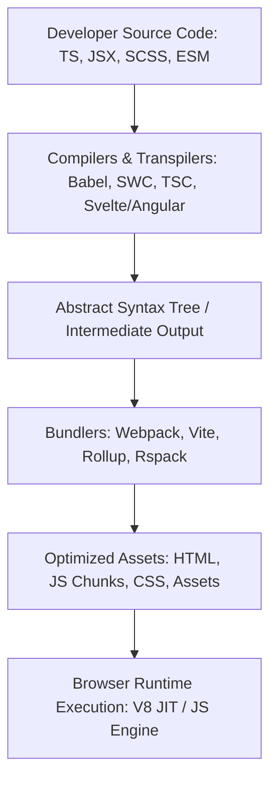
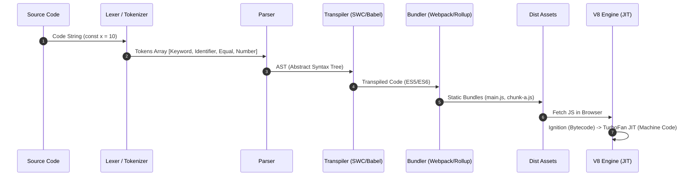

# 📦 Build Tools & Compilers — Bundlers, Webpack, JIT, AOT & Modern Tooling

> "Build tools and compilers bridge the gap between developer productivity (TypeScript, JSX, Modern ESNext) and browser execution efficiency (Minified JavaScript, Bytecode, Static Assets)."

---

## 📂 Cấu Trúc Thư Mục

| File | Nội dung | Level |
| :--- | :--- | :--- |
| 📑 [`README.md`](./README.md) | Tổng quan kiến trúc Build & Compiler, Ma trận quyết định (Decision Matrix) & Pipeline tổng thể | ⭐ Mid |
| ⚡ [`compilers-jit-aot.md`](./compilers-jit-aot.md) | Lexer/Parser, AST, JIT (V8 TurboFan/Ignition, Inline Cache, Deopt) vs AOT (Angular, Svelte) & Transpilers (Babel vs SWC) | ⭐⭐⭐ Senior |
| 🛠️ [`bundlers-webpack-vite.md`](./bundlers-webpack-vite.md) | Bundling internals, Webpack (Tapable, Loaders/Plugins, SplitChunks, HMR, Module Federation) vs Modern Bundlers (Vite/Rollup, esbuild), Tree-shaking | ⭐⭐⭐ Senior |
| 🎯 [`interviews.md`](./interviews.md) | 25+ Câu hỏi phỏng vấn phân cấp & 3 Tình huống thiết kế thực tế dành cho Senior / Architect | ⭐⭐⭐ Senior |

---

## 1. Khái Niệm Chính & Vai Trò Trong Frontend Modern Stack

Trong hệ sinh thái Frontend hiện đại, ứng dụng không còn được viết trực tiếp dưới dạng tập tin JavaScript đơn lẻ chạy thẳng trên trình duyệt. Thay vào đó, quy trình xây dựng phần mềm bao gồm hai giai đoạn cốt lõi:

### 1.1 Compilers & Transpilers (Trình biên dịch & Chuyển dịch)
- **Nhiệm vụ:** Biến đổi cú pháp lập trình cao cấp (TypeScript, JSX, Vue/Svelte SFC, ESNext) thành cú pháp JavaScript tiêu chuẩn mà môi trường đích (trình duyệt hoặc Node.js) có thể hiểu và thực thi.
- **Biên dịch AOT (Ahead-Of-Time):** Xảy ra ở bước **build-time** trên máy lập trình viên hoặc CI/CD server trước khi ứng dụng chạy.
- **Biên dịch JIT (Just-In-Time):** Xảy ra ở **runtime** trực tiếp ngay trên JS Engine của trình duyệt (ví dụ: V8 của Chrome/Node.js, JavaScriptCore của Safari).

### 1.2 Bundlers (Trình đóng gói)
- **Nhiệm vụ:** Phân tích đồ thị phụ thuộc (**Dependency Graph**) của toàn bộ dự án từ các câu lệnh `import` / `require`, gom nhóm (bundle) hàng nghìn file thành các file đầu ra (bundles/chunks) tối ưu để truyền tải qua mạng hiệu quả.
- **Tính năng nâng cao:** Tree-shaking (loại bỏ code dư thừa), Code Splitting (chia nhỏ file tải theo nhu cầu), Hot Module Replacement (HMR - cập nhật module nóng không cần reload lại trang).

---

## 2. Ma Trận Quyết Định (Decision Matrix) Chọn Build Tooling

Dưới đây là ma trận so sánh các công cụ Build & Bundler phổ biến trong ngành:

| Tiêu chí | Webpack 5 | Vite (Rollup + esbuild) | Rspack | esbuild | SWC |
| :--- | :--- | :--- | :--- | :--- | :--- |
| **Ngôn ngữ viết Tool** | JavaScript (Node.js) | JS (Dev) + Go (esbuild) + JS (Rollup) | Rust | Go | Rust |
| **Tốc độ Build** | Trung bình / Chậm | Cực nhanh (Dev), Nhanh (Prod) | Siêu nhanh | Siêu nhanh (Gấp 10-100x JS) | Siêu nhanh |
| **Hệ sinh thái Plugins** | Khổng lồ (Lâu đời nhất) | Rất lớn (Rollup ecosystem) | Tương thích Webpack plugin | Hạn chế | Hạn chế |
| **Dev Server Concept** | Bundle toàn bộ app vào memory | Native ESM (No bundle dev server) | Webpack-compatible HMR | Basic dev server | N/A (Compiler only) |
| **Khả năng Tùy biến** | Thâm sâu, bất kỳ use-case nào | Cao, cấu hình gọn gàng | Rất cao (Tương thích Webpack) | Thấp (Ưu tiên speed over features) | Trung bình |
| **Use-case Phù hợp** | Enterprise legacy, Micro Frontends phức tạp | Dự án SPA mới (React, Vue, Svelte) | Thay thế Webpack cho app lớn | Build tool phụ, CLI, Bundler siêu nhanh | Thay thế Babel/TSC compiler |

---

## 3. Tổng Quan Pipeline Biên Dịch & Đóng Gói (Build Pipeline)

Một quy trình build từ source code đến file thực thi trên trình duyệt trải qua các giai đoạn nghiêm ngặt sau:

1. **Lexical Analysis (Tokenizer):** Đọc chuỗi ký tự nguồn và phân tích thành danh sách các token (từ khóa, định danh, toán tử).
2. **Syntactic Analysis (Parsing):** Dựng danh sách token thành cây cú pháp trừu tượng **AST (Abstract Syntax Tree)** đại diện cho cấu trúc ngữ nghĩa của chương trình.
3. **AST Transformation (Transpilation):** Các plugin (Babel/SWC) duyệt cây AST để biến đổi các cú pháp mới thành cú pháp tương thích cũ (ví dụ: JSX → `React.createElement`, Optional Chaining `a?.b` → `a && a.b`).
4. **Dependency Resolution & Bundling:** Bundler đi từ file entry (`index.js`), phân tích `import`, xây dựng đồ thị phụ thuộc (Dependency Graph), áp dụng Loaders & Plugins, thực hiện Tree-shaking và chia nhỏ chunk.
5. **Runtime JIT Compilation:** Khi trình duyệt nhận file JS, JS Engine (như V8) dùng bộ thông dịch **Ignition** để tạo Bytecode chạy ngay lập tức, sau đó bộ biên dịch tối ưu **TurboFan** sẽ JIT-compile các vùng code "nóng" (hot code) thành **Machine Code** native của CPU.

---

## 4. Liên Kết Chéo & Roadmap Học Tập

- Muốn tìm hiểu sâu về cách V8 quản lý bộ nhớ, Hidden Classes và tránh Deoptimization? Xem ⚡ [`compilers-jit-aot.md`](./compilers-jit-aot.md).
- Muốn làm chủ cấu hình Webpack, cơ chế HMR, Module Federation và tối ưu Bundle Size? Xem 🛠️ [`bundlers-webpack-vite.md`](./bundlers-webpack-vite.md).
- Muốn chuẩn bị cho câu hỏi phỏng vấn Senior/Architect về chủ đề Build & Performance? Xem 🎯 [`interviews.md`](./interviews.md).
