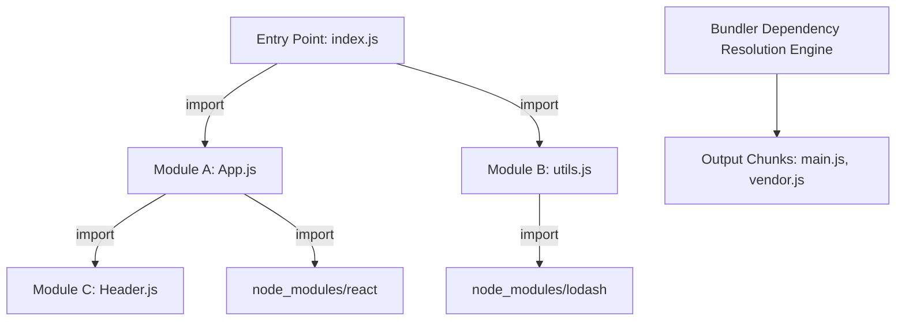
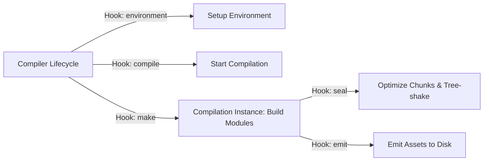
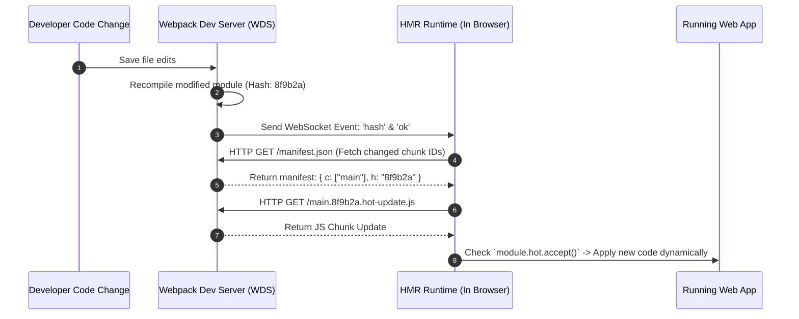
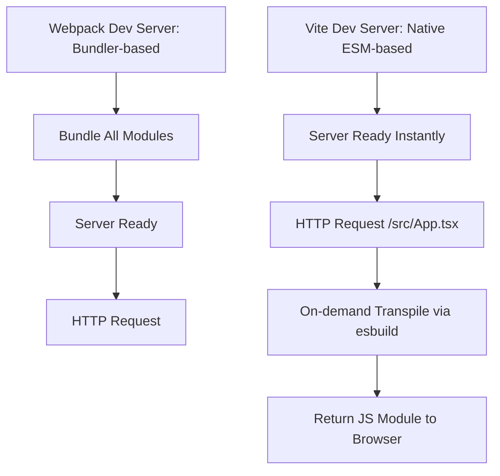

# 🛠️ Bundlers, Webpack & Modern Build Tooling

> "A modern bundler is not just a file concatenator — it is a sophisticated module graph engine, dependency optimizer, code splitter, and runtime assets orchestrator."

---

## 1. Bản Chất Của Bundling & Dependency Graph Resolution

Khi trình duyệt chưa hỗ trợ ES Modules (ESM), việc gửi hàng trăm file `.js` riêng lẻ qua giao thức HTTP/1.1 sẽ gây nghẽn nghiêm trọng (HTTP head-of-line blocking). Nhiệm vụ cốt lõi của **Bundler** là xây dựng **Dependency Graph (Đồ thị phụ thuộc)** và gom nhóm chúng.



### Thuật toán Xây Dựng Dependency Graph:
1. **Resolution:** Bắt đầu từ file Entry (`index.js`), dùng **Enhanced-Resolve** để xác định đường dẫn tuyệt đối của từng file được `import`.
2. **Parsing:** Đọc mã nguồn file, gọi Compiler/Loader để dịch về JS tiêu chuẩn, sau đó parse sang AST để tìm tất cả các câu lệnh `import` / `export` / `require`.
3. **Graph Construction:** Thêm file vào danh sách các node của Module Graph và tiếp tục đệ quy (BFS/DFS) cho các dependencies con.
4. **Chunk Optimization:** Phân nhóm các Module Node thành các tập hợp lớn hơn gọi là **Chunks** dựa trên các quy tắc cấu hình (Code Splitting).

---

## 2. Webpack Deep Dive: Kiến Trúc & Cơ Cơ Cấu Hoạt Động

Webpack là bundler phổ biến và thâm sâu nhất trong hệ sinh thái Frontend.

### 2.1 Tapable Architecture (Event-Driven Plugin System)
Toàn bộ kiến trúc Webpack được dựng trên thư viện **Tapable** — một hệ thống Pub/Sub chuyên dụng cho phép các plugin "cắm" (tap) vào bất kỳ giai đoạn nào của quá trình build.



---

### 2.2 Loaders vs Plugins: Phân Biệt & Cách Viết Custom

| Tiêu chí | Loaders | Plugins |
| :--- | :--- | :--- |
| **Vai trò** | Chuyển đổi mã nguồn của **từng file đơn lẻ** (File-level Transformer) | Tác động vào **toàn bộ quy trình build** (Build-level Pipeline Transformer) |
| **Đầu vào / Đầu ra** | Nhận chuỗi String/Buffer file gốc $\rightarrow$ Trả về String JS | Can thiệp vào các Lifecycle Hooks của Compiler & Compilation |
| **Giai đoạn hoạt động** | Trước khi dựng Module Graph | Trong và sau khi dựng Module Graph (Optimize, Emit) |
| **Ví dụ phổ biến** | `babel-loader`, `css-loader`, `sass-loader`, `ts-loader` | `HtmlWebpackPlugin`, `MiniCssExtractPlugin`, `DefinePlugin` |

#### 💻 Code Lab 1: Viết Custom Webpack Loader (Chuyển đổi file `.txt` thành JS module)
```javascript
// my-custom-loader.js
module.exports = function (source) {
  // `source` là nội dung thô của file được import
  const json = JSON.stringify(source)
    .replace(/\u2028/g, '\\u2028')
    .replace(/\u2029/g, '\\u2029');
    
  // Trả về mã JavaScript hợp lệ
  return `export default ${json};`;
};
```

#### 💻 Code Lab 2: Viết Custom Webpack Plugin (Tạo file log danh sách bundle output)
```javascript
// BundleLoggerPlugin.js
class BundleLoggerPlugin {
  constructor(options = {}) {
    this.options = options;
  }

  apply(compiler) {
    // Tap vào hook 'emit' ngay trước khi ghi file ra đĩa
    compiler.hooks.emit.tapAsync('BundleLoggerPlugin', (compilation, callback) => {
      let fileList = '# Generated Bundles:\n\n';

      // Duyệt qua tất cả các file assets sắp xuất ra
      for (let filename in compilation.assets) {
        const size = compilation.assets[filename].size();
        fileList += `- ${filename} (${(size / 1024).toFixed(2)} KB)\n`;
      }

      // Tạo một asset mới đẩy vào compilation
      compilation.assets['bundle-report.md'] = {
        source: () => fileList,
        size: () => fileList.length
      };

      callback(); // Tiếp tục pipeline
    });
  }
}

module.exports = BundleLoggerPlugin;
```

---

### 2.3 Code Splitting & SplitChunksPlugin Strategy

Nếu không chia nhỏ code, toàn bộ mã nguồn app + thư viện bên thứ 3 (React, Lodash, Chart.js) sẽ bị dồn vào file `main.js` nặng hàng Megabyte.

#### Các Cơ Chế Code Splitting:
1. **Entry Points:** Cấu hình thủ công nhiều file đầu vào trong `webpack.config.js`.
2. **Dynamic Imports (`import()` syntax):** Tách chunk tự động tại điểm gọi hàm.

```javascript
// Static import: Bắt buộc gộp vào main bundle
// import { HeavyChart } from './HeavyChart';

// Dynamic import: Webpack tự động tách HeavyChart thành file chunk riêng (async chunk)
button.addEventListener('click', () => {
  import(/* webpackChunkName: "heavy-chart" */ './HeavyChart')
    .then(({ HeavyChart }) => {
      HeavyChart.render();
    });
});
```

3. **`SplitChunksPlugin` Configuration:** Tối ưu hoá việc tách `node_modules` (Vendor chunk).

```javascript
// webpack.config.js
module.exports = {
  optimization: {
    splitChunks: {
      chunks: 'all', // Áp dụng cho cả sync và async chunks
      minSize: 20000, // Kích thước tối thiểu để tách chunk (20KB)
      maxInitialRequests: 30, // Tối đa số request HTTP tải song song lúc load trang
      cacheGroups: {
        defaultVendors: {
          test: /[\\/]node_modules[\\/]/,
          name: 'vendors',
          priority: -10,
          reuseExistingChunk: true,
        },
        reactVendor: {
          test: /[\\/]node_modules[\\/](react|react-dom)[\\/]/,
          name: 'vendor-react',
          priority: 10, // Ưu tiên cao hơn để tách React ra file riêng
        }
      }
    }
  }
};
```

---

### 2.4 HMR (Hot Module Replacement) Internals

HMR cho phép cập nhật ứng dụng khi sửa code ở môi trường dev **ngay lập tức** mà không mất đi state hiện tại của UI trên trình duyệt.



If `module.hot.accept()` is missing in the component chain, HMR **falls back** to a full page reload (`window.location.reload()`).

---

## 3. Webpack vs Modern Bundlers (Vite, Rollup, Rspack)

### 3.1 Vite: Kiến Trúc Dev Server Dựa Trên Native ESM

Khác với Webpack phải bundle toàn bộ ứng dụng trước khi dev server lắng nghe request, **Vite** lợi dụng tính năng **Native ES Modules (`<script type="module">`)** của các trình duyệt hiện đại.



- **In Dev:** Vite không bundle code app. Trình duyệt gửi request HTTP cho từng file module khi cần (On-demand). Vite dùng **esbuild** để transpile file TypeScript/JSX siêu nhanh trong vài miligiây.
- **In Production:** Vite dùng **Rollup** để đóng gói code thành các production bundles được tối ưu sâu về tree-shaking và code-splitting.

### 3.2 Rspack & Turbopack: Rust-based Webpack Replacements
- **Rspack (by ByteDance):** Được thiết kế với kiến trúc và API tương thích 99% với Webpack nhưng được viết hoàn toàn bằng **Rust**. Giúp các ứng dụng Enterprise Webpack lớn tăng tốc độ build từ 10 phút xuống vài giây mà không cần viết lại file config.
- **Turbopack (by Vercel):** Công cụ đóng gói mã nguồn thế hệ mới dành cho Next.js, viết bằng Rust, tối ưu hóa dựa trên cơ chế caching hàm (Incremental Computation Engine).

---

## 4. Tree-Shaking & Scope Hoisting

### 4.1 Tree-Shaking vs Dead Code Elimination (DCE)

- **Dead Code Elimination (DCE):** Thuật toán loại bỏ các đoạn code không thể với tới (unreachable code) ví dụ: `if (false) { ... }`.
- **Tree-Shaking:** Kỹ thuật loại bỏ các **module export không được sử dụng** dựa trên phân tích tĩnh (**Static Analysis**) đồ thị `import`/`export` của ES Modules.

```javascript
// math.js
export function add(a, b) { return a + b; }
export function multiply(a, b) { return a * b; } // Unused export

// app.js
import { add } from './math.js';
console.log(add(2, 3));

// Code sau khi Tree-Shake: Hàm `multiply` hoàn toàn bị xóa bỏ khỏi bundle cuối!
```

> ⚠️ **Tại sao CommonJS (`require`/`module.exports`) KHÔNG THỂ Tree-Shake hiệu quả?**
> Đòn bẩy của CommonJS mang tính chất động (Dynamic). Bạn có thể viết `require('./' + variableName)` hoặc `if (condition) require(...)`. Bundler không thể phân tích tĩnh ở build-time mà phải đợi runtime, do đó không thể loại bỏ code thừa an toàn.

---

### 4.2 Cấu Hình `sideEffects: false` Trong `package.json`

Có những file khi import không export bất kỳ hàm nào nhưng vẫn thực hiện hành động toàn cục (ví dụ: `import './global.css'`, `import 'core-js/polyfills'`). Đây gọi là **Side Effects**.

Khi bạn khai báo trong `package.json`:
```json
{
  "name": "my-library",
  "sideEffects": false
}
```
Bạn báo cho Webpack/Vite biết: *"Tất cả các file trong thư viện này hoàn toàn thuần khiết (Pure). Nếu app không xài biến export từ file nào, Webpack cứ mạnh tay xóa bỏ cả file đó khỏi bundle!"*

Nếu dự án có chứa CSS imports, cần khai báo cụ thể:
```json
{
  "sideEffects": ["*.css", "*.scss"]
}
```

---

### 4.3 Scope Hoisting (ModuleConcatenationPlugin)

Mặc định, Webpack bọc mỗi module trong một Closure Function riêng dạng:
```javascript
// Webpack default: Tốn bộ nhớ và chậm runtime do nhiều function scope
(function(module, __webpack_exports__, __webpack_require__) {
  // module code
})
```

**Scope Hoisting** phân tích đồ thị phụ thuộc và "hoist" (kéo) tất cả các module vào **một Function Scope duy nhất**.
- **Lợi ích:** Giảm bớt overhead tạo function scope, giảm kích thước file sau khi minified, giúp V8 engine thực thi JS nhanh hơn.
