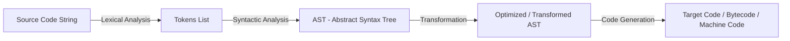
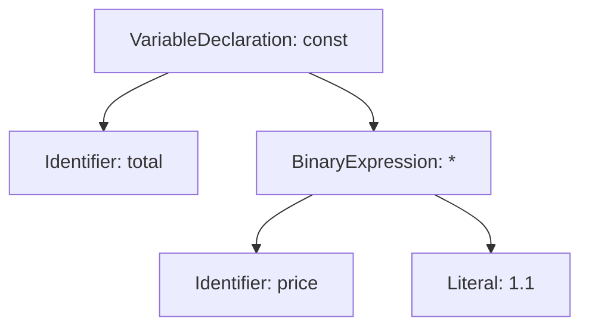
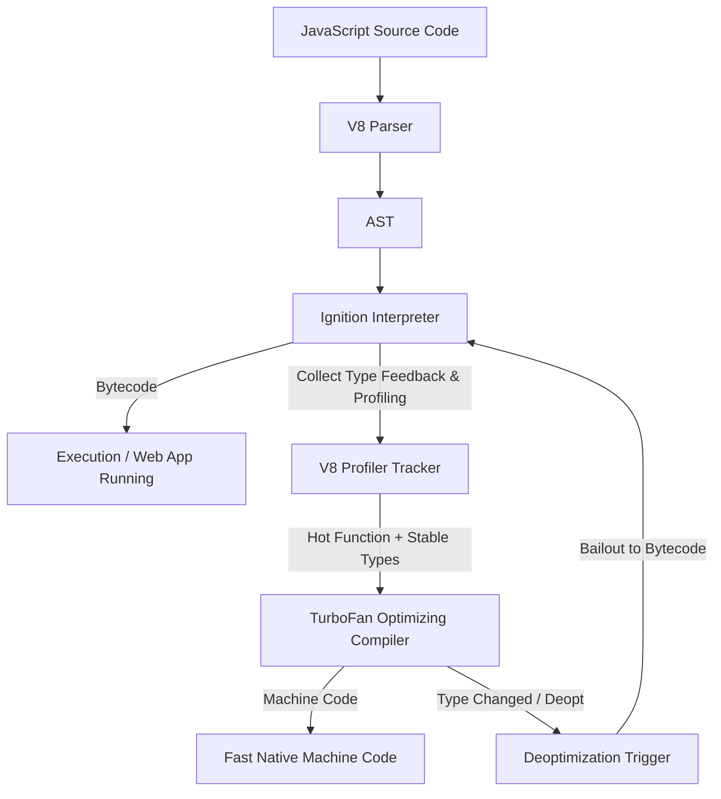
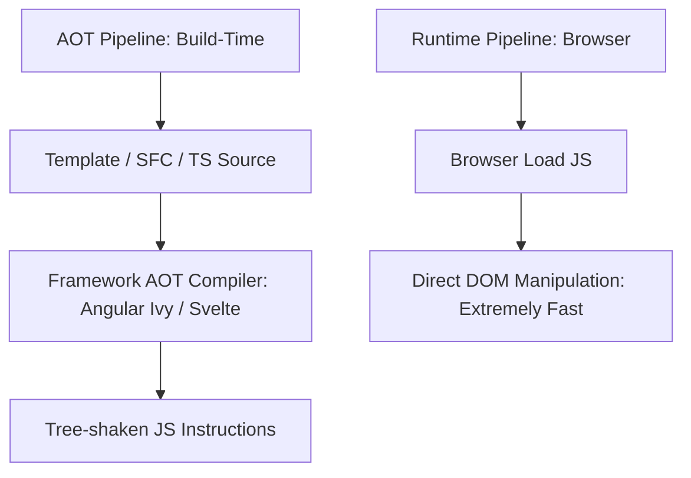
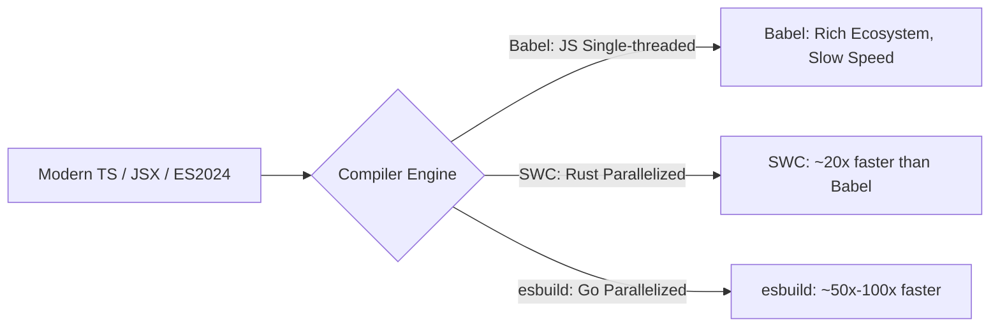

# ⚡ Compilers, JIT & AOT Internals

> "Understanding how JS engines compile code at runtime (JIT) and how modern frameworks transform code at build-time (AOT) is the boundary between writing code that just works and writing software optimized for maximum performance."

---

## 1. Nguyên Lý Cốt Lõi Của Compiler Trong Frontend

Một trình biên dịch (**Compiler**) về bản chất là một chương trình chuyển đổi mã nguồn từ ngôn ngữ này (Source Language) sang một ngôn ngữ khác (Target Language). Trong Frontend, pipeline biên dịch luôn trải qua 3 giai đoạn chính:



### 1.1 Lexical Analysis (Phân tích từ vựng - Lexer / Tokenizer)
Lexer đọc luồng ký tự mã nguồn (string) và gom chúng thành các đơn vị ý nghĩa nhỏ nhất gọi là **Tokens**.
- *Ví dụ code:* `const total = price * 1.1;`
- *Tokens thu được:* `[Keyword: const]`, `[Identifier: total]`, `[Operator: =]`, `[Identifier: price]`, `[Operator: *]`, `[Number: 1.1]`, `[Punctuation: ;]`.

### 1.2 Syntactic Analysis (Phân tích cú pháp - Parser & AST)
Parser lấy danh sách tokens và xây dựng cây cú pháp trừu tượng **AST (Abstract Syntax Tree)** theo ngữ pháp của ngôn ngữ.



### 1.3 Transformation & Code Generation
- **Transformation:** Các công cụ như Babel, SWC duyệt cây AST để thêm, sửa, xoá nút (ví dụ: chuyển đổi `const` thành `var`, biến đổi JSX `<h1>Hi</h1>` thành `React.createElement('h1', null, 'Hi')`).
- **Code Generation:** Duyệt cây AST đã biến đổi để xuất ra chuỗi mã nguồn mới (Source String) hoặc Bytecode/Machine Code.

---

## 2. JIT (Just-In-Time) Compilation Trong V8 Engine

JavaScript ban đầu là một ngôn ngữ **Interpreted** (thông dịch thuần túy: đọc dòng nào chạy dòng đó, chạy chậm). Các JS Engine hiện đại (Chrome V8, Firefox SpiderMonkey, Safari JavaScriptCore) áp dụng mô hình **JIT Compilation** — kết hợp giữa Interpreter và Compiler để đạt tốc độ tối đa ngay khi runtime.

### 2.1 Kiến Trúc V8: Ignition Interpreter & TurboFan Compiler



1. **Ignition (Interpreter):** Dịch AST thành **Bytecode** nhỏ gọn và khởi chạy ngay lập tức. Giúp thời gian khởi động (Startup Time / TTI) cực nhanh.
2. **Profiler Tracker:** Theo dõi tần suất gọi hàm (Hotspots) và thu thập thông tin kiểu dữ liệu runtime (**Type Feedback**).
3. **TurboFan (Optimizing Compiler):** Khi một hàm được gọi đủ nhiều (trở thành "Hot Function") và kiểu tham số đầu vào ổn định, TurboFan lấy Bytecode + Type Feedback để biên dịch thẳng thành **Machine Code** tối ưu dành riêng cho CPU.
4. **Deoptimization (Deopt):** Nếu hàm "hot" đột ngột nhận vào một kiểu dữ liệu mới không đúng giả định ban đầu, V8 hủy bỏ Machine Code và **bailout** quay lại chạy Bytecode ở Ignition.

---

### 2.2 Inline Caching (IC) & Hidden Classes (Shapes)

Do JavaScript là ngôn ngữ động (Dynamic Type), việc truy cập thuộc tính object `obj.x` mặc định tốn kém vì phải tìm kiếm trong chuỗi prototype (prototype chain lookup). V8 giải quyết bằng hai kỹ thuật tiên tiến:

#### A. Hidden Classes (Shapes / Maps)
Khi tạo một object, V8 gán cho nó một **Hidden Class** để lưu trữ offset vị trí của các thuộc tính trong bộ nhớ.

```javascript
// Cùng khởi tạo thuộc tính x, y theo đúng thứ tự -> Cùng chung Hidden Class (Shape A)
class Point {
  constructor(x, y) {
    this.x = x; // Shape A (offset 0: x)
    this.y = y; // Shape B (offset 0: x, offset 1: y)
  }
}
const p1 = new Point(1, 2); // Hidden Class B
const p2 = new Point(3, 4); // Hidden Class B (Dùng chung với p1!)
```

#### B. Trạng Thái Của Inline Caching (IC)
Inline Cache ghi nhớ vị trí lưu trữ thuộc tính của các Hidden Class đã gặp tại câu lệnh truy cập:

1. **Monomorphic IC (Tối ưu nhất):** Câu lệnh chỉ gặp 1 loại Hidden Class duy nhất. V8 generate ra machine code 1 bước truy cập thẳng bộ nhớ offset $O(1)$.
2. **Polymorphic IC (Tương đối tốt):** Câu lệnh gặp từ 2 đến 4 Hidden Classes khác nhau. V8 kiểm tra nhanh trong một danh sách nhỏ dạng `switch-case`.
3. **Megamorphic IC (Chậm - Anti-pattern):** Câu lệnh gặp quá 4 Hidden Classes khác nhau. V8 từ bỏ tối ưu Inline Cache và quay lại tìm kiếm thuộc tính toàn cục (Slow Lookups).

---

### 2.3 Code Lab: Nguyên Nhân & Cách Tránh Deoptimization Trong V8

#### ❌ Lỗi 1: Làm biến đổi Shape của Object (Dynamic Property Addition)
```javascript
// BAD: Thêm thuộc tính ngẫu nhiên sau khi khởi tạo làm vỡ Hidden Class
function createUser(name, age) {
  this.name = name;
  this.age = age;
}

const user1 = new createUser("Alice", 25);
const user2 = new createUser("Bob", 30);

user2.isAdmin = true; // ⚠️ V8 phải xé rào tạo Hidden Class mới cho user2! 
                      // Mất tính Monomorphic ở tất cả các hàm nhận `user`
```

```javascript
// GOOD: Khởi tạo đầy đủ tất cả thuộc tính ngay trong Constructor/Object Literal
function createUser(name, age, isAdmin = false) {
  this.name = name;
  this.age = age;
  this.isAdmin = isAdmin; // Khởi tạo cố định từ đầu
}
```

#### ❌ Lỗi 2: Hàm nhận tham số với kiểu dữ liệu không ổn định (Polymorphic / Megamorphic Call Site)
```javascript
// BAD: Kích hoạt Deopt trong TurboFan vì thay đổi kiểu dữ liệu
function add(a, b) {
  return a + b;
}

// Gọi 10,000 lần với kiểu Number -> TurboFan compile thành Machine Code cộng số nguyên
for (let i = 0; i < 10000; i++) add(i, i);

// Đột ngột truyền String vào -> TurboFan phát hiện vi phạm giả định (Speculation Failure)
// Trigger DEOPTIMIZATION -> Quay về Ignition Bytecode!
add("Hello ", "World");
```

---

## 3. AOT (Ahead-Of-Time) Compilation Trong Modern Frameworks

Ngược lại với JIT xảy ra ở runtime, **AOT Compilation** thực hiện toàn bộ quá trình phân tích, tối ưu và chuyển đổi mã nguồn ngay tại thời điểm **build-time**.



### 3.1 Angular Ivy AOT Compiler
Trong Angular cổ điển (View Engine JIT), trình duyệt phải tải nguyên thư viện Compiler của Angular (khoảng vài trăm KB) về trình duyệt để parse HTML template tại runtime.

Với **Ivy AOT Compiler**:
- **Locality Principle:** Mỗi component được biên dịch độc lập chỉ dựa vào thông tin của chính nó và Decorator `@Component`.
- **Template to DOM Instructions:** HTML template được dịch thẳng thành mã JavaScript thuần chứa các lệnh gọi DOM trực tiếp (`elementStart`, `text`, `elementEnd`).
- **Kết quả:** Loại bỏ hoàn toàn Angular Compiler khỏi production bundle, giúp bundle size nhỏ gọn và thời gian hiển thị đầu tiên (FCP) cực nhanh.

### 3.2 Svelte AOT Compiler (Compile Away The Framework)
Svelte là minh chứng rõ nhất cho triết lý **AOT Reactivity**:
- Svelte không hề có Virtual DOM hay thư viện runtime nặng nề shipped tới browser.
- Svelte Compiler xem ứng dụng như một ngôn ngữ DSL và biên dịch các đoạn mã reactive `$: double = count * 2` thành code JavaScript imperative thao tác chính xác vào node DOM cần update:

```javascript
// Code Svelte gốc
// <button on:click={increment}>{count}</button>

// Code sau khi Svelte AOT Compiler biên dịch out:
function create_fragment(ctx) {
  let button, t;
  return {
    c() { // Create
      button = element("button");
      t = text(ctx[0]); // count value
    },
    m(target, anchor) { // Mount
      insert(target, button, anchor);
      append(button, t);
      listen(button, "click", ctx[1]);
    },
    p(ctx, [dirty]) { // Patch (Reactive Update)
      if (dirty & 1) set_data(t, ctx[0]); // Chỉ update đúng node text t!
    }
  };
}
```

---

## 4. Transpilation Tools: Babel vs SWC vs esbuild

Chuyển dịch mã nguồn (Transpilation) là một dạng đặc biệt của AOT Compiler, biến đổi mã từ ESNext/TypeScript/JSX về ES5/ES6.



### So Sánh Chi Tiết Các Compiler Engines

| Tiêu chí | Babel | SWC (Speedy Web Compiler) | esbuild |
| :--- | :--- | :--- | :--- |
| **Ngôn ngữ phát triển** | JavaScript (Node.js) | Rust | Go |
| **Kiến trúc luồng** | Single-threaded | Multi-threaded (Rayon/Rust concurrency) | Multi-threaded (Go Goroutines & Memory sharing) |
| **Tốc độ Transpile** | 1x (Chuẩn cơ sở) | ~20x - 40x Babel | ~50x - 100x Babel |
| **Hỗ trợ Plugins Custom** | Rất dễ (Babel AST plugin ecosystem) | Hỗ trợ qua Rust / WASM plugins | Rất hạn chế (Chỉ có Go API hoặc JS wrappers) |
| **Tích hợp thực tế** | Webpack cổ điển, CRA | Next.js (Default compiler), Vite (SWC plugin) | Vite (Dev transpile), Remix, Tsup |

---

## 5. Bảng So Sánh Tổng Hợp: JIT vs AOT

| Tiêu chí | JIT (Just-In-Time) | AOT (Ahead-Of-Time) |
| :--- | :--- | :--- |
| **Thời điểm biên dịch** | Runtime trên thiết bị người dùng | Build-time trên CI/CD hoặc máy Dev |
| **Thời gian khởi động (Startup)** | Chậm hơn (do vừa nạp vừa dịch Bytecode/Machine code) | Cực nhanh (Mã JS/Machine Code đã sẵn sàng) |
| **Tối ưu hóa Peak Performance** | **Cực cao** (Nhờ thông tin Type Feedback & Profiling thực tế) | Trung bình (Tối ưu hóa theo phỏng đoán tĩnh - Static Analysis) |
| **Tải trọng bộ nhớ (Memory Overhead)** | Cao (Cần lưu Interpreter, Compiler, Bytecode & Profiler Data) | Thấp (Chỉ chứa code thực thi đã đóng gói) |
| **Kích thước Bundle Size** | Lớn hơn nếu phải ship kèm runtime compiler | Nhỏ hơn (Đã tree-shake và loại bỏ Compiler engine) |
| **Phát hiện lỗi (Error Detection)** | Xảy ra khi code chạy đến (Runtime errors) | Phát hiện ngay khi build (Build-time type-check/syntax errors) |
| **Đại diện tiêu biểu** | V8 Engine (Chrome/Node.js), SpiderMonkey | Angular Ivy Compiler, Svelte, SWC, TSC |
