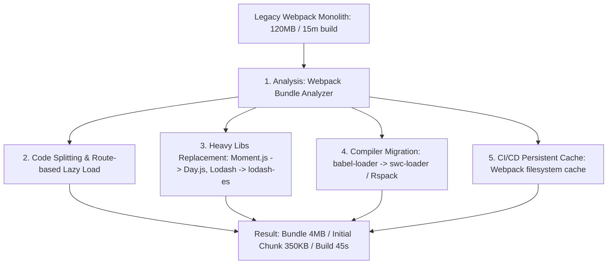
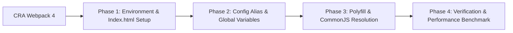

# 🎯 Q&A Phỏng Vấn Build Tools, Compilers & Webpack

---

## 1. Câu Hỏi Phân Cấp Khái Niệm (Concepts Q&A)

### 🟢 Junior Level

#### Q1: Trình biên dịch (Compiler), Trình chuyển dịch (Transpiler) và Trình đóng gói (Bundler) khác nhau thế nào?
- **Answer:**
  - **Compiler:** Biến đổi mã nguồn từ ngôn ngữ này sang ngôn ngữ khác hoặc Bytecode/Machine Code (ví dụ: TypeScript Compiler `tsc` dịch TS $\rightarrow$ JS).
  - **Transpiler (Source-to-Source Compiler):** Dạng đặc biệt của Compiler dịch mã ở cùng cấp độ ngôn ngữ (ví dụ: Babel dịch ES2024 $\rightarrow$ ES5).
  - **Bundler:** Phân tích `import`/`export` để gom hàng nghìn file riêng lẻ thành các bundles/chunks tối ưu để truyền tải qua mạng (ví dụ: Webpack, Rollup).

#### Q2: Loader và Plugin trong Webpack khác nhau ở điểm nào?
- **Answer:**
  - **Loader:** Biến đổi nội dung của **từng file riêng lẻ** trước hoặc trong khi dựng Module Graph (ví dụ: dịch SCSS $\rightarrow$ CSS, JSX $\rightarrow$ JS).
  - **Plugin:** Can thiệp vào **toàn bộ vòng đời build** của Compiler và Compilation qua hệ thống Tapable Hooks (ví dụ: tối ưu chunk, minified code, inject script tag vào HTML).

#### Q3: Source Maps là gì? Có nên deploy Source Maps lên môi trường Production không?
- **Answer:**
  - Source Map (`.map` file) là file bản đồ ánh xạ từ mã đã bị nén/transpile (minified JS) quay trở lại mã nguồn gốc (TypeScript/JSX) giúp lập trình viên debug dễ dàng trên DevTools.
  - **Production Strategy:** Không nên công khai file `.map` trực tiếp lên server (dễ bị lộ mã nguồn gốc). Giải pháp Senior: Cấu hình `hidden-source-map` (vẫn tạo `.map` nhưng không inject URL comment vào file JS) để gửi log error về các công cụ theo dõi lỗi như Sentry.

---

### 🟡 Middle Level

#### Q4: Phân biệt cơ chế biên dịch JIT (Just-In-Time) và AOT (Ahead-Of-Time)?
- **Answer:**
  - **JIT:** Biên dịch diễn ra tại **runtime** ngay trên trình duyệt (ví dụ: V8 Engine). Có ưu điểm khởi động cực nhanh bằng Interpreter (Ignition) và tối ưu hóa cực đại mã "hot" bằng TurboFan nhờ Type Feedback thực tế. Nhược điểm: Tốn bộ nhớ CPU trình duyệt và nguy cơ bị Deoptimization.
  - **AOT:** Biên dịch diễn ra tại **build-time** trên CI/CD server trước khi app chạy (ví dụ: Angular Ivy, Svelte). Ưu điểm: Loại bỏ compiler khỏi production bundle, khởi động giao diện nhanh, phát hiện lỗi cú pháp/type sớm. Nhược điểm: Thời gian build CI/CD lâu hơn.

#### Q5: Tại sao Vite chạy Dev Server nhanh hơn Webpack hàng chục lần?
- **Answer:**
  - **Webpack Dev Server:** Phải phân tích đồ thị phụ thuộc và **bundle toàn bộ ứng dụng** vào bộ nhớ trước khi sẵn sàng phục vụ HTTP request. Khi sửa 1 file, Webpack phải re-bundle các chunk liên quan.
  - **Vite Dev Server:** Không thực hiện bundle ở môi trường dev. Vite tận dụng **Native ES Modules (`<script type="module">`)** của trình duyệt. Trình duyệt request file nào, Vite dùng **esbuild** (viết bằng Go) transpile file đó on-demand tức thì.

#### Q6: Tại sao các thư viện dùng CommonJS (`require`) lại khó Tree-Shaking hơn ES Modules (`import`/`export`)?
- **Answer:**
  - ES Modules có cấu trúc **tĩnh (Static Structure)**. Các câu lệnh `import` và `export` bắt buộc phải nằm ở top-level của file, không nằm trong `if/else`. Bundler có thể phân tích cây AST ở build-time mà không cần chạy mã.
  - CommonJS có cấu trúc **động (Dynamic Structure)**. Bạn có thể gọi `require('./' + variable)` hoặc đặt `require` trong câu lệnh điều kiện. Bundler không thể biết trước module nào thực sự được gọi nếu không thực thi mã.

#### Q7: Giải thích cơ chế Hot Module Replacement (HMR) trong Webpack?
- **Answer:**
  1. Khi dev lưu file, Webpack Dev Server biên dịch lại các module bị sửa và phát tín hiệu qua kết nối **WebSocket** tới HMR Runtime ở trình duyệt kèm theo `hash` mới.
  2. HMR Runtime gửi request HTTP đến server lấy file `manifest.json` và chunk cập nhật (`.hot-update.js`).
  3. Runtime kiểm tra cây phụ thuộc module: Nếu module có khai báo `module.hot.accept()`, runtime thay thế hàm của module mới vào bộ nhớ và chạy callback để cập nhật UI mà **không làm reload toàn bộ trang**.

---

### 🔴 Senior & Architect Level

#### Q8: V8 Engine bị Deoptimization (Deopt) khi nào? Viết code minh họa cách tránh?
- **Answer:**
  - Deopt xảy ra khi bộ biên dịch tối ưu **TurboFan** đã phát sinh Machine Code dựa trên giả định kiểu dữ liệu ổn định (Monomorphic IC), nhưng tại runtime tham số truyền vào đột ngột bị đổi kiểu (Polymorphic/Megamorphic) hoặc thuộc tính của Object bị thay đổi thứ tự (Hidden Class bị vỡ).
  - *Ví dụ tránh Deopt:*

```javascript
// ❌ BAD: Thay đổi Hidden Class liên tục
function Point(x, y) {
  this.x = x;
  this.y = y;
}
const p1 = new Point(1, 2);
p1.z = 3; // ⚠️ V8 phải đẻ Hidden Class mới -> Deopt!

// ✅ GOOD: Giữ Hidden Class cố định
class Point {
  constructor(x, y, z = null) {
    this.x = x;
    this.y = y;
    this.z = z; // Khởi tạo từ đầu
  }
}
```

#### Q9: Tệp `package.json` có trường `"sideEffects": false` mang ý nghĩa gì trong Tree-Shaking?
- **Answer:**
  - Trường này báo cho Bundler biết toàn bộ mã nguồn trong gói npm đó không chứa tác dụng phụ toàn cục (không sửa `window`, không đụng DOM toàn cục khi import).
  - Nếu một file được import nhưng ứng dụng không trực tiếp sử dụng bất kỳ biến `export` nào từ file đó, Bundler được phép **loại bỏ hoàn toàn toàn bộ file đó** khỏi bundle xuất ra.
  - *Lưu ý:* Nếu gói có chứa file CSS (`import './styles.css'`), phải cấu hình `"sideEffects": ["*.css"]` để tránh việc CSS bị loại bỏ do nhầm lẫn.

#### Q10: Phân biệt kiến trúc build của Rspack, Turbopack so với Webpack 5?
- **Answer:**
  - **Webpack 5:** Viết hoàn toàn bằng JavaScript (Node.js), chạy đơn luồng (single-threaded) về mặt xử lý AST, gặp giới hạn về V8 Garbage Collection khi dự án đạt hàng chục nghìn module.
  - **Rspack:** Viết bằng **Rust**, kế thừa 100% tư duy kiến trúc và Plugin API của Webpack nhưng chạy đa luồng (multi-threaded), tận dụng song song hóa CPU.
  - **Turbopack:** Viết bằng **Rust**, phát triển từ đầu dựa trên động cơ tính toán tăng tiến (**Incremental Computation Engine** của Salsa framework), nhớ lại kết quả của từng hàm biên dịch ở mức chi tiết nhất (function-level caching).

---

## 2. Tình Huống Thiết Kế & Tối Ưu Thực Tế (Real-World Scenarios)

### 🔴 Scenario 1: Tối Ưu Bundle Size 120MB & Build Time 15 Phút Của Ứng Dụng Enterprise Monolith

#### 📋 Đặt vấn đề:
Hệ thống quản lý doanh nghiệp (React Monolith) sau 5 năm phát triển có kích thước bundle xuất ra lên tới **120MB**, thời gian CI/CD build mất **15 phút**, và trang web load mất **8 giây** trên mạng 4G.

#### 🛠️ Giải pháp kiến trúc của Senior/Architect:



1. **Phân tích nguyên nhân (Profiling):**
   - Dùng `webpack-bundle-analyzer` để quét sơ đồ kích thước.
   - Phát hiện: `moment.js` chứa toàn bộ locales (30MB), `lodash` bị import nguyên khối (`import _ from 'lodash'`), và toàn bộ 50 routes đều bị gộp chung vào 1 file `main.js`.

2. **Thực thi Code Splitting:**
   - Đổi toàn bộ Route imports sang **Dynamic Import** dùng `React.lazy()` và `Suspense`.
   - Cấu hình `SplitChunksPlugin` tách riêng `vendor-react` và `vendor-charts`.

3. **Thay thế thư viện nặng:**
   - Thay `moment` bằng `dayjs` (tiết kiệm ~95% dung lượng).
   - Thay `lodash` bằng `lodash-es` và dùng babel plugin `babel-plugin-lodash` để hỗ trợ Tree-shaking.

4. **Tăng tốc Build Pipeline:**
   - Thay thế `babel-loader` bằng `swc-loader` (Rust-based loader tăng tốc transpile 10x).
   - Bật Webpack **FileSystem Cache**:
     ```javascript
     module.exports = {
       cache: { type: 'filesystem' }
     };
     ```
5. **Kết quả đạt được:** Initial load bundle giảm từ 120MB xuống **350KB**, build time trên CI/CD giảm từ 15 phút xuống **45 giây**.

---

### 🔴 Scenario 2: Lập Kế Hoạch Migration Từ Webpack 4 / CRA Sang Vite + SWC

#### 📋 Đặt vấn đề:
Đội ngũ dự án muốn nâng cấp hệ thống từ Create React App (Webpack 4) sang **Vite + SWC** để tăng trải nghiệm lập trình viên (DX) và tốc độ HMR.

#### 🛠️ Lộ trình Migration từng bước (Migration Checklist):



1. **Chuẩn bị file `index.html`:**
   - Di chuyển `public/index.html` ra gốc dự án (Root directory).
   - Thêm thẻ `<script type="module" src="/src/index.tsx"></script>` vào cuối `<body>`.
   - Thay thế các biến `%PUBLIC_URL%` bằng đường dẫn tương đối `/`.

2. **Chuyển đổi Biến Môi Trường (Environment Variables):**
   - Đổi tiền tố `REACT_APP_` thành `VITE_`.
   - Thay thế tất cả lệnh gọi `process.env.REACT_APP_XYZ` trong code bằng `import.meta.env.VITE_XYZ`.

3. **Cấu hình Alias & Extensions (`vite.config.ts`):**
   ```typescript
   import { defineConfig } from 'vite';
   import react from '@vitejs/plugin-react-swc';
   import path from 'path';

   export default defineConfig({
     plugins: [react()],
     resolve: {
       alias: {
         '@': path.resolve(__dirname, './src'),
       },
     },
     build: {
       target: 'es2015',
       sourcemap: true,
     }
   });
   ```

4. **Xử lý các bẫy phụ thuộc (CommonJS Gotchas):**
   - Một số thư viện cũ chỉ export CommonJS (`module.exports`). Sử dụng `@originjs/vite-plugin-commonjs` hoặc cấu hình `optimizeDeps.include` để Vite pre-bundle các thư viện này qua `esbuild`.

---

### 🔴 Scenario 3: Thiết Kế Long-Term Caching & Asset Delivery Pipeline Cho Micro Frontends

#### 📋 Đặt vấn đề:
Thiết kế hệ thống Build & Deploy cho 10 ứng dụng Micro Frontend (dùng **Webpack Module Federation**) sao cho khi một Micro App (Container hoặc Remote) deploy bản mới, người dùng **không bị vỡ cache** nhưng cũng **không phải nạp lại các file tĩnh chưa bị thay đổi**.

#### 🛠️ Giải pháp kiến trúc của Architect:

```mermaid
graph TD
    AppBuild[App Build Pipeline] --> HashNaming[1. Hash Naming: [name].[contenthash:8].js]
    HashNaming --> ManifestGen[2. Manifest Generation / remoteEntry.js]
    ManifestGen --> CDN[3. CDN Cloudflare / AWS S3 Deployment]
    
    CDN --> CacheRule1[HTML & remoteEntry.js: Cache-Control: no-cache, must-revalidate]
    CDN --> CacheRule2[Hashed Assets .contenthash.js: Cache-Control: max-age=31536000, immutable]
```

1. **Chiến lược đặt tên File bằng `[contenthash]`:**
   - Cấu hình Webpack Output:
     ```javascript
     output: {
       filename: 'static/js/[name].[contenthash:8].js',
       chunkFilename: 'static/js/[name].[contenthash:8].chunk.js',
       clean: true,
     }
     ```
   - `contenthash` chỉ thay đổi khi chính nội dung của file đó bị thay đổi. Nếu sửa code ở App A, `contenthash` của Vendor chunk và App B giữ nguyên 100%.

2. **Phân tách Chiến Lược Caching Trên CloudFront / CDN:**
   - **File `index.html` và `remoteEntry.js` (Entry points):**
     - Cấu hình Header: `Cache-Control: no-cache, no-store, must-revalidate`.
     - *Mục đích:* Trình duyệt luôn phải truy vấn CDN để lấy file entry mới nhất chỉ trỏ tới các hash chunks mới.
   - **Các file Chunk chứa hash (`[name].[contenthash].js`):**
     - Cấu hình Header: `Cache-Control: public, max-age=31536000, immutable`.
     - *Mục đích:* Trình duyệt vĩnh viễn cache file này trong 1 năm mà không bao giờ gửi lại request kiểm tra.

3. **Cơ chế Module Federation Dynamic Remote Resolution:**
   - Thay vì hardcode URL của các Remote App ở build-time, dùng **Dynamic Remote Loading** ở runtime:
     ```javascript
     // Runtime Dynamic Loading Remote Entry
     window.injectRemoteApp = (remoteUrl, scope, module) => {
       return new Promise((resolve) => {
         const script = document.createElement('script');
         script.src = remoteUrl; // e.g., https://cdn.example.com/appB/remoteEntry.js
         script.onload = () => {
           // Init Container Module Federation Runtime
           resolve(window[scope].get(module));
         };
         document.head.appendChild(script);
       });
     };
     ```
   - *Kết quả:* Các team có thể deploy độc lập 100% bất kỳ lúc nào mà không cần rebuild lại Container Host app.
