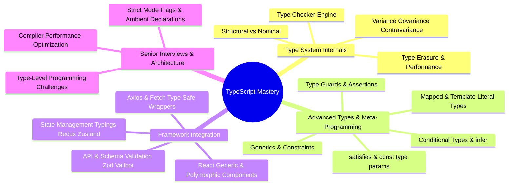
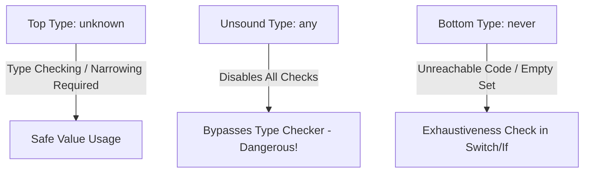
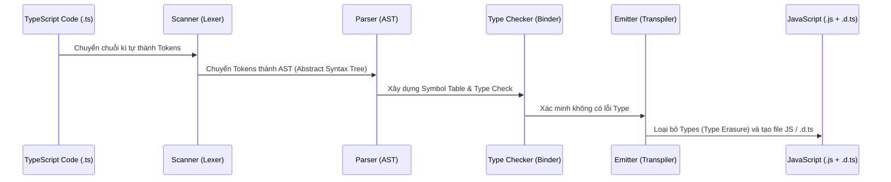

# 📘 Module 12: TypeScript Core & Framework Applications

> **Mục đích:** Hệ thống hóa toàn bộ kiến thức TypeScript từ cơ bản đến nâng cao (Middle → Senior/Architect level), đi sâu vào Type System internals, các kỹ thuật Type-Level Programming, ứng dụng thực tiễn trong các Frontend Frameworks (React, Vue, Angular) và các bài toán phỏng vấn chuyên sâu.

---

## 📑 Mục Lục (Table of Contents)
- [📌 Bản Đồ Học Tập (Roadmap)](#-bản-đồ-học-tập-roadmap)
- [🎯 Danh Sách Tài Liệu Trong Module](#-danh-sách-tài-liệu-trong-module)
- [⚡ Decision Matrix: Đưa Ra Quyết Định Thiết Kế Trong TypeScript](#-decision-matrix-đưa-ra-quyết-định-thiết-kế-trong-typescript)
  - [1. interface vs type (Type Alias)](#1-interface-vs-type-type-alias)
  - [2. any vs unknown vs never](#2-any-vs-unknown-vs-never)
  - [3. Enum vs Const Object / Union Types](#3-enum-vs-const-object--union-types)
- [🛠 TypeScript Compiler (tsc) Internals & Build Pipeline](#-typescript-compiler-tsc-internals--build-pipeline)
- [🔗 Liên Kết Liên Phân Môn](#-liên-kết-liên-phân-môn)

---

## 📌 Bản Đồ Học Tập (Roadmap)



---

## 🎯 Danh Sách Tài Liệu Trong Module

| File | Nội dung chính | Trọng tâm Senior Pitch | Level |
|------|----------------|-----------------------|-------|
| [`keywords.md`](./keywords.md) | Từ khóa đắt giá cho phỏng vấn Senior TypeScript | Type Inference Engine, Variance, Satisfies, Type Erasure | ⭐⭐⭐ Senior |
| [`type-system-advanced.md`](./type-system-advanced.md) | Hệ thống Type nâng cao & Type-Level Programming | Generics, Conditional Types, `infer`, Mapped Types, Type Guards | ⭐⭐⭐ Senior |
| [`framework-applications.md`](./framework-applications.md) | Ứng dụng TS trong React, Vue, State & API Layer | Polymorphic UI, Generic Hooks, Zod Schema Inference, Typed API | ⭐⭐ Mid-Senior |
| [`interviews.md`](./interviews.md) | 25+ Câu hỏi phỏng vấn & Thử thách code Type-Level | Bẫy Type System, Custom Utility Types, Monorepo Build Optimization | ⭐⭐⭐ Architect |

---

## ⚡ Decision Matrix: Đưa Ra Quyết Định Thiết Kế Trong TypeScript

### 1. `interface` vs `type` (Type Alias)

| Tiêu chí | `interface` | `type` (Type Alias) |
|----------|-------------|---------------------|
| **Khái niệm** | Khai báo bản hợp đồng cấu trúc (Structural Contract) của Object / Class. | Tạo biệt danh (alias) cho bất kỳ kiểu dữ liệu nào (Primitive, Union, Tuple, Object). |
| **Declaration Merging** | ✅ Có hỗ trợ (nhiều `interface` cùng tên tự hợp nhất). Thích hợp viết thư viện / SDK. | ❌ Không hỗ trợ (sẽ báo lỗi trùng tên). |
| **Mở rộng (Extends)** | `interface B extends A` (Cú pháp sạch, compiler dễ cache performance). | `type B = A & C` (Dùng Intersection type). |
| **Union & Primitive** | ❌ Không thể đại diện cho Union Types (`type A = B \| C`) hoặc Primitives (`type ID = string \| number`). | ✅ Hỗ trợ đầy đủ Union, Intersection, Mapped Types, Tuple. |
| **Khuyến nghị Senior** | Dùng cho **Public APIs**, **Component Props**, **OOP Entities**, **Class Interfaces**. | Dùng cho **Domain Models**, **State Unions**, **Utility Types**, **Complex Expressions**. |

### 2. `any` vs `unknown` vs `never`



- **`any`**: Tắt hoàn toàn Type Checker. Gây rò rỉ (type leakage) sang các biến xung quanh. Tránh dùng tuyệt đối trong codebase Senior trừ khi transpile code JS cũ.
- **`unknown`**: Kiểu an toàn của `any`. Mọi giá trị đều có thể gán cho `unknown`, nhưng **không thể tương tác** với nó nếu chưa ép kiểu / narrowing (dùng `typeof`, `instanceof`, Type Guard).
- **`never`**: Đánh dấu trạng thái không bao giờ xảy ra (hàm luôn ném ngoại lệ, vòng lặp vô tận, hoặc trường hợp còn lại trong switch case exhaustiveness check).

### 3. Enum vs Const Object / Union Types

```typescript
// ❌ CÁCH CŨ: Enum (tạo ra JavaScript code phình to khi transpile)
enum UserRoleEnum {
  ADMIN = 'ADMIN',
  USER = 'USER'
}

// ✅ CÁCH SENIOR: Const Assertion Object + Union Type (Zero runtime overhead, Type-safe)
export const USER_ROLE = {
  ADMIN: 'ADMIN',
  USER: 'USER',
} as const;

export type UserRole = typeof USER_ROLE[keyof typeof USER_ROLE]; // 'ADMIN' | 'USER'
```

---

## 🛠 TypeScript Compiler (`tsc`) Internals & Build Pipeline



- **Type Erasure**: TypeScript hoàn toàn biến mất ở Runtime. Mọi kiểm tra kiểu chỉ diễn ra trong quá trình **Compile-Time**. Do đó, TypeScript **không giúp tăng hiệu năng runtime** của JS, nhưng giảm thiểu lỗi rò rỉ runtime nghiêm trọng.
- **Transpilation Alternatives**: Trong các bundler hiện đại như Vite/Next.js, `tsc` chỉ dùng để type-check (`tsc --noEmit`), còn việc chuyển đổi `.ts` sang `.js` được đảm nhiệm bởi **SWC** hoặc **esbuild** với tốc độ nhanh gấp 10-100 lần.

---

## 🔗 Liên Kết Liên Phân Môn

- ↔ [`01-javascript`](../01-javascript/README.md): TypeScript mở rộng trực tiếp trên nền tảng JavaScript (ESNext).
- ↔ [`03-react`](../03-react/README.md): Ứng dụng TypeScript nâng cao trong React Component Patterns, Custom Hooks, và Context.
- ↔ [`08-design-patterns`](../08-design-patterns/README.md): Thiết kế các GoF patterns bằng TypeScript Interfaces và Generics.
- ↔ [`11-build-tools-compilers`](../11-build-tools-compilers/README.md): Tích hợp `tsc`, `swc`, `esbuild` và SWC loaders trong Webpack/Vite build pipelines.
