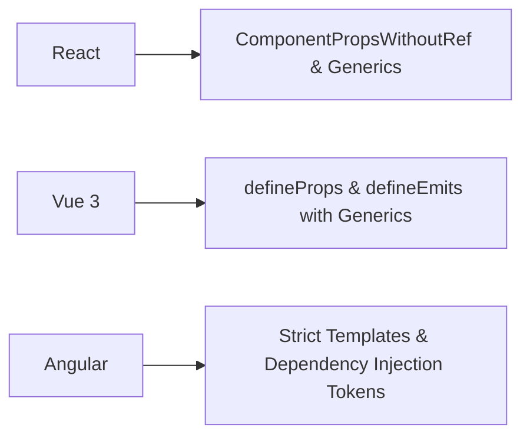

# 🚀 TypeScript Practical Applications in Frontend Frameworks & Architecture

> **Mục đích:** Hướng dẫn ứng dụng thực tế các kỹ thuật TypeScript nâng cao vào việc thiết kế Kiến trúc Component (React/Vue), Quản lý State (Redux/Zustand), Xây dựng API Layer Type-Safe và Tích hợp Schema Validation (Zod).

---

## 📑 Mục Lục (Table of Contents)
- [⚛️ 1. React Architecture & Polymorphic Component Patterns](#️-1-react-architecture--polymorphic-component-patterns)
- [📦 2. State Management Typings (Redux Toolkit & Zustand)](#-2-state-management-typings-redux-toolkit--zustand)
- [🌐 3. API Layer Type Safety & Schema Validation (Zod)](#-3-api-layer-type-safety--schema-validation-zod)
- [🟢 4. TypeScript trong Vue 3 & Angular](#-4-typescript-trong-vue-3--angular)

---

## ⚛️ 1. React Architecture & Polymorphic Component Patterns

### Polymorphic Component (`as` prop) với Type Safety Tuyệt Đối

Polymorphic Component là component có thể thay đổi thẻ HTML hiển thị bên dưới (ví dụ: `<Button as="a" href="...">` hiển thị thẻ `<a>`, còn `<Button as="button" onClick="...">` hiển thị thẻ `<button>`) mà vẫn gợi ý đúng 100% Props hợp lệ của thẻ đó.

```tsx
import React, { ElementType, ComponentPropsWithoutRef } from 'react';

// 1. Khai báo Props cơ bản của Component
type ButtonOwnProps<E extends ElementType> = {
  as?: E;
  variant?: 'primary' | 'secondary' | 'outline';
  children: React.ReactNode;
};

// 2. Tự động gộp với Props mặc định của HTML Element tương ứng (loại bỏ trùng lặp bằng Omit)
type ButtonProps<E extends ElementType> = ButtonOwnProps<E> &
  Omit<ComponentPropsWithoutRef<E>, keyof ButtonOwnProps<E>>;

// 3. Component Implementation
export const Button = <E extends ElementType = 'button'>({
  as,
  variant = 'primary',
  children,
  ...restProps
}: ButtonProps<E>) => {
  const Component = as || 'button';
  return (
    <Component className={`btn btn-${variant}`} {...restProps}>
      {children}
    </Component>
  );
};

// --- USAGE ---
const App = () => {
  return (
    <>
      {/* Render dạng button: Gợi ý type="submit", onClick */}
      <Button variant="primary" type="submit" onClick={(e) => console.log(e)}>
        Submit Form
      </Button>

      {/* Render dạng thẻ link a: Gợi ý href, target, rel */}
      <Button as="a" href="https://example.com" target="_blank" variant="secondary">
        Go to External Link
      </Button>

      {/* ❌ LỖI BIÊN DỊCH: Thẻ button không có attribute href */}
      {/* <Button as="button" href="https://google.com">Test</Button> */}
    </>
  );
};
```

### Custom Generic Hooks & Generic ForwardRef Pattern

#### Generic Hook: `useAsyncData<T>`

```tsx
import { useState, useEffect } from 'react';

type AsyncState<T> =
  | { status: 'idle' | 'pending'; data: null; error: null }
  | { status: 'success'; data: T; error: null }
  | { status: 'error'; data: null; error: Error };

export function useAsyncData<T>(asyncFn: () => Promise<T>) {
  const [state, setState] = useState<AsyncState<T>>({
    status: 'idle',
    data: null,
    error: null,
  });

  useEffect(() => {
    setState({ status: 'pending', data: null, error: null });
    asyncFn()
      .then((data) => setState({ status: 'success', data, error: null }))
      .catch((error) => setState({ status: 'error', data: null, error }));
  }, [asyncFn]);

  return state;
}
```

#### Wrapper cho React Context không bị `null` Boilerplate

```tsx
import React, { createContext, useContext } from 'react';

export function createSafeContext<TValue>() {
  const Context = createContext<TValue | undefined>(undefined);

  function useSafeContext() {
    const value = useContext(Context);
    if (value === undefined) {
      throw new Error('useSafeContext must be used within a ContextProvider');
    }
    return value;
  }

  return [Context.Provider, useSafeContext] as const;
}

// USAGE: Không bao giờ phải check if (!context) nữa!
interface UserContextType {
  user: { id: string; name: string };
  logout: () => void;
}

const [UserProvider, useUser] = createSafeContext<UserContextType>();

const UserProfile = () => {
  const { user, logout } = useUser(); // ✅ Type UserContextType trực tiếp, không có undefined!
  return <div>{user.name}</div>;
};
```

---

## 📦 2. State Management Typings (Redux Toolkit & Zustand)

### Redux Toolkit Typed Hooks & Async Thunk

```typescript
import { configureStore, createAsyncThunk, createSlice, PayloadAction } from '@reduxjs/toolkit';
import { TypedUseSelectorHook, useDispatch, useSelector } from 'react-redux';

interface UserState {
  items: Array<{ id: string; name: string }>;
  loading: boolean;
}

const initialState: UserState = { items: [], loading: false };

export const fetchUsers = createAsyncThunk<Array<{ id: string; name: string }>>(
  'users/fetch',
  async () => {
    const res = await fetch('/api/users');
    return res.json();
  }
);

const userSlice = createSlice({
  name: 'users',
  initialState,
  reducers: {
    addUser: (state, action: PayloadAction<{ id: string; name: string }>) => {
      state.items.push(action.payload);
    },
  },
  extraReducers: (builder) => {
    builder.addCase(fetchUsers.fulfilled, (state, action) => {
      state.loading = false;
      state.items = action.payload; // Type-safe với AsyncThunk return
    });
  },
});

export const store = configureStore({ reducer: { users: userSlice.reducer } });

// RootState & AppDispatch setup
export type RootState = ReturnType<typeof store.getState>;
export type AppDispatch = typeof store.dispatch;

// Custom Typed Hooks dùng xuyên suốt app
export const useAppDispatch: () => AppDispatch = useDispatch;
export const useAppSelector: TypedUseSelectorHook<RootState> = useSelector;
```

### Zustand Slices với Store Middleware Typing

```typescript
import { create } from 'zustand';
import { devtools, persist } from 'zustand/middleware';

interface AuthSlice {
  token: string | null;
  setToken: (token: string) => void;
  logout: () => void;
}

export const useAuthStore = create<AuthSlice>()(
  devtools(
    persist(
      (set) => ({
        token: null,
        setToken: (token) => set({ token }),
        logout: () => set({ token: null }),
      }),
      { name: 'auth-storage' }
    )
  )
);
```

---

## 🌐 3. API Layer Type Safety & Schema Validation (Zod)

### Strongly Typed Axios Client với Generic Envelopes

```typescript
import axios, { AxiosInstance, AxiosRequestConfig } from 'axios';

// Chuẩn hóa cấu trúc ApiResponse chuẩn Enterprise
export interface ApiResponse<T> {
  data: T;
  message: string;
  statusCode: number;
  timestamp: string;
}

export class HttpClient {
  private client: AxiosInstance;

  constructor(baseURL: string) {
    this.client = axios.create({ baseURL, timeout: 10000 });
  }

  public async get<T>(url: string, config?: AxiosRequestConfig): Promise<T> {
    const response = await this.client.get<ApiResponse<T>>(url, config);
    return response.data.data; // Trả về T trực tiếp đã được unwrap
  }

  public async post<T, B = unknown>(url: string, body: B, config?: AxiosRequestConfig): Promise<T> {
    const response = await this.client.post<ApiResponse<T>>(url, body, config);
    return response.data.data;
  }
}
```

### Dynamic Runtime Validation + Type Inference với Zod

Dữ liệu nhận về từ API bên ngoài luôn ẩn chứa rủi ro không đúng cấu trúc (Dirty Data). Kết hợp Zod để vừa validate Runtime vừa sinh ra Static Type tự động:

```typescript
import { z } from 'zod';

// 1. Định nghĩa Schema Runtime
export const UserSchema = z.object({
  id: z.string().uuid(),
  email: z.string().email(),
  age: z.number().min(18),
  role: z.enum(['ADMIN', 'USER', 'GUEST']),
  tags: z.array(z.string()).optional(),
});

// 2. Suy luận Type Tĩnh tự động (Single Source of Truth)
export type User = z.infer<typeof UserSchema>;

// 3. Hàm gọi API an toàn tuyệt đối ở Runtime & Compile-time
async function getValidatedUser(userId: string): Promise<User> {
  const response = await fetch(`/api/users/${userId}`);
  const rawData = await response.json();

  // Parse & Validate at Runtime (Nếu dữ liệu sai cấu trúc sẽ throw ZodError)
  const validatedUser = UserSchema.parse(rawData);
  return validatedUser; // Type safe: User
}
```

---

## 🟢 4. TypeScript trong Vue 3 & Angular



### Vue 3 Composition API (Script Setup với Type Generics)

```vue
<script setup lang="ts" generic="T extends { id: string | number }">
// Generic Props trong Vue 3.3+
defineProps<{
  items: T[];
  selectedId?: T['id'];
}>();

const emit = defineEmits<{
  (e: 'select', item: T): void;
}>();
</script>
```
