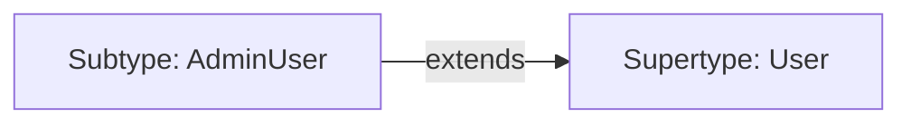

# 🧠 Advanced Type System & Type-Level Programming

> **Mục đích:** Đi sâu vào bản chất của TypeScript Type System. Trang bị cho bạn năng lực tư duy bằng kiểu (Type-Level Programming), viết các Custom Utility Types phức tạp, làm chủ Type Inference Engine và xử lý các bài toán nâng cao cấp độ Senior/Architect.

---

## 📑 Mục Lục (Table of Contents)
- [🎯 1. Generics & Generic Constraints (extends, keyof)](#-1-generics--generic-constraints-extends-keyof)
- [⚡ 2. Conditional Types & Từ khóa infer](#-2-conditional-types--từ-khóa-infer)
- [🛠 3. Mapped Types & Template Literal Types](#-3-mapped-types--template-literal-types)
- [🛡 4. Type Guards (is) vs Assertion Functions (asserts)](#-4-type-guards-is-vs-assertion-functions-asserts)
- [⚡ 5. Modern TS: satisfies Operator (TS 4.9+) & const Type Parameters (TS 5.0+)](#-5-modern-ts-satisfies-operator-ts-49--const-type-parameters-ts-50)
- [🔄 6. Variance trong TypeScript: Covariance & Contravariance](#-6-variance-trong-typescript-covariance--contravariance)
- [🏷️ 7. Branded Types / Opaque Types (Nominal Typing Simulation)](#️-7-branded-types--opaque-types-nominal-typing-simulation)

---

## 🎯 1. Generics & Generic Constraints (`extends`, `keyof`)

Generics cho phép chúng ta tham số hóa kiểu dữ liệu (Type Parameterization), tạo ra các hàm, class, hoặc interface có thể tái sử dụng nhưng vẫn giữ nguyên Type Safety tuyệt đối.

### Generic Constraints (Ràng buộc kiểu)

Nếu chỉ khai báo `<T>`, `T` có thể là bất kỳ kiểu gì (`unknown`). Khi muốn thao tác trên các thuộc tính cụ thể của `T`, ta cần dùng từ khóa `extends`.

```typescript
// ❌ LỖI BiỂN DỊCH: T không đảm bảo có thuộc tính length
function getLengthBad<T>(arg: T): number {
  return arg.length; // Property 'length' does not exist on type 'T'.
}

// ✅ CHUẨN SENIOR: Đặt ràng buộc T phải chứa thuộc tính length
interface HasLength {
  length: number;
}

function getLength<T extends HasLength>(arg: T): number {
  return arg.length;
}

getLength("Hello World"); // ✅ OK (string có length)
getLength([1, 2, 3]);      // ✅ OK (Array có length)
getLength({ length: 10 }); // ✅ OK (Object có length)
// getLength(123);         // ❌ Lỗi: number không có length
```

### Kết hợp `keyof` và `extends` để truy cập thuộc tính an toàn

```typescript
// Lấy giá trị của một key bất kỳ từ Object một cách Type-Safe
function getProperty<T, K extends keyof T>(obj: T, key: K): T[K] {
  return obj[key];
}

const user = { id: 101, name: "Alice", isSenior: true };

const name = getProperty(user, "name");     // Type: string
const isSenior = getProperty(user, "isSenior"); // Type: boolean
// getProperty(user, "email");              // ❌ Lỗi: Argument of type '"email"' is not assignable to parameter of type '"id" | "name" | "isSenior"'.
```

---

## ⚡ 2. Conditional Types & Từ khóa `infer`

Conditional Types mang tư duy câu lệnh điều kiện (`ternary operator`) vào thế giới của Type:

$$\text{T extends U ? X : Y}$$

### Phân phối Conditional Types (Distributive Conditional Types)

Khi truyền một Union Type vào Conditional Type dưới dạng Naked Type Parameter (chưa bị bọc bởi Array hay Tuple), TypeScript sẽ tự động phân phối điều kiện qua từng phần tử của Union:

```typescript
type ToArray<T> = T extends any ? T[] : never;

type Result = ToArray<string | number>; 
// Phân phối thành: ToArray<string> | ToArray<number>
// Result: string[] | number[]
```

### Magic với từ khóa `infer` (Type Pattern Matching)

Từ khóa `infer` cho phép chúng ta **khai báo một biến kiểu tạm thời** để TypeScript tự động trích xuất (extract) kiểu dữ liệu bên trong một cấu trúc phức tạp.

```typescript
// 1. Tự viết lại Utility Type ReturnType<T>
type MyReturnType<T> = T extends (...args: any[]) => infer R ? R : never;

function fetchUser() {
  return { id: 1, role: "ADMIN" };
}

type UserFetchResult = MyReturnType<typeof fetchUser>; 
// Output Type: { id: number; role: string; }

// 2. Trích xuất kiểu phần tử của Promise / Array (Awaited Custom)
type MyUnwrapPromise<T> = T extends Promise<infer U> ? MyUnwrapPromise<U> : T;

type AsyncData = MyUnwrapPromise<Promise<Promise<number>>>; 
// Output Type: number (Đệ quy unwrap Promise nhiều tầng)

// 3. Flatten Array Element Type
type ElementOf<T> = T extends (infer E)[] ? E : T;

type Str = ElementOf<string[]>; // string
type Num = ElementOf<number>;   // number
```

---

## 🛠 3. Mapped Types & Template Literal Types

### Mapped Types (Duyệt và biến đổi thuộc tính)

Mapped Types cho phép tạo một kiểu dữ liệu mới bằng cách lặp qua các keys của một kiểu dữ liệu hiện có.

```typescript
type User = {
  id: number;
  name: string;
  email: string;
};

// Custom DeepReadonly
type DeepReadonly<T> = {
  readonly [K in keyof T]: T[K] extends object ? DeepReadonly<T[K]> : T[K];
};

// Key Remapping với từ khóa `as` (TS 4.1+)
// Biến các thuộc tính thành Getter methods: id -> getId, name -> getName
type Getters<T> = {
  [K in keyof T as `get${Capitalize<string & K>}`]: () => T[K];
};

type UserGetters = Getters<User>;
/* Output Type:
{
  getId: () => number;
  getName: () => string;
  getEmail: () => string;
}
*/
```

### Template Literal Types (Type-level string manipulation)

Cho phép ghép chuỗi ở Type-level để sinh ra các union types vô cùng mạnh mẽ.

```typescript
type Event = "click" | "hover" | "focus";
type Component = "Button" | "Input" | "Modal";

// Sinh ra tất cả kết hợp sự kiện: "onButtonClick" | "onButtonHover" | ...
type ComponentEventHander = `on${Component}${Capitalize<Event>}`;

// Ứng dụng: Type-Safe Event Bus Dynamic Listener
type EventMap = {
  "user:created": { id: string; name: string };
  "user:deleted": { id: string };
  "page:render": { url: string };
};

type EventBus = {
  on<K extends keyof EventMap>(event: K, handler: (data: EventMap[K]) => void): void;
  emit<K extends keyof EventMap>(event: K, data: EventMap[K]): void;
};
```

---

## 🛡 4. Type Guards (`is`) vs Assertion Functions (`asserts`)

Để hẹp kiểu (Type Narrowing) từ `unknown` hoặc Union types một cách an toàn ở runtime:

```typescript
interface Cat { name: string; meow(): void; }
interface Dog { name: string; bark(): void; }

// 1. User-Defined Type Guard với `is` predicate
function isCat(animal: Cat | Dog): animal is Cat {
  return (animal as Cat).meow !== undefined;
}

function handlePet(pet: Cat | Dog) {
  if (isCat(pet)) {
    pet.meow(); // ✅ TypeScript tự hiểu pet là Cat ở nhánh này
  } else {
    pet.bark(); // ✅ TypeScript tự hiểu pet là Dog
  }
}

// 2. Assertion Functions với `asserts` (dùng cho validation & error throwing)
function assertIsString(val: unknown): asserts val is string {
  if (typeof val !== "string") {
    throw new Error(`Expected string but received ${typeof val}`);
  }
}

function processInput(input: unknown) {
  assertIsString(input);
  // Từ dòng này trở xuống, TypeScript đảm bảo input có kiểu `string`
  console.log(input.toUpperCase()); 
}
```

---

## ⚡ 5. Modern TS: `satisfies` Operator (TS 4.9+) & `const` Type Parameters (TS 5.0+)

### `satisfies` Operator vs Type Annotation

- **Type Annotation (`: Type`)**: Ép kiểu giá trị về Type chung, làm **mất thông tin cụ thể** (literal type).
- **`satisfies`**: Kiểm tra giá trị có tuân thủ Type không, nhưng **giữ lại kiểu cụ thể** chính xác nhất.

```typescript
type Color = string | { r: number; g: number; b: number };

// ❌ Dùng Annotation: lose specific method access
const paletteAnnotation: Record<string, Color> = {
  red: "#ff0000",
  green: { r: 0, g: 255, b: 0 }
};
// paletteAnnotation.red.toUpperCase(); // ❌ Lỗi: Property 'toUpperCase' does not exist on type 'Color'.

// ✅ Dùng satisfies (TS 4.9+): Validated AND Specific!
const paletteSatisfies = {
  red: "#ff0000",
  green: { r: 0, g: 255, b: 0 }
} satisfies Record<string, Color>;

paletteSatisfies.red.toUpperCase(); // ✅ OK! TypeScript biết chính xác red là `string`.
paletteSatisfies.green.r.toFixed(2); // ✅ OK! TypeScript biết chính xác green là Object `{r, g, b}`.
```

### `const` Type Parameters (TS 5.0+)

Giúp suy luận Readonly Tuple/Literal Type tự động mà không bắt Caller phải viết `as const`.

```typescript
// TS 5.0+: Khai báo const T
function createRoutes<const T extends readonly string[]>(routes: T): T {
  return routes;
}

const routes = createRoutes(["/home", "/about", "/dashboard"]);
// Type của routes là: readonly ["/home", "/about", "/dashboard"]
// (Thay vì bị suy luận thành string[] rộng lớn)
```

---

## 🔄 6. Variance trong TypeScript: Covariance & Contravariance

Hiểu cách TypeScript kiểm tra tính tương thích giữa hai Generic Type `F<T>` khi `Sub` kế thừa `Super` ($Sub \subseteq Super$):



| Dạng Variance | Định nghĩa | Trường hợp xảy ra trong TypeScript |
|---------------|------------|-----------------------------------|
| **Covariance (Biến thiên thuận)** | Nếu $Sub \subseteq Super \Rightarrow F<Sub> \subseteq F<Super>$ | Trả về dữ liệu (Return values, Readonly arrays, Promises). |
| **Contravariance (Biến thiên nghịch)** | Nếu $Sub \subseteq Super \Rightarrow F<Super> \subseteq F<Sub>$ | Nhận tham số vào hàm (Function parameter types khi bật `strictFunctionTypes`). |
| **Invariance (Bất biến)** | $F<Sub>$ và $F<Super>$ không tương thích lẫn nhau | Mutable Objects/Arrays (vừa read vừa write). |
| **Bivariance (Lưỡng biến)** | Cả hai chiều đều gán được cho nhau | Method shorthand signatures (khi chưa bật strict flag). |

### Code Ví dụ minh họa Contravariance (Tham số hàm):

```typescript
class User { name!: string; }
class AdminUser extends User { permissions!: string[]; }

type Logger<T> = (arg: T) => void;

let logUser: Logger<User> = (user) => console.log(user.name);
let logAdmin: Logger<AdminUser> = (admin) => console.log(admin.permissions.join(","));

// HỎI: Liệu ta có thể gán logUser cho logAdmin được không?
logAdmin = logUser; // ✅ CHẤP NHẬN! (Contravariant)
// Vì logUser chỉ cần tên, mà AdminUser hoàn toàn CÓ tên. Cực kỳ an toàn!

// ❌ NGƯỢC LẠI:
// logUser = logAdmin; // ❌ LỖI trong strictFunctionTypes!
// Vì nếu gọi logUser(normalUser), logAdmin sẽ cố đọc normalUser.permissions -> Runtime Crash!
```

---

## 🏷️ 7. Branded Types / Opaque Types (Nominal Typing Simulation)

TypeScript mặc định dùng **Structural Typing**. Để tạo ra các loại dữ liệu độc nhất không thể gán nhầm (như `UserId` vs `ProductId` đều là `string` ở runtime):

```typescript
// Định nghĩa Brand Utility
declare const brand: unique symbol;
type Brand<T, K extends string> = T & { readonly [brand]: K };

export type UserId = Brand<string, "UserId">;
export type ProductId = Brand<string, "ProductId">;

// Smart Constructors
function createUserId(id: string): UserId {
  return id as UserId;
}
function createProductId(id: string): ProductId {
  return id as ProductId;
}

const userId = createUserId("usr_123");
const productId = createProductId("prd_999");

// Test Type Safety:
function getUserOrders(id: UserId) { /* ... */ }

getUserOrders(userId); // ✅ OK
// getUserOrders(productId); // ❌ LỖI BIÊN DỊCH: Type 'ProductId' is not assignable to type 'UserId'.
// getUserOrders("usr_123"); // ❌ LỖI BIÊN DỊCH: Type 'string' is not assignable to type 'UserId'.
```
