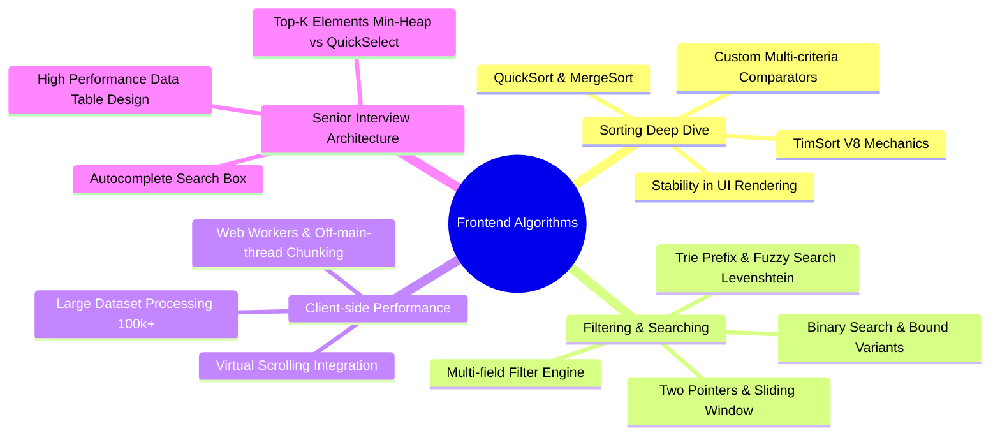
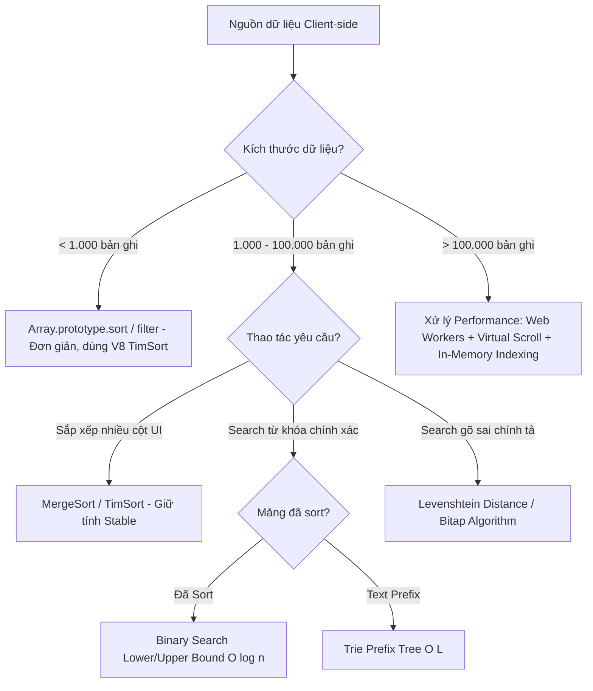

# ⚡ Module 13: Algorithms — Sorting, Filtering & Senior Frontend Scenarios

> **Mục đích:** Hệ thống hóa các Thuật toán kinh điển về **Sắp xếp (Sorting)** và **Lọc/Tìm kiếm (Filtering & Searching)**, đi sâu vào phân tích độ phức tạp thời gian/bộ nhớ (Big-O), cơ chế xử lý dữ liệu in-memory phía Client-side và giải quyết các bài toán phỏng vấn thực tế dành cho **Senior Frontend Engineer / Architect**.

---

## 📑 Mục Lục (Table of Contents)
- [📌 Bản Đồ Học Tập (Roadmap)](#-bản-đồ-học-tập-roadmap)
- [🎯 Danh Sách Tài Liệu Trong Module](#-danh-sách-tài-liệu-trong-module)
- [📊 Ma Trận Độ Phức Tạp (Big-O Complexity Matrix)](#-ma-trận-độ-phức-tạp-big-o-complexity-matrix)
- [⚡ Decision Tree: Lựa Chọn Thuật Toán Xử Lý Dữ Liệu Client-Side](#-decision-tree-lựa-chọn-thuật-toán-xử-lý-dữ-liệu-client-side)
- [🔗 Liên Kết Liên Phân Môn](#-liên-kết-liên-phân-môn)

---

## 📌 Bản Đồ Học Tập (Roadmap)

---

## 🎯 Danh Sách Tài Liệu Trong Module

| File | Nội dung chính | Trọng tâm Senior Pitch | Level |
|------|----------------|-----------------------|-------|
| [`keywords.md`](./keywords.md) | Từ khóa đắt giá về thuật toán & xử lý dữ liệu Client | In-Memory Processing, Stability, Binary Search Bounds, Sliding Window | ⭐⭐⭐ Senior |
| [`sorting-algorithms.md`](./sorting-algorithms.md) | Thuật toán Sắp xếp: QuickSort, MergeSort, TimSort, Stability | QuickSort vs MergeSort, V8 Array.sort(), Multi-column Comparator | ⭐⭐ Mid-Senior |
| [`filtering-searching.md`](./filtering-searching.md) | Thuật toán Lọc & Tìm kiếm: Binary Search, Window, Trie, Fuzzy | Binary Search bounds, Sliding Window $O(n)$, Fuzzy Search Levenshtein | ⭐⭐⭐ Senior |
| [`interviews.md`](./interviews.md) | Bài toán thiết kế hệ thống UI & Phỏng vấn Senior | Data Grid 100k rows, Real-time Autocomplete, Top-K Elements | ⭐⭐⭐ Architect |

---

## 📊 Ma Trận Độ Phức Tạp (Big-O Complexity Matrix)

### 1. Thuật toán Sắp xếp (Sorting Algorithms)

| Thuật toán | Best Case | Average Case | Worst Case | Space Complexity | Stable? | Ghi chú ứng dụng Frontend |
|------------|-----------|--------------|------------|------------------|---------|---------------------------|
| **QuickSort** | $O(n \log n)$ | $O(n \log n)$ | $O(n^2)$ | $O(\log n)$ | ❌ Không | Sắp xếp in-place nhanh, ít tốn bộ nhớ RAM. |
| **MergeSort** | $O(n \log n)$ | $O(n \log n)$ | $O(n \log n)$ | $O(n)$ | ✅ Có | Rất ổn định, phù hợp với Linked List hoặc dữ liệu lớn cần giữ thứ tự cũ. |
| **TimSort** | $O(n)$ | $O(n \log n)$ | $O(n \log n)$ | $O(n)$ | ✅ Có | **Thuật toán mặc định trong V8 JavaScript Engine** (`Array.prototype.sort()`). Lai giữa MergeSort & InsertionSort. |
| **InsertionSort** | $O(n)$ | $O(n^2)$ | $O(n^2)$ | $O(1)$ | ✅ Có | Cực kỳ nhanh với mảng kích thước nhỏ ($n \le 10$) hoặc mảng suýt sắp xếp. |
| **HeapSort** | $O(n \log n)$ | $O(n \log n)$ | $O(n \log n)$ | $O(1)$ | ❌ Không | Dùng Priority Queue để tìm Top-K phần tử lớn nhất/nhỏ nhất. |

### 2. Thuật toán Lọc & Tìm kiếm (Filtering & Searching Algorithms)

| Thuật toán / Kỹ thuật | Time Complexity | Space Complexity | Ứng dụng thực tiễn trên UI Frontend |
|------------------------|-----------------|------------------|-------------------------------------|
| **Binary Search** | $O(\log n)$ | $O(1)$ | Tìm kiếm trên mảng đã sort (Calendar, Time-series chart, Virtual scroll binary lookup). |
| **Two Pointers** | $O(n)$ | $O(1)$ | Lọc mảng đã sort, lọc cặp số thỏa điều kiện, đảo ngược/partition dữ liệu. |
| **Sliding Window** | $O(n)$ | $O(1)$ / $O(k)$ | Lọc chuỗi con/mảng con dài nhất thỏa điều kiện (ví dụ: tìm sub-string không trùng ký tự). |
| **Trie Prefix Search** | $O(L)$ với $L$ là độ dài từ | $O(N \cdot L)$ | Tính năng Autocomplete / Typeahead Search gợi ý từ nhanh tức thì. |
| **Levenshtein Distance (Fuzzy Search)** | $O(m \cdot n)$ | $O(min(m, n))$ | Tìm kiếm gần đúng cho ô Input (sửa lỗi gõ sai chính tả của người dùng). |

---

## ⚡ Decision Tree: Lựa Chọn Thuật Toán Xử Lý Dữ Liệu Client-Side

---

## 🔗 Liên Kết Liên Phân Môn

- ↔ [`01-javascript`](../01-javascript/README.md): V8 Engine Array implementation, Microtask Queue và Memory Management.
- ↔ [`03-react`](../03-react/README.md): React Virtualization (react-window/react-virtualized), useMemo & useCallback cache kết quả sort/filter.
- ↔ [`09-data-structures`](../09-data-structures/README.md): Nền tảng Heap, Trie, Hash Map và Array Data Structures.
- ↔ [`11-build-tools-compilers`](../11-build-tools-compilers/README.md): V8 Ignition Compiler optimizations cho loops và Inline Caches.
