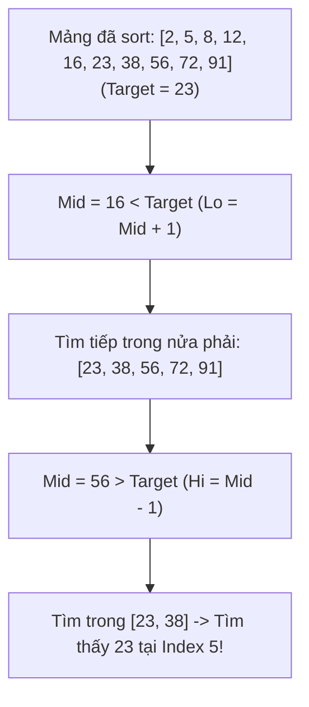
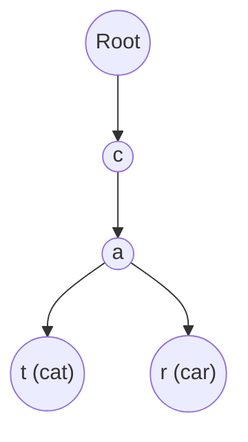

# 🔍 Filtering & Searching Algorithms — From Binary Search to Fuzzy Matching

> **Mục đích:** Hệ thống hóa các thuật toán Lọc và Tìm kiếm dữ liệu từ cơ bản đến chuyên sâu: Binary Search & biến thể Bounds, kỹ thuật Two Pointers, Sliding Window, Engine lọc đa tiêu chí (Multi-field Filtering) và Autocomplete Fuzzy Search (Trie & Levenshtein Distance).

---

## 📑 Mục Lục (Table of Contents)
- [🎯 1. Binary Search & Các Biến Thể Bounds](#-1-binary-search--các-biến-thể-bounds)
- [⚡ 2. Kỹ Thuật Two Pointers & Sliding Window](#-2-kỹ-thuật-two-pointers--sliding-window)
- [⚙️ 3. High-Performance Multi-Field Filter Engine](#️-3-high-performance-multi-field-filter-engine)
- [🔤 4. Autocomplete & Fuzzy Search (Trie vs Levenshtein Distance)](#-4-autocomplete--fuzzy-search-trie-vs-levenshtein-distance)

---

## 🎯 1. Binary Search & Các Biến Thể Bounds

Binary Search là thuật toán tìm kiếm trên tập dữ liệu **đã sắp xếp** với độ phức tạp $O(\log n)$.



### Biến thể Senior: Lower Bound và Upper Bound

Trong ứng dụng Frontend (như Virtual Scroll, Time-Series Charts), ta thường cần tìm vị trí phần tử **đầu tiên** hoặc **cuối cùng** thỏa mãn điều kiện chứ không chỉ tìm phần tử chính xác:

```javascript
// 1. Lower Bound: Tìm vị trí phần tử ĐẦU TIÊN >= target
export function lowerBound(arr, target, comparator = (a, b) => a - b) {
  let low = 0;
  let high = arr.length; // Đội hình mở [low, high)

  while (low < high) {
    const mid = Math.floor((low + high) / 2);
    if (comparator(arr[mid], target) >= 0) {
      high = mid; // Thu hẹp nửa phải
    } else {
      low = mid + 1;
    }
  }
  return low; // Trả về index đầu tiên >= target
}

// 2. Upper Bound: Tìm vị trí phần tử ĐẦU TIÊN > target
export function upperBound(arr, target, comparator = (a, b) => a - b) {
  let low = 0;
  let high = arr.length;

  while (low < high) {
    const mid = Math.floor((low + high) / 2);
    if (comparator(arr[mid], target) > 0) {
      high = mid;
    } else {
      low = mid + 1;
    }
  }
  return low;
}
```

---

## ⚡ 2. Kỹ Thuật Two Pointers & Sliding Window

### Kỹ thuật Two Pointers (Hai con trỏ)

Biến các bài toán lặp lồng nhau $O(n^2)$ thành $O(n)$ bằng cách duy trì 2 chỉ số trượt từ 2 đầu hoặc cùng chiều.

```javascript
// Bài toán: Tìm 2 sản phẩm có tổng giá đúng bằng TargetPrice trong mảng đã sort
export function findTwoSumSorted(prices, targetPrice) {
  let left = 0;
  let right = prices.length - 1;

  while (left < right) {
    const currentSum = prices[left] + prices[right];
    if (currentSum === targetPrice) {
      return [prices[left], prices[right]];
    } else if (currentSum < targetPrice) {
      left++; // Cần tăng giá -> Dịch trỏ trái sang phải
    } else {
      right--; // Cần giảm giá -> Dịch trỏ phải sang trái
    }
  }
  return null; // Time: O(n), Space: O(1)
}
```

### Kỹ thuật Sliding Window (Cửa sổ trượt)

Duy trì một cửa sổ kích thước động/cố định để xử lý chuỗi/mảng con liên tục.

```javascript
// Bài toán: Tìm chuỗi con dài nhất KHÔNG chứa ký tự trùng lặp (Longest Substring Without Repeating Characters)
export function lengthOfLongestSubstring(s) {
  const charMap = new Map();
  let maxLength = 0;
  let windowStart = 0;

  for (let windowEnd = 0; windowEnd < s.length; windowEnd++) {
    const rightChar = s[windowEnd];

    if (charMap.has(rightChar)) {
      // Co rút cửa sổ bên trái đến sau vị trí trùng lặp cũ
      windowStart = Math.max(windowStart, charMap.get(rightChar) + 1);
    }

    charMap.set(rightChar, windowEnd);
    maxLength = Math.max(maxLength, windowEnd - windowStart + 1);
  }

  return maxLength; // Time: O(n), Space: O(k) với k là số lượng ký tự unique
}
```

---

## ⚙️ 3. High-Performance Multi-Field Filter Engine

Thiết kế Engine lọc phía Client-side cho danh sách $100.000+$ sản phẩm với nhiều tiêu chí (Range, Multiple Choice Tags, Full-text Search):

```javascript
export function filterProducts(products, criteria = {}) {
  const query = criteria.searchQuery?.trim().toLowerCase();

  return products.filter((product) => {
    // 1. Text Search Filter
    if (query) {
      const matchTitle = product.title.toLowerCase().includes(query);
      if (!matchTitle) return false;
    }

    // 2. Category Set Filter O(1) Lookup
    if (criteria.categories && criteria.categories.size > 0) {
      if (!criteria.categories.has(product.category)) return false;
    }

    // 3. Price Range Filter
    if (criteria.minPrice !== undefined && product.price < criteria.minPrice) return false;
    if (criteria.maxPrice !== undefined && product.price > criteria.maxPrice) return false;

    // 4. Boolean Flag Filter
    if (criteria.inStockOnly && !product.inStock) return false;

    // 5. Array Intersection Filter (Tags)
    if (criteria.selectedTags && criteria.selectedTags.size > 0) {
      const hasAllTags = Array.from(criteria.selectedTags).every((tag) =>
        product.tags.includes(tag)
      );
      if (!hasAllTags) return false;
    }

    return true;
  });
}
```

---

## 🔤 4. Autocomplete & Fuzzy Search (Trie vs Levenshtein Distance)

### 1. Trie Prefix Search (Cây tiền tố cho Autocomplete nhanh tức thì)

Trie giúp tra cứu từ theo tiền tố với thời gian $O(L)$ (chỉ phụ thuộc độ dài từ nhập vào, không phụ thuộc vào 1 triệu từ trong từ điển!).



```javascript
class TrieNode {
  constructor() {
    this.children = new Map();
    this.isEndOfWord = false;
  }
}

export class AutocompleteTrie {
  constructor() {
    this.root = new TrieNode();
  }

  insert(word) {
    let current = this.root;
    for (const char of word.toLowerCase()) {
      if (!current.children.has(char)) {
        current.children.set(char, new TrieNode());
      }
      current = current.children.get(char);
    }
    current.isEndOfWord = true;
  }

  searchPrefix(prefix) {
    let current = this.root;
    for (const char of prefix.toLowerCase()) {
      if (!current.children.has(char)) return [];
      current = current.children.get(char);
    }

    const results = [];
    this.collectWords(current, prefix.toLowerCase(), results);
    return results;
  }

  collectWords(node, currentPrefix, results) {
    if (node.isEndOfWord) results.push(currentPrefix);
    for (const [char, childNode] of node.children) {
      this.collectWords(childNode, currentPrefix + char, results);
    }
  }
}
```

### 2. Levenshtein Distance (Edit Distance — Fuzzy Search tự sửa lỗi gõ sai)

Tính số thao tác sửa đổi tối thiểu (Thêm, Xóa, Thay thế) để chuyển chuỗi `a` thành chuỗi `b`:

```javascript
export function levenshteinDistance(a, b) {
  const matrix = [];

  for (let i = 0; i <= a.length; i++) {
    matrix[i] = [i];
  }
  for (let j = 0; j <= b.length; j++) {
    matrix[0][j] = j;
  }

  for (let i = 1; i <= a.length; i++) {
    for (let j = 1; j <= b.length; j++) {
      if (a[i - 1] === b[j - 1]) {
        matrix[i][j] = matrix[i - 1][j - 1];
      } else {
        matrix[i][j] = Math.min(
          matrix[i - 1][j] + 1,    // Deletion
          matrix[i][j - 1] + 1,    // Insertion
          matrix[i - 1][j - 1] + 1 // Substitution
        );
      }
    }
  }

  return matrix[a.length][b.length];
}

// USAGE: Cho phép gõ sai tối đa 2 lỗi
function fuzzyMatch(input, target, maxDistance = 2) {
  return levenshteinDistance(input.toLowerCase(), target.toLowerCase()) <= maxDistance;
}
```
