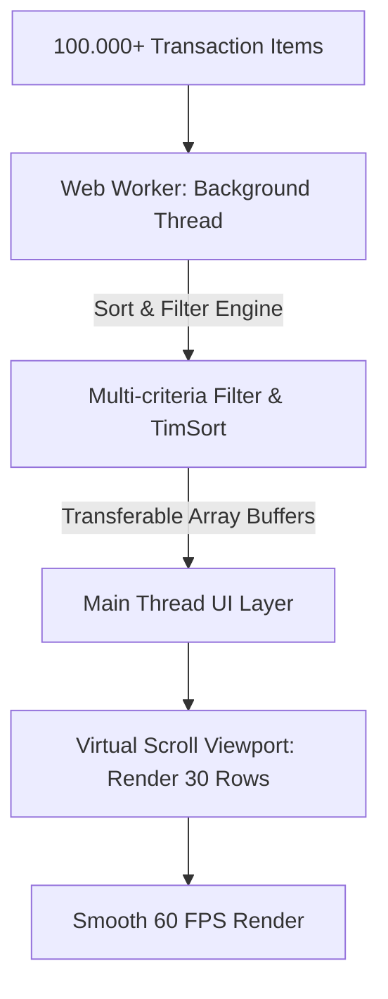

# 🎯 Senior Frontend Interview Scenarios — Algorithms, Performance & System Design

> **Mục đích:** Tổng hợp các tình huống thiết kế hệ thống UI thực tế (System Design Scenarios) và câu hỏi phỏng vấn thuật toán nâng cao dành cho **Senior Frontend Engineer / Architect**. Tập trung vào bài toán xử lý bộ dữ liệu lớn, thiết kế Data Table, Autocomplete Search Box và tối ưu Main Thread.

---

## 📑 Mục Lục (Table of Contents)
- [🏗️ Tình Huống Thiết Kế System Design UI (Real-World Scenarios)](#️-tình-huống-thiết-kế-system-design-ui-real-world-scenarios)
  - [🔴 SCENARIO 1: Thiết Kế High-Performance Data Grid Xử Lý 100.000+ Bản Ghi Client-Side](#-scenario-1-thiết-kế-high-performance-data-grid-xử-lý-100000-bản-ghi-client-side)
  - [🟡 SCENARIO 2: Thiết Kế Smart Autocomplete Search Box Trực Tiếp Trên Client](#-scenario-2-thiết-kế-smart-autocomplete-search-box-trực-tiếp-trên-client)
  - [🟢 SCENARIO 3: Thuật Toán Top-K Elements (Most Viewed Products Widget)](#-scenario-3-thuật-toán-top-k-elements-most-viewed-products-widget)
- [❓ Bộ 15 Câu Hỏi Phỏng Vấn Thuật Toán Senior Frontend](#-bộ-15-câu-hỏi-phỏng-vấn-thuật-toán-senior-frontend)

---

## 🏗️ Tình Huống Thiết Kế System Design UI (Real-World Scenarios)

### 🔴 SCENARIO 1: Thiết Kế High-Performance Data Grid Xử Lý 100.000+ Bản Ghi Client-Side

**Đề bài:** Nhà tuyển dụng yêu cầu bạn thiết kế giải pháp cho một ứng dụng Quản lý Tài chính hiển thị bảng danh sách giao dịch gồm **$100.000+$ bản ghi**. Người dùng có thể:
1. Tìm kiếm và Lọc dữ liệu theo nhiều tiêu chí (Search từ khóa, Range số tiền, Tag trạng thái).
2. Sắp xếp theo nhiều cột liên tiếp (Multi-column Stable Sort).
3. Đảm bảo giao diện cuộn mượt mà 60 FPS, không gây đứng màn hình (UI Jank) hoặc tràn bộ nhớ RAM trình duyệt.



#### Lời giải chuẩn Architect:

1. **Off-Main-Thread Processing (Web Worker)**:
   - Toàn bộ thao tác Lọc (Filtering) và Sắp xếp (Sorting) $100.000+$ bản ghi được đẩy hoàn toàn sang **Web Worker** chạy ngầm ở Background Thread.
   - Dùng **Transferable Objects** (`ArrayBuffer` / `Structured Clone`) để truyền dữ liệu giữa Main Thread và Web Worker với thời gian $0\text{ms}$ sao chép bộ nhớ.

2. **Thuật toán Sắp xếp & Lọc**:
   - Dùng **TimSort** (đảm bảo Stable Multi-Column Sort).
   - Dùng **Pre-indexed Hash Map** cho các tiêu chí Lọc dạng Category/Tag ($O(1)$ lookup) kết hợp với **Binary Search Lower/Upper Bound** cho các truy vấn theo khoảng thời gian/số tiền.

3. **Virtual Scroll (Render Windowing)**:
   - Không render $100.000$ DOM nodes cùng lúc. Dùng kỹ thuật Virtual Scrolling (như `react-window` hoặc tự code với `scrollTop` calculation): chỉ render **30 - 50 DOM nodes** đang thực sự hiển thị trong ô nhìn (Viewport) cộng với một dải padding buffer nhỏ xung quanh.

---

## 🟡 SCENARIO 2: Thiết Kế Smart Autocomplete Search Box Trực Tiếp Trên Client

**Đề bài:** Thiết kế ô Input Search Autocomplete với danh sách $50.000$ sản phẩm. Yêu cầu:
1. Phản hồi gợi ý trong dưới **$10\text{ms}$** sau khi người dùng ngừng gõ.
2. Hỗ trợ tìm kiếm theo tiền tố (Prefix) và tự động gợi ý gần đúng khi gõ sai chính tả (Fuzzy Search).
3. Tránh hiện tượng **Race Condition** khi gọi API hoặc xử lý bất đồng bộ.

#### Lời giải chuẩn Senior:

```javascript
// Client-side Autocomplete Engine Architecture
import { AutocompleteTrie } from './filtering-searching.js';

export class SmartSearchEngine {
  constructor(items) {
    this.trie = new AutocompleteTrie();
    this.cache = new Map();
    this.activeRequestId = 0;

    // 1. Build Trie Tree at Initial Load
    for (const item of items) {
      this.trie.insert(item);
    }
  }

  search(query, maxResults = 10) {
    const currentRequestId = ++this.activeRequestId;
    const cleanQuery = query.trim().toLowerCase();

    if (!cleanQuery) return Promise.resolve([]);

    // 2. Cache Lookup
    if (this.cache.has(cleanQuery)) {
      return Promise.resolve(this.cache.get(cleanQuery));
    }

    return new Promise((resolve) => {
      // 3. Trie Prefix Matching O(L)
      let results = this.trie.searchPrefix(cleanQuery);

      // 4. Fallback Fuzzy Search nếu kết quả Prefix ít hơn mong muốn
      if (results.length < maxResults) {
        // Tìm bổ sung bằng Levenshtein Distance
      }

      results = results.slice(0, maxResults);
      this.cache.set(cleanQuery, results);

      // 5. Anti-Race Condition Guard: Chỉ trả về nếu đây là request mới nhất!
      if (currentRequestId === this.activeRequestId) {
        resolve(results);
      }
    });
  }
}
```

---

## 🟢 SCENARIO 3: Thuật Toán Top-K Elements (Most Viewed Products Widget)

**Đề bài:** Cho mảng $1.000.000$ sản phẩm kèm số lượt xem (`views`). Làm sao để lọc ra **Top 10 sản phẩm có lượt xem cao nhất** với thời gian và bộ nhớ tối ưu nhất?

#### So sánh các hướng tiếp cận trong phỏng vấn Senior:

| Phương pháp | Time Complexity | Space Complexity | Đánh giá |
|-------------|-----------------|------------------|----------|
| **1. Sort mảng đầy đủ `Array.sort()`** | $O(N \log N)$ | $O(N)$ | ❌ Rất lãng phí! Phải sort cả 1 triệu phần tử chỉ để lấy 10 phần tử đầu. |
| **2. Min-Heap (Kích thước K)** | $O(N \log K)$ | $O(K)$ | ✅ **Rất Tốt!** Duy trì Heap 10 phần tử. Chỉ tốn bộ nhớ nhỏ cố định $O(10)$. |
| **3. QuickSelect Algorithm** | $O(N)$ average | $O(1)$ in-place | 🚀 **Tối Ưu Nhất Về Thời Gian!** Tìm partition chứa K phần tử lớn nhất trong $O(N)$. |

#### Cài đặt Min-Heap cho Top-K Elements:

```javascript
export function getTopKItems(items, k, getScore = (item) => item.views) {
  // Duy trì mảng minHeap kích thước tối đa K
  const minHeap = [];

  function pushHeap(item) {
    minHeap.push(item);
    minHeap.sort((a, b) => getScore(a) - getScore(b)); // Heapify đơn giản
    if (minHeap.length > k) {
      minHeap.shift(); // Loại bỏ phần tử nhỏ nhất
    }
  }

  for (const item of items) {
    if (minHeap.length < k || getScore(item) > getScore(minHeap[0])) {
      pushHeap(item);
    }
  }

  return minHeap.reverse(); // Trả về danh sách xếp từ cao xuống thấp
}
```

---

## ❓ Bộ 15 Câu Hỏi Phỏng Vấn Thuật Toán Senior Frontend

### Q1: Tại sao `Array.prototype.sort()` trong JS mặc định lại không thể dùng trực tiếp cho mảng số `[10, 2, 5, 1]`?

**Trả lời:** Vì mặc định specification của JavaScript chuyển đổi tất cả phần tử thành `string` rồi so sánh theo thứ tự mã ký tự UTF-16 code units. Kết quả sẽ ra `[1, 10, 2, 5]`. Để sort số đúng, bắt buộc phải truyền custom comparator: `(a, b) => a - b`.

---

### Q2: Khác biệt giữa Stable Sort và Unstable Sort? Cho ví dụ trường hợp Unstable Sort làm hỏng UI.

**Trả lời:** xem chi tiết trong file [`sorting-algorithms.md`](./sorting-algorithms.md#4-khái-niệm-tính-ổn-định-stability--ứng-dụng-trong-ui-data-tables).

---

### Q3: Làm thế nào để lọc 2 mảng cực lớn ($100.000$ phần tử mỗi mảng) tìm các phần tử chung (Intersection) với thời gian tối ưu nhất?

**Trả lời:**
- **Cách dở $O(N \cdot M)$**: Dùng `arr1.filter(x => arr2.includes(x))`.
- **Cách Senior $O(N + M)$**: Đưa `arr2` vào a `Set` ($O(M)$ time build), sau đó dùng `arr1.filter(x => set2.has(x))` với $O(1)$ membership check.

---

### Q4: Kỹ thuật Time Slicing và `scheduler.yield()` giúp ích gì cho thuật toán sắp xếp/lọc dữ liệu lớn trên Main Thread?

**Trả lời:** Giúp chia nhỏ bài toán lọc thành nhiều bước chạy ngắn (chunks dưới $5\text{ms}$). Sau mỗi chunk, hàm nhường quyền điều khiển lại cho browser rendering engine (nhờ `requestIdleCallback` hoặc `scheduler.yield()`) để UI không bị đơ giật 0 FPS.

---

### Q5: Phân biệt Binary Search Lower Bound và Upper Bound. Cho ứng dụng trong thiết kế UI.

**Trả lời:** Xem chi tiết trong file [`filtering-searching.md`](./filtering-searching.md#1-binary-search--các-biến-thể-bounds).

---

### Q6 đến Q15 (Tóm tắt trọng tâm tra cứu Senior):
- **Q6**: Thuật toán Levenshtein Distance hoạt động thế nào? Độ phức tạp là bao nhiêu?
- **Q7**: Khi nào nên chọn Trie thay vì dùng Regex hay `String.includes()` cho bài toán tìm kiếm từ khóa?
- **Q8**: Làm sao để đo đạc chính xác thời gian thực thi của một thuật toán sort/filter trong Browser (dùng `performance.now()` và Chrome Performance Profiler)?
- **Q9**: Cấu trúc dữ liệu và thuật toán nào đứng sau các tính năng Undo/Redo (Stack) và Navigation History (Deque)?
- **Q10**: Làm thế nào để đảo ngược một chuỗi từ (Word Reversal) in-place bằng Two Pointers?
- **Q11**: Thuật toán Kadane's Algorithm giải quyết bài toán Maximum Subarray Sum như thế nào trong $O(n)$?
- **Q12**: Xử lý đệ quy quá sâu (Maximum call stack size exceeded) trong QuickSort bằng cách chuyển sang Iterative QuickSort hoặc Tail Call Optimization.
- **Q13**: Kỹ thuật Memoization với Map / LRU Cache giúp tối ưu các thuật toán lọc dữ liệu lặp lại nhiều lần ra sao?
- **Q14**: Phân biệt In-place and Out-of-place algorithms về mặt tác động lên Garbage Collection của V8 Engine.
- **Q15**: Viết thuật toán Flatten an N-dimensional Array mà không dùng `Array.prototype.flat()`.
