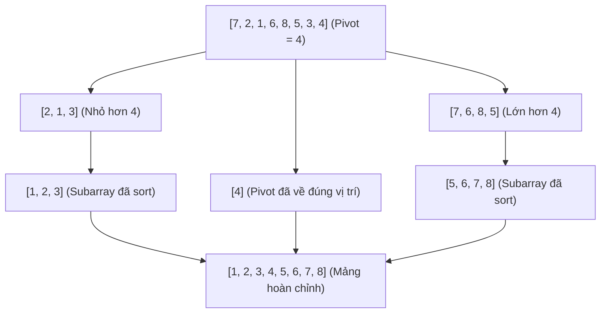
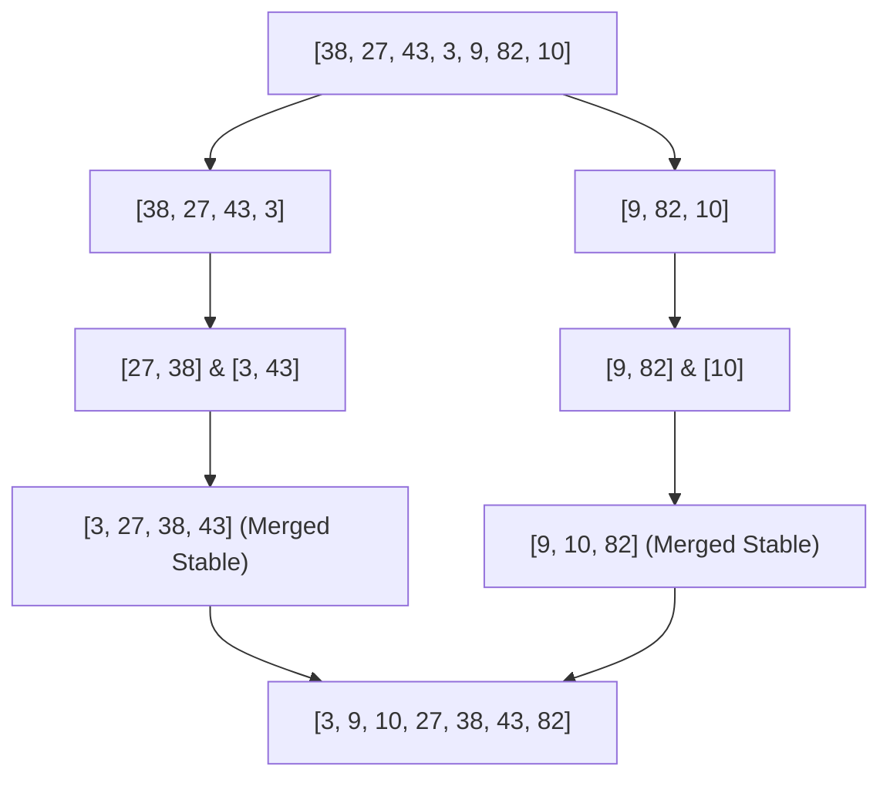
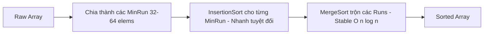

# 🔀 Sorting Algorithms — Modern & Classic Deep Dive

> **Mục đích:** Phân tích toàn diện các thuật toán sắp xếp kinh điển và hiện đại (QuickSort, MergeSort, TimSort, InsertionSort), cơ chế hoạt động của `Array.prototype.sort()` trong V8 Engine, khái niệm **Stability** và kỹ thuật viết Custom Multi-criteria Comparator cho UI Data Grids.

---

## 📑 Mục Lục (Table of Contents)
- [🚀 1. QuickSort (Sắp xếp nhanh)](#-1-quicksort-sắp-xếp-nhanh)
- [🧩 2. MergeSort (Sắp xếp trộn)](#-2-mergesort-sắp-xếp-trộn)
- [🏎️ 3. TimSort — Thuật Toán Sắp Xếp Thực Tế Trong V8 Engine](#️-3-timsort--thuật-toán-sắp-xếp-thực-tế-trong-v8-engine)
- [🎯 4. Khái Niệm Tính Ổn Định (Stability) & Ứng Dụng Trong UI Data Tables](#-4-khái-niệm-tính-ổn-định-stability--ứng-dụng-trong-ui-data-tables)
- [🛠️ 5. Dynamic Multi-Criteria Comparator Engine (Enterprise Pattern)](#️-5-dynamic-multi-criteria-comparator-engine-enterprise-pattern)

---

## 🚀 1. QuickSort (Sắp xếp nhanh)

QuickSort thuộc nhóm thuật toán **Chia để trị (Divide and Conquer)**. Nó chọn một phần tử làm **Pivot** (chốt), phân chia mảng thành 2 mảng con (phần tử nhỏ hơn Pivot đứng bên trái, lớn hơn Pivot đứng bên phải), sau đó đệ quy sắp xếp 2 mảng con.



### Cài đặt QuickSort bằng JavaScript (Hoare Partitioning - In-place)

```javascript
export function quickSort(arr, comparator = (a, b) => a - b) {
  function sort(low, high) {
    if (low >= high) return;

    const pivotIndex = partition(low, high);
    sort(low, pivotIndex - 1);
    sort(pivotIndex + 1, high);
  }

  function partition(low, high) {
    // Median-of-three selection để tránh worst case O(n^2) khi mảng đã sort sẵn
    const mid = Math.floor((low + high) / 2);
    if (comparator(arr[mid], arr[low]) < 0) swap(low, mid);
    if (comparator(arr[high], arr[low]) < 0) swap(low, high);
    if (comparator(arr[mid], arr[high]) < 0) swap(mid, high);

    const pivot = arr[high];
    let i = low - 1;

    for (let j = low; j < high; j++) {
      if (comparator(arr[j], pivot) <= 0) {
        i++;
        swap(i, j);
      }
    }
    swap(i + 1, high);
    return i + 1;
  }

  function swap(i, j) {
    const temp = arr[i];
    arr[i] = arr[j];
    arr[j] = temp;
  }

  sort(0, arr.length - 1);
  return arr;
}
```

### Đánh giá QuickSort:
- **Time Complexity**: Average Case $O(n \log n)$, Worst Case $O(n^2)$ (nếu chọn Pivot tệ).
- **Space Complexity**: $O(\log n)$ (Call stack đệ quy).
- **Stability**: ❌ **Unstable** (Không bảo đảm thứ tự ban đầu của phần tử bằng nhau).

---

## 🧩 2. MergeSort (Sắp xếp trộn)

MergeSort chia đôi mảng liên tục cho đến khi mỗi mảng con chỉ còn 1 phần tử, sau đó **gộp (merge)** các mảng con lại theo đúng thứ tự.



### Cài đặt MergeSort bằng JavaScript (Stable Implementation)

```javascript
export function mergeSort(arr, comparator = (a, b) => a - b) {
  if (arr.length <= 1) return arr;

  const mid = Math.floor(arr.length / 2);
  const left = mergeSort(arr.slice(0, mid), comparator);
  const right = mergeSort(arr.slice(mid), comparator);

  return merge(left, right, comparator);
}

function merge(left, right, comparator) {
  const result = [];
  let i = 0, j = 0;

  while (i < left.length && j < right.length) {
    // Dùng <= 0 để giữ tính Stable: nếu bằng nhau, ưu tiên lấy phần tử bên left trước!
    if (comparator(left[i], right[j]) <= 0) {
      result.push(left[i++]);
    } else {
      result.push(right[j++]);
    }
  }

  while (i < left.length) result.push(left[i++]);
  while (j < right.length) result.push(right[j++]);

  return result;
}
```

### Đánh giá MergeSort:
- **Time Complexity**: Luôn là $O(n \log n)$ trong mọi trường hợp (Best, Average, Worst).
- **Space Complexity**: $O(n)$ (Cần bộ nhớ đệm tạo mảng phụ khi merge).
- **Stability**: ✅ **Stable** (Bảo toàn thứ tự tuyệt đối).

---

## 🏎️ 3. TimSort — Thuật Toán Sắp Xếp Thực Tế Trong V8 Engine

**TimSort** (được phát triển bởi Tim Peters cho Python năm 2002) là thuật toán sắp xếp lai (Hybrid) mặc định được V8 Engine sử dụng cho `Array.prototype.sort()` kể từ Chrome 70+ (thay thế cho QuickSort cũ).

### Tại sao V8 lại chọn TimSort?
1. **Dữ liệu thực tế thường đã có sẵn các chuỗi con tăng/giảm sẵn (Runs)**.
2. Với mảng kích thước nhỏ ($n \le 64$), **Insertion Sort** chạy nhanh hơn bất kỳ thuật toán $O(n \log n)$ nào vì tận dụng CPU Cache locality xuất sắc.
3. TimSort chia mảng thành các **MinRun** (thường từ 32-64 phần tử), dùng Insertion Sort để sắp xếp từng run, sau đó dùng Merge Sort để trộn các runs lại.



---

## 🎯 4. Khái Niệm Tính Ổn Định (Stability) & Ứng Dụng Trong UI Data Tables

Một thuật toán sắp xếp được gọi là **Stable** nếu 2 phần tử có cùng giá trị key giữ nguyên vị trí tương quan ban đầu của chúng sau khi sắp xếp.

### Tình huống thực tế trên Frontend UI Data Table:

Giả sử người dùng có danh sách Đơn hàng:
1. **Bước 1**: Người dùng click sort theo cột **Tên Khách Hàng** (A $\rightarrow$ Z).
2. **Bước 2**: Người dùng tiếp tục click sort theo cột **Trạng Thái** ("Pending", "Shipping", "Delivered").

```javascript
// Dữ liệu ban đầu sau Bước 1 (Đã sort theo Name):
// [1] { name: "Alice", status: "Pending" }
// [2] { name: "Bob", status: "Pending" }
// [3] { name: "Charlie", status: "Delivered" }

// BƯỚC 2: Sort theo Status
// Nếu dùng STABLE SORT (TimSort/MergeSort):
// -> Các đơn hàng cùng status "Pending" sẽ GIỮ NGUYÊN thứ tự Alice trước Bob!
// [1] { name: "Alice", status: "Pending" }
// [2] { name: "Bob", status: "Pending" }
// [3] { name: "Charlie", status: "Delivered" }

// Nếu dùng UNSTABLE SORT (QuickSort):
// -> Thứ tự Alice và Bob có thể bị NHẢY LỘN XỘN (Bob lên trước Alice) làm người dùng khó chịu!
```

---

## 🛠️ 5. Dynamic Multi-Criteria Comparator Engine (Enterprise Pattern)

Viết một engine so sánh đa tiêu chí hỗ trợ sort theo nhiều cột linh hoạt dành cho các thư viện Data Grid (React Table, Ag-Grid):

```javascript
export function createMultiCriteriaComparator(criteria) {
  return (a, b) => {
    for (const { field, direction } of criteria) {
      const valA = typeof field === 'function' ? field(a) : a[field];
      const valB = typeof field === 'function' ? field(b) : b[field];

      if (valA === valB) continue;

      let result = 0;
      if (valA == null) result = -1;
      else if (valB == null) result = 1;
      else if (typeof valA === 'string' && typeof valB === 'string') {
        result = valA.localeCompare(valB, undefined, { numeric: true, sensitivity: 'base' });
      } else {
        result = valA < valB ? -1 : 1;
      }

      if (result !== 0) {
        return direction === 'asc' ? result : -result;
      }
    }
    return 0; // Tất cả tiêu chí bằng nhau
  };
}

// --- USAGE EXAMPLE ---
const products = [
  { category: 'Electronics', price: 500, rating: 4.8 },
  { category: 'Electronics', price: 300, rating: 4.5 },
  { category: 'Clothing', price: 500, rating: 4.9 },
];

// Ưu tiên 1: Category ASC -> Ưu tiên 2: Price DESC -> Ưu tiên 3: Rating DESC
const multiComparator = createMultiCriteriaComparator([
  { field: 'category', direction: 'asc' },
  { field: 'price', direction: 'desc' },
  { field: 'rating', direction: 'desc' },
]);

products.sort(multiComparator); // ✅ Stable Multi-Column Sort!
```
